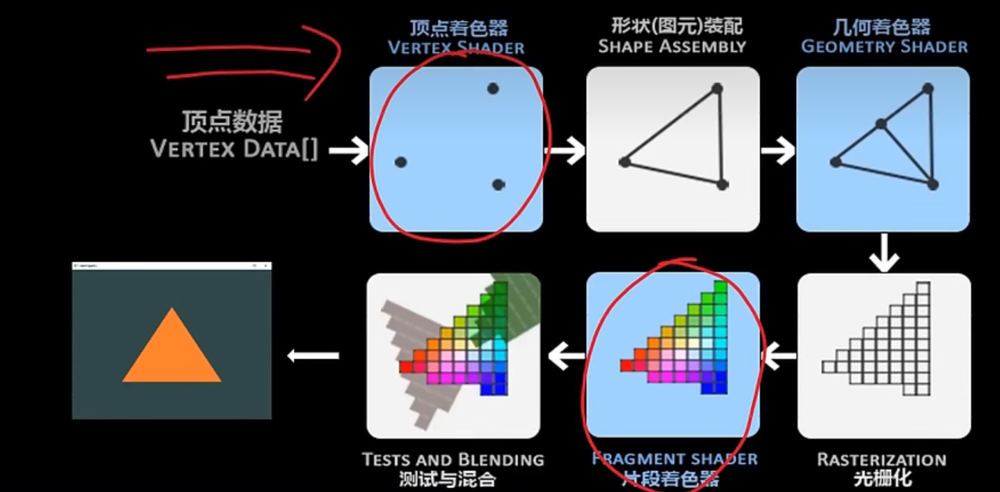
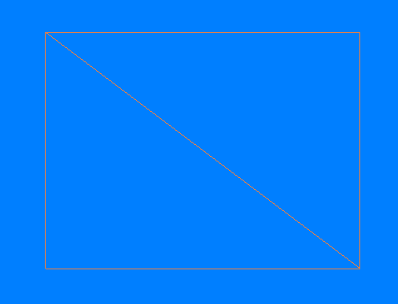

## OpenGL-GLFW-GLAD

OpenGL自身是一个巨大的状态机
OpenGl的状态通常被称为上下文

GLFW解决操作系统层面的不同
-创建窗口
-定义上下文
-处理用户输入
GLAD使得代码可以用于不同的OpenGL驱动
-OpenGl本身只是标准/规范
-各个厂家具体实现方法可以不同
-不同操作系统处理方法也不同
GLFW
https://www.glfw.org/download.html
GLAD使用了一个web服务器，通过输入想要为使用的OpenGL版本和相关信息转到GLAD服务器网站（[https://glad.dav1d.de](https://glad.dav1d.de/)）

glfwWindowHint(target, Hint);

把某一种target设置成hint


片段：包含渲染单个像素所需的所有数据。

显卡上有数千个小型处理器（核），可以在渲染管线中快速处理数据。核在GPU上为管线的每一步运行小程序。这些小程序成为着色器。

渲染管线 每一步执行完 后再执行下一步。

顶点着色器处理后，顶点值应该是NDC坐标；NDC坐标使用glViewport提供的数据，通过视口转换变为屏幕坐标。生成的屏幕空间左边将转换为片段，作为片段着色器的输入。

标准化设备坐标（Normalized Device Coordinates，NDC）

顶点着色器中处理过后，就应该是标准化设备坐标了，x、y和z的值在-1.0到1.0的一小段空间（立方体）。落在范围外的坐标都会被裁剪。

## VAO、VBO

顶点输入

在GPU上创建内存，储存的顶点数据

- 通过顶点缓冲对象（Vertex Buffer Objecits，VBO）管理
- 顶点缓冲对象的缓冲类型是GL_ARRAY_BUFFER

配置OpenGL如何解释这些内存

- 通过顶点数组对象（Vertex Array Objects，VAO）管理

使用缓冲区对象的优点是，可以一次将大量数据发送到显卡，不必一次发送一个数据。

用着色器语言GLSL（OpenGL Shading Language）编写顶点着色器，然后进行编译。

## 添加着色器



### 对着色器进行编译

为了让OpenGL使用着色器，必须在运行时从源码中动态编译着色器。首先创建着色器对象。

各个阶段的着色器需要通过着色器程序对象链接起来。着色器程序对象是多个着色器组成的最终链接版本。

```c++
const char *vertexShaderSource = 
"#version 330 core\n"
"layout(location = 0) in vec3 aPos;\n"
"void main()\n"
"{\n"
"gl_Position = vec4(aPos.x,aPos.y,aPos.z,1.0);\n"
"}\0";
```

```c++
const char *fragmentShaderSource = 
"#version 330 core\n"
"out vec4 FragColor;\n"
"void main()\n"
"{\n"
"FragColor = vec4(1.0f,0.5f,0.2f,1.0f);\n"
"}\n\0";
```

将着色器链接到程序时，会将每个着色器的输出连接到下一个着色器的输入.如果输出和输入不匹配，会出现链接错误。

```c++
//创建和编译着色器程序
	//顶点着色器
	unsigned int vertexShader = glCreateShader(GL_VERTEX_SHADER);
	glShaderSource(vertexShader, 1, &vertexShaderSource, NULL);
	glCompileShader(vertexShader);
	//检查编译错误 
	int success;
	char infoLog[512];
	glGetShaderiv(vertexShader, GL_COMPILE_STATUS, &success);
	if (!success)
	{
		glGetShaderInfoLog(vertexShader, 512, NULL, infoLog);
		std::cout << "ERROR::Shader::VERTEX::COMPILATION_FAIED\n" << infoLog << std::endl;
	}
	//片段着色器
	unsigned int fragmentShader = glCreateShader(GL_FRAGMENT_SHADER);
	glShaderSource(fragmentShader, 1, &fragmentShaderSource, NULL);
	glCompileShader(fragmentShader);
	//检查编译错误
	glGetShaderiv(fragmentShader, GL_COMPILE_STATUS, &success);
	if (!success)
	{
		glGetShaderInfoLog(fragmentShader, 512, NULL, infoLog);
		std::cout << "ERROR::Shader::FRAGMENT::COMPILATION_FAIED\n" << infoLog << std::endl;
	}
	//着色器程序
	unsigned int shaderProgram = glCreateProgram();
	glAttachShader(shaderProgram, vertexShader);
	glAttachShader(shaderProgram, fragmentShader);
	glLinkProgram(shaderProgram);
	//链接错误检查
	glGetProgramiv(shaderProgram, GL_LINK_STATUS, &success);
	if (!success)
	{
		glGetProgramInfoLog(shaderProgram, 512, NULL, infoLog);
		std::cout << "ERROR::SHADER::PROGRAM::LINKING_FAILED\n" << infoLog << std::endl;
	}
	glDeleteShader(vertexShader);
	glDeleteShader(fragmentShader);
```

创建着色器程序

## 元素缓冲对象EBO

EBO:Element Buffer Object

绘制两个三角形来组成一个矩形，可以使用下面的顶点的集合

```c++
float vertices[] =
{
	//第一个三角形
	0.5f,0.5f,0.0f,//右上
	0.5f,-0.5f,0.0f,//右下
	-0.5f,0.5f,0.0f,//左上
	//第二个三角形
	0.5f,-0.5f,0.0f,//右下
	-0.5f,-0.5f,0.0f,//左下
	-0.5f,0.5f,0.0f//左上
};
```

通过下面修改顶点数进行绘制

```c++
glDrawArrays(GL_TRIANGLES, 0, 6);
```

可以获得以下图像


修改光栅化模式，改为GL_LINE后

```
glPolygonMode(GL_FRONT_AND_BACK, GL_LINE);
```



在这种情况下，有两个左上的点，两个右下的点，其中有两个点是多余的。

换一种方式，用索引的方式，使用四个点的坐标

```c++
float vertices[] = {
	0.5f,0.5f,0.0f,// 右上
	0.5f,-0.5f,0.0f,// 右下
	-0.5f,-0.5f,0.0f,// 左下
	-0.5f,0.5f,0.0f// 左上
};
unsigned int indices[] = {
	0,1,3,//第一个三角形
	1,2,3//第二个三角形
};
```

选择使用索引渲染的函数，这样就可以绘出和上图一样的图像

```c++
glDrawElements(GL_TRIANGLES, 6, GL_UNSIGNED_INT, indices); //选择索引的方式
```

PS:采用了EBO时，则需要用glDrawElements函数来代替glDrawArrays函数，来指明我们从索引缓冲渲染。

参照[glDrawArrays 和 glDrawElements](https://www.cnblogs.com/keguniang/p/9866065.html)

这样写还不是整个的流程，还需要配置EBO

```c++
unsigned int EBO;
	glGenBuffers(1, &EBO);//创建缓冲区对象名字
	glBindBuffer(GL_ELEMENT_ARRAY_BUFFER, EBO);//绑定EBO缓冲
	glBufferData(GL_ELEMENT_ARRAY_BUFFER, sizeof(indices), indices, GL_STATIC_DRAW);//设置缓冲区数据
```

修改参数

```c++
glDrawElements(GL_TRIANGLES, 6, GL_UNSIGNED_INT, 0/*indices*/);
```

