# 入门章

## OpenGL-GLFW-GLAD

OpenGL自身是一个巨大的状态机
OpenGl的状态通常被称为上下文

GLFW解决操作系统层面的不同
-创建窗口
-定义上下文
-处理用户输入
GLAD使得代码可以用于不同的OpenGL驱动
-OpenGl本身只是标准/规范
-各个厂家具体实现方法可以不同
-不同操作系统处理方法也不同
GLFW
https://www.glfw.org/download.html
GLAD使用了一个web服务器，通过输入想要为使用的OpenGL版本和相关信息转到GLAD服务器网站（[https://glad.dav1d.de](https://glad.dav1d.de/)）

glfwWindowHint(target, Hint);

把某一种target设置成hint

<!--more-->

片段：包含渲染单个像素所需的所有数据。

显卡上有数千个小型处理器（核），可以在渲染管线中快速处理数据。核在GPU上为管线的每一步运行小程序。这些小程序成为着色器。

渲染管线 每一步执行完 后再执行下一步。

顶点着色器处理后，顶点值应该是NDC坐标；NDC坐标使用glViewport提供的数据，通过视口转换变为屏幕坐标。生成的屏幕空间左边将转换为片段，作为片段着色器的输入。

标准化设备坐标（Normalized Device Coordinates，NDC）

顶点着色器中处理过后，就应该是标准化设备坐标了，x、y和z的值在-1.0到1.0的一小段空间（立方体）。落在范围外的坐标都会被裁剪。

## VAO、VBO

顶点输入

在GPU上创建内存，储存的顶点数据

- 通过顶点缓冲对象（Vertex Buffer Objecits，VBO）管理
- 顶点缓冲对象的缓冲类型是GL_ARRAY_BUFFER

配置OpenGL如何解释这些内存

- 通过顶点数组对象（Vertex Array Objects，VAO）管理

使用缓冲区对象的优点是，可以一次将大量数据发送到显卡，不必一次发送一个数据。

用着色器语言GLSL（OpenGL Shading Language）编写顶点着色器，然后进行编译。

## 添加着色器


### 对着色器进行编译

为了让OpenGL使用着色器，必须在运行时从源码中动态编译着色器。首先创建着色器对象。

各个阶段的着色器需要通过着色器程序对象链接起来。着色器程序对象是多个着色器组成的最终链接版本。

```c++
const char *vertexShaderSource = 
"#version 330 core\n"
"layout(location = 0) in vec3 aPos;\n"
"void main()\n"
"{\n"
"gl_Position = vec4(aPos.x,aPos.y,aPos.z,1.0);\n"
"}\0";
```

```c++
const char *fragmentShaderSource = 
"#version 330 core\n"
"out vec4 FragColor;\n"
"void main()\n"
"{\n"
"FragColor = vec4(1.0f,0.5f,0.2f,1.0f);\n"
"}\n\0";
```

将着色器链接到程序时，会将每个着色器的输出连接到下一个着色器的输入.如果输出和输入不匹配，会出现链接错误。

```c++
//创建和编译着色器程序
	//顶点着色器
	unsigned int vertexShader = glCreateShader(GL_VERTEX_SHADER);
	glShaderSource(vertexShader, 1, &vertexShaderSource, NULL);
	glCompileShader(vertexShader);
	//检查编译错误 
	int success;
	char infoLog[512];
	glGetShaderiv(vertexShader, GL_COMPILE_STATUS, &success);
	if (!success)
	{
		glGetShaderInfoLog(vertexShader, 512, NULL, infoLog);
		std::cout << "ERROR::Shader::VERTEX::COMPILATION_FAIED\n" << infoLog << std::endl;
	}
	//片段着色器
	unsigned int fragmentShader = glCreateShader(GL_FRAGMENT_SHADER);
	glShaderSource(fragmentShader, 1, &fragmentShaderSource, NULL);
	glCompileShader(fragmentShader);
	//检查编译错误
	glGetShaderiv(fragmentShader, GL_COMPILE_STATUS, &success);
	if (!success)
	{
		glGetShaderInfoLog(fragmentShader, 512, NULL, infoLog);
		std::cout << "ERROR::Shader::FRAGMENT::COMPILATION_FAIED\n" << infoLog << std::endl;
	}
	//着色器程序
	unsigned int shaderProgram = glCreateProgram();
	glAttachShader(shaderProgram, vertexShader);
	glAttachShader(shaderProgram, fragmentShader);
	glLinkProgram(shaderProgram);
	//链接错误检查
	glGetProgramiv(shaderProgram, GL_LINK_STATUS, &success);
	if (!success)
	{
		glGetProgramInfoLog(shaderProgram, 512, NULL, infoLog);
		std::cout << "ERROR::SHADER::PROGRAM::LINKING_FAILED\n" << infoLog << std::endl;
	}
	glDeleteShader(vertexShader);
	glDeleteShader(fragmentShader);
```

创建着色器程序

### 元素缓冲对象EBO

EBO:Element Buffer Object

绘制两个三角形来组成一个矩形，可以使用下面的顶点的集合

```c++
float vertices[] =
{
	//第一个三角形
	0.5f,0.5f,0.0f,//右上
	0.5f,-0.5f,0.0f,//右下
	-0.5f,0.5f,0.0f,//左上
	//第二个三角形
	0.5f,-0.5f,0.0f,//右下
	-0.5f,-0.5f,0.0f,//左下
	-0.5f,0.5f,0.0f//左上
};
```

通过下面修改顶点数进行绘制

```c++
glDrawArrays(GL_TRIANGLES, 0, 6);
```

可以获得以下图像


修改光栅化模式，改为GL_LINE后

```
glPolygonMode(GL_FRONT_AND_BACK, GL_LINE);
```


在这种情况下，有两个左上的点，两个右下的点，其中有两个点是多余的。

换一种方式，用索引的方式，使用四个点的坐标

```c++
float vertices[] = {
	0.5f,0.5f,0.0f,// 右上
	0.5f,-0.5f,0.0f,// 右下
	-0.5f,-0.5f,0.0f,// 左下
	-0.5f,0.5f,0.0f// 左上
};
unsigned int indices[] = {
	0,1,3,//第一个三角形
	1,2,3//第二个三角形
};
```

选择使用索引渲染的函数，这样就可以绘出和上图一样的图像

```c++
glDrawElements(GL_TRIANGLES, 6, GL_UNSIGNED_INT, indices); //选择索引的方式
```

PS:采用了EBO时，则需要用glDrawElements函数来代替glDrawArrays函数，来指明我们从索引缓冲渲染。

参照[glDrawArrays 和 glDrawElements](https://www.cnblogs.com/keguniang/p/9866065.html)

这样写还不是整个的流程，还需要配置EBO

```c++
unsigned int EBO;
	glGenBuffers(1, &EBO);//创建缓冲区对象名字
	glBindBuffer(GL_ELEMENT_ARRAY_BUFFER, EBO);//绑定EBO缓冲
	glBufferData(GL_ELEMENT_ARRAY_BUFFER, sizeof(indices), indices, GL_STATIC_DRAW);//设置缓冲区数据
```

修改参数

```c++
glDrawElements(GL_TRIANGLES, 6, GL_UNSIGNED_INT, 0/*indices*/);
```

然后使用绑定，之后注销

### 视口

调整窗口的时候，也应该同时调整视口。在窗口上注册一个回调函数，每次调用窗口大小时都调用该函数

```c++
void frameBuffer_size_callback(GLFWwindow* window, int width, int height)
{
	glViewport(0, 0, width, height);
}
```

注册回调函数

```c++
//注册回调函数
glfwSetFramebufferSizeCallback(window, frameBuffer_size_callback);
```

PS：OpenGL中使用的坐标介于-1和1之间和屏幕空间坐标不同。例如：如果屏幕右下角为（800，600），（-0.5，0.5）将映射到屏幕空间的（200，450）

### 练习

1. 通过添加更多的顶点数据，使用glDrawArrays绘制两个挨在一起的三角形
2. 创建相同的两个三角形，但对它们的数据使用不同的VAO和VBO
3. 创建两个着色器，其中一个使用片段做着色器输出黄色

## 着色器Shader

着色器是基于GPU的小程序，这些小程序针对渲染管线中的每个特定步骤运行。从本质上说，着色器只不过是将输入转换为输出的程序。着色器也是非常孤立的程序，他们之间唯一的交流是通过输入和输出。

GLSL：OpenGL SHading Language

PS:Shader Language目前主要有3种语言：

1. 基于 OpenGL 的 **OpenGL Shading Language**，简称 **GLSL**;
2. 基于 DirectX 的 **High Level Shading Language**,简称 **HLSL**;
3. 还有 NVIDIA 公司的 **C for Graphic**，简称 **Cg** 语言。

这是GLSL程序的典型结构

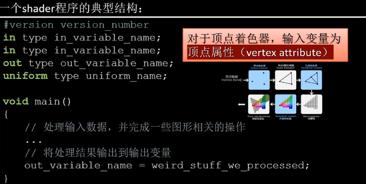

### 类型

GLSL中包含C等其它语言大部分的默认基础数据类型

- int、float、double、uint和bool

GLSL也有两种容器类型

- 向量(Vector)
  - vecn: the default vector of n floats
  - bvecn: a vector of n booleans
  - ivecn: a vector of n integers
  - uvecn: a vector of n unsigned integers
  - dvecn: a vector of n double components 
- 矩阵(Matrix)

> 向量的分量可以通过xyzw分别访问。GLSL还允许对颜色使用rgba，或对纹理坐标使用stpq。

向量允许一些有趣而灵活的分量选择方式，叫做重组(Swizzling):

```glsl
vec2 vect = vec2(0.5,0.7);
vec4 result = vec4(vect,0.0,0.0);
vec4 otherResult = vect(result.xyz,1.0);
```

顶点着色器接受的是一种特殊形式的输入，否则就会效率低下

从顶点数据中直接接受输出。为了顶点数据该如何管理，使用location这一元数据（metadata）指定输入变量，这样才可以在CPU端配置顶点属性。例如：`layout (location = 0)`。layout这个的标识，使得能把它链接到顶点数据。

可以忽略`layout(location = 0)`标识符，通过在OpenGL代码中使用`glGenAttribLocation`查询属性位置值(Location)，通过`glBindAttribLocation`绑定属性位置值(Location)。但是推荐在着色器中设置它们，这样会更容易理解和节省工作量。

输入输出：

- 在发生方着色器中声明一个输出
- 在接受方着色器中声明一个类似的输入
- 当类型和名字都一致，OpenGL将把变量连接到一起（在链接程序对象时完成）

### Uniform:

 另一种从CPU的应用，向GPU中的着色器发送数据的方式

- uniform是全局的(Global)，可以被任意着色器程序在任意阶段访问

  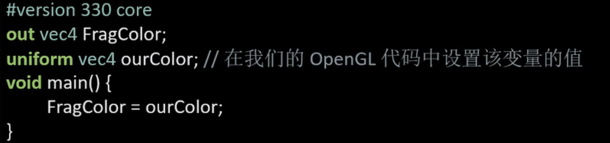

如果声明了一个uniform却没用过，编译器会默认移除这个变量，导致最后编译出的版本并不会包含它，这可能导致一些非常麻烦的错误，切记！

不去给像素传递一个单一的颜色，而是让它随着时间改变颜色

设置着色器，使用uniform

```c++
const char *vertexShaderSource = 
	"#version 330 core\n"
	"layout(location = 0) in vec3 aPos;\n"
	"void main()\n"
	"{\n"
	"gl_Position = vec4(aPos,1.0);\n"
	"}\0";
const char *fragmentShaderSource = 
	"#version 330 core\n"
	"out vec4 FragColor;\n"
	"uniform vec4 ourColor;\n"
	"void main()\n"
	"{\n"
	"FragColor = ourColor;\n"
	"}\n\0";
```

最后通过sin和cos实现颜色渐变

```c++
glUseProgram(shaderProgram);
//设置uniform值
float timeValue = glfwGetTime();
float greenValue = sin(timeValue) / 2.0f + 0.5F;
float redValue = cos(timeValue) / 2.0f + 0.5F;
float blueValue = cos(timeValue+45) / 2.0f + 0.5F;
int vertexColorLocation = glGetUniformLocation(shaderProgram, "ourColor");
glUniform4f(vertexColorLocation, redValue, greenValue, blueValue, 1.0f);
```

给顶点不同的颜色：

```c++
float vertices[] =  // 位置 // 颜色
{
	-0.5f,-0.5f,0.0f,1.0f,0.0f,0.0f,//右下
	0.5f,-0.5f,0.0f,0.0f,1.0f,0.0f,//左下
	0.0f,0.5,0.0f,0.0f,0.0f,1.0f//上
};
const char *vertexShaderSource = 
	"#version 330 core\n"
	"layout(location = 0) in vec3 aPos;\n"
	"layout(location = 1) in vec3 aColor;\n"
	"out vec3 ourColor;\n"
	"void main()\n"
	"{\n"
	"gl_Position = vec4(aPos,1.0);\n"
	"ourColor = aColor;\n"
	"}\0";
const char *fragmentShaderSource = 
	"#version 330 core\n"
	"out vec4 FragColor;\n"
	"uniform vec4 ourColor;\n"
	"void main()\n"
	"{\n"
	"FragColor = ourColor;\n"
	"}\n\0";
```

```c++
	glBufferData(GL_ARRAY_BUFFER, sizeof(vertices), vertices, GL_STATIC_DRAW);
	//告知Shader如何解析缓冲里的属性值
	glVertexAttribPointer(0, 3, GL_FLOAT, GL_FALSE, 6 * sizeof(float), (void*)0);
	//开启VAI管理的第一个属性值
	glEnableVertexAttribArray(0);
	//告知Shader如何解析缓冲里的属性值
	glVertexAttribPointer(1, 3, GL_FLOAT, GL_FALSE, 6 * sizeof(float), (void*)(3*4));
	//开启VAI管理的第一个属性值
	glEnableVertexAttribArray(1);
```


## 编写自己的着色器类

把着色器类全部放在在头文件里，主要是为了学习用途，当然也方便移植。添加必要的include，并定义类结构：

```c++
#ifndef SHADER_H
#define SHADER_H

#include <glad/glad.h>; // 包含glad来获取所有的必须OpenGL头文件

#include <string>
#include <fstream>
#include <sstream>
#include <iostream>


class Shader
{
public:
    // 程序ID
    unsigned int ID;

    // 构造器读取并构建着色器
    Shader(const GLchar* vertexPath, const GLchar* fragmentPath);
    // 使用/激活程序
    void use();
    // uniform工具函数
    void setBool(const std::string &name, bool value) const;  
    void setInt(const std::string &name, int value) const;   
    void setFloat(const std::string &name, float value) const;
};

#endif
```

下一步，我们需要编译和链接着色器。

```g
        // 2. 编译着色器
        unsigned int vertex, fragment;
        // vertex shader 顶点
        vertex = glCreateShader(GL_VERTEX_SHADER);
        glShaderSource(vertex, 1, &vShaderCode, NULL);
        glCompileShader(vertex);
        checkCompileErrors(vertex, "VERTEX");
        // fragment Shader 片元
        fragment = glCreateShader(GL_FRAGMENT_SHADER);
        glShaderSource(fragment, 1, &fShaderCode, NULL);
        glCompileShader(fragment);
        checkCompileErrors(fragment, "FRAGMENT");
        // shader Program 
        ID = glCreateProgram();
        glAttachShader(ID, vertex); //附加vertex对象给ID
        glAttachShader(ID, fragment);
        glLinkProgram(ID);
        checkCompileErrors(ID, "PROGRAM");
        // delete the shaders as they're linked into our program now and no longer necessary
        // 因为它们已经链接程序，不再需要，然后就删除这些着色器
        glDeleteShader(vertex);
        glDeleteShader(fragment);
```

设置use函数

```c++
    void use()
    {
        glUseProgram(ID);
    }
```

```c++
    // 一些有用Uniform函数
    // ------------------------------------------------------------------------
    void setBool(const std::string& name, bool value) const
    {
        glUniform1i(glGetUniformLocation(ID, name.c_str()), (int)value);
    }
    // ------------------------------------------------------------------------
    void setInt(const std::string& name, int value) const
    {
        glUniform1i(glGetUniformLocation(ID, name.c_str()), value);
    }
    // ------------------------------------------------------------------------
    void setFloat(const std::string& name, float value) const
    {
        glUniform1f(glGetUniformLocation(ID, name.c_str()), value);
    }
```

最后创建着色器对象，再使用

### 着色器练习

- 修改顶点着色器让三角形上下颠倒：

  ```glsl
  #version 330 core
  layout (location = 0) in vec3 aPos;
  layout (location = 1) in vec3 aColor;
  
  out vec3 ourColor;
  //修改顶点着色器，让aPos.y变成负值
  void main()
  {
      gl_Position = vec4(aPos.x,- aPos.y,aPos.z, 1.0);
      ourColor = aColor;
  }
  ```

  

- 使用uniform定义一个水平偏移量，在顶点着色器中使用这个偏移量把三角形移动到屏幕右侧：

  - 在C++代码设置

  ```c++
  float offset = 0.5f;
  ourShader.setFloat("xOffset", offset);
  ```

  - ​	在顶点着色器

    ```glsl
    #version 330 core
    layout (location = 0) in vec3 aPos;
    layout (location = 1) in vec3 aColor;
    
    out vec3 ourColor;
    
    uniform float xOffset;
    
    void main()
    {
        gl_Position = vec4(aPos.x + xOffset, aPos.y, aPos.z, 1.0); // add the xOffset to the x position of the vertex position
        ourColor = aColor;
    }
    ```

    

- 使用`out`关键字把顶点位置输出到片段着色器，并将片段的颜色设置为与顶点位置相等（来看看连顶点位置值都在三角形中被插值的结果）。做完这些后，尝试回答下面的问题：为什么在三角形的左下角是黑的?：

```glsl
//顶点
#version 330 core
layout (location = 0) in vec3 aPos;
layout (location = 1) in vec3 aColor;

// out vec3 ourColor;
out vec3 ourPosition;

void main()
{
    gl_Position = vec4(aPos, 1.0); 
    // ourColor = aColor;
    ourPosition = aPos;
}
```

```glsl
//片元
#version 330 core
layout (location = 0) in vec3 aPos;
layout (location = 1) in vec3 aColor;

// out vec3 ourColor;
out vec3 ourPosition;

void main()
{
    gl_Position = vec4(aPos, 1.0); 
    // ourColor = aColor;
    ourPosition = aPos;
}
```

回答：因为左下角的顶点的坐标为`(-0.5f,-0.5f,0.0f)`,在作为颜色显示的时候负值被固定为0，而(0,0,0,1)就是黑色，而这一直发生那个顶点插值到其他顶点的过程，所以导致了左下角为黑边。

## 纹理

纹理是一个2D图片(其实也有1D和3D的纹理)，它可以用来添加物体的细节。			

> 纹理也可以用来存储大量数据。

### 纹理坐标

纹理坐标(Texture Coordinate)：每一个顶点会关联一个纹理坐标，用来标明该从纹理图像的哪个部分采样。之后再图形的其它片段进行片段插值(Fragment Interpolation)。

纹理坐标也是在x和y轴，分别范围也为[0,1]；

采样(Sampling)：使用纹理坐标获取纹理颜色。

### 纹理环绕方式(Texture Wrapping)

纹理坐标的范围通常是从(0,0)到(1,1)，当外面设置的纹理坐标超出了范围，OpenGL的行为是重复这个纹理图像，也提供了一下可以选择的方式

| 环绕方式           | 描述                                                         |
| ------------------ | ------------------------------------------------------------ |
| GL_REPEAT          | 对纹理的默认行为。重复纹理图像。                             |
| GL_MIRRORED_REPEAT | 和GL_REPEAT一样，但每次重复图片是镜像放置的。                |
| GL_CLAMP_TO_EDGE   | 纹理坐标会被约束在0到1之间，超出的部分会重复纹理坐标的边缘，产生一种边缘被拉伸的效果。 |
| GL_CLAMP_TO_BORDER | 超出的坐标为用户指定的边缘颜色。                             |

通过使用glTexParameter*函数，可以使用上面提及的每一个选项来对单独的坐标系(s、t、r(如果使用3D纹理的话))，它们和x、y、z等价

```c++
glTexParameteri(GL_TEXTURE_2D, GL_TEXTURE_WRAP_S, GL_MIRRORED_REPEAT); 
glTexParameteri(GL_TEXTURE_2D, GL_TEXTURE_WRAP_T, GL_MIRRORED_REPEAT);
```

第一个参数指定纹理目标，这里使用2D纹理，所以这里使用GL_TEXTURE_2D。第二个参数要求我们提供我们需要设置的纹理坐标系，这里我们选择S轴和T轴，最后一个参数指定纹理环绕方式。

如果选择了GL_CLAMP_TO_BORDERGL_CLAMP_TO_BORDER的选项，我们还需要选择外围的颜色。这里需要使用glTexParameter函数带fv后置的形式来设置当超出边界后外围的颜色。

```c++
float borderColor[] = { 1.0f, 1.0f, 0.0f, 1.0f };
glTexParameterfv(GL_TEXTURE_2D, GL_TEXTURE_BORDER_COLOR, borderColor); 
```

### 纹理过滤(Texture Filtering)

纹理坐标不依赖分辨率，它可以是任意浮点值，所以OpenGl需要知道怎么样将纹理像素(Texture Pixel,也叫Texel)映射到纹理坐标，当有一个很大的物体但是纹理的分辨率很低的时候这就变得很重要了。所以OpenGL也有对于纹理过滤(Texture Filtering)的选项，纹理过滤有很多选项，这里只讨论最重要的两种：GL_NEARET和GL_LINEAR.

> Texture Pixel也叫Texel，你可以想象你打开一张`.jpg`格式图片，不断放大你会发现它是由无数像素点组成的，这个点就是纹理像素；注意不要和纹理坐标搞混，纹理坐标是你给模型顶点设置的那个数组，OpenGL以这个顶点的纹理坐标数据去查找纹理图像上的像素，然后进行采样提取纹理像素的颜色。

GL_NEAREST（也叫邻近过滤，Nearest Neighbor Filtering）是OpenGL默认的纹理过滤方式。当设置为GL_NEAREST的时候，OpenGL会选择中心点最接近纹理坐标的那个像素。下图中你可以看到四个像素，加号代表纹理坐标。左上角那个纹理像素的中心距离纹理坐标最近，所以它会被选择为样本颜色：


GL_LINEAR（也叫线性过滤，(Bi)linear Filtering）它会基于纹理坐标附近的纹理像素，计算出一个插值，近似出这些纹理像素之间的颜色。一个纹理像素的中心距离纹理坐标越近，那么这个纹理像素的颜色对最终的样本颜色的贡献越大。下图中你可以看到返回的颜色是邻近像素的混合色：


这两种纹理过滤方式的视觉效果，用一个很大的物体上应用一张低分辨率纹理，（纹理被放大了，每个纹理像素都能看到）：


### 多级渐远纹理

OpenGL使用一种叫做多级渐远纹理(Mipmap)的概念来解决这个问题，它简单来说就是一系列的纹理图像，后一个纹理图像是前一个的二分之一。多级渐远纹理背后的理念很简单：距观察者的距离超过一定的阈值，OpenGL会使用不同的多级渐远纹理，即最适合物体的距离的那个。由于距离远，解析度不高也不会被用户注意到。同时，多级渐远纹理另一加分之处是它的性能非常好。让我们看一下多级渐远纹理是什么样子的：

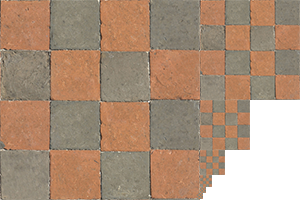

OpenGL有一个glGenerateMipmaps函数，可以在创建完一个纹理后调用 OpenGL就会自动接着干这些事。

在渲染过程中切换多级渐远纹理级别时，OpenGL在两个不同级别的多级渐远纹理层之间会产生不真实的生硬边界。像普通的纹理过滤，不同的纹理级别切换也可以使用NEAREST和LINEAR过滤。

| 过滤方式                  | **描述**                                                     |
| ------------------------- | ------------------------------------------------------------ |
| GL_NEAREST_MIPMAP_NEAREST | 使用最邻近的多级渐远纹理来匹配像素大小，并使用邻近插值进行纹理采样 |
| GL_LINEAR_MIPMAP_NEAREST  | 使用最邻近的多级渐远纹理级别，并使用线性插值进行采样         |
| GL_NEAREST_MIPMAP_LINEAR  | 在两个最匹配像素大小的多级渐远纹理之间进行线性插值，使用邻近插值进行采样 |
| GL_LINEAR_MIPMAP_LINEAR   | 在两个邻近的多级渐远纹理之间使用线性插值，并使用线性插值进行采样 |

就像纹理过滤一样，我们可以使用glTexParameteri将过滤方式设置为前面四种提到的方法之一：

```c++
glTexParameteri(GL_TEXTURE_2D, GL_TEXTURE_MIN_FILTER, GL_LINEAR_MIPMAP_LINEAR);
glTexParameteri(GL_TEXTURE_2D, GL_TEXTURE_MAG_FILTER, GL_LINEAR);
```

### 加载与创建纹理

### 纹理单元

你可能会奇怪为什么`sampler2D`变量是个uniform，我们却不用glUniform给它赋值。使用glUniform1i，我们可以给纹理采样器分配一个位置值，这样的话我们能够在一个片段着色器中设置多个纹理。一个纹理的位置值通常称为一个纹理单元(Texture Unit)。一个纹理的默认纹理单元是0，它是默认的激活纹理单元

纹理单元的主要目的是让我们在着色器中可以使用多于一个的纹理。通过把纹理单元赋值给采样器，我们可以一次绑定多个纹理，只要我们首先激活对应的纹理单元。就像glBindTexture一样，我们可以使用glActiveTexture激活纹理单元，传入我们需要使用的纹理单元：

```c++
glActiveTexture(GL_TEXTURE0); // 在绑定纹理之前先激活纹理单元
glBindTexture(GL_TEXTURE_2D, texture);
```

激活纹理单元之后，接下来的glBindTexture函数调用会绑定这个纹理到当前激活的纹理单元，纹理单元GL_TEXTURE0默认总是被激活，所以我们在前面的例子里当我们使用`glBindTexture`的时候，无需激活任何纹理单元。

> OpenGL至少保证有16个纹理单元供你使用，也就是说你可以激活从GL_TEXTURE0到GL_TEXTRUE15。它们都是按顺序定义的，所以我们也可以通过GL_TEXTURE0 + 8的方式获得GL_TEXTURE8，这在当我们需要循环一些纹理单元的时候会很有用。

### 练习

- 修改片段着色器，**仅**让笑脸图案朝另一个方向看，[参考解答](https://learnopengl.com/code_viewer.php?code=getting-started/textures-exercise1)

```glsl
#version 330 core
out vec4 FragColor;

in vec3 ourColor;
in vec2 TexCoord;


uniform sampler2D texture1;
uniform sampler2D texture2;

void main()
{
    FragColor = mix(texture(texture1, TexCoord), texture(texture2, vec2(1.0-TexCoord.x,TexCoord.y)), 0.2);
}
```

- 尝试用不同的纹理环绕方式，设定一个从`0.0f`到`2.0f`范围内的（而不是原来的`0.0f`到`1.0f`）纹理坐标。试试看能不能在箱子的角落放置4个笑脸：[参考解答](https://learnopengl.com/code_viewer_gh.php?code=src/1.getting_started/4.3.textures_exercise2/textures_exercise2.cpp)，[结果](https://learnopengl-cn.gitee.io/img/01/06/textures_exercise2.png)。记得一定要试试其它的环绕方式。

  - 修改纹理坐标	

  ```c++
  float vertices[] = {
  	//     ---- 位置 ----       ---- 颜色 ----     - 纹理坐标 -
  		 0.5f,  0.5f, 0.0f,   1.0f, 0.0f, 0.0f,   2.0f, 2.0f,   // 右上
  		 0.5f, -0.5f, 0.0f,   0.0f, 1.0f, 0.0f,   2.0f, 0.0f,   // 右下
  		-0.5f, -0.5f, 0.0f,   0.0f, 0.0f, 1.0f,   0.0f, 0.0f,   // 左下
  		-0.5f,  0.5f, 0.0f,   1.0f, 1.0f, 0.0f,   0.0f, 2.0f    // 左上
  };		
  ```

  - 修改第一个纹理的环绕方式

  ```c++
  	glTexParameteri(GL_TEXTURE_2D, GL_TEXTURE_WRAP_S, GL_CLAMP_TO_EDGE);
  	glTexParameteri(GL_TEXTURE_2D, GL_TEXTURE_WRAP_T, GL_CLAMP_TO_EDGE);
  ```

  - 修改第二个纹理的环绕方式

    ```c++
    	glTexParameteri(GL_TEXTURE_2D, GL_TEXTURE_WRAP_S, GL_MIRRORED_REPEAT);
    	glTexParameteri(GL_TEXTURE_2D, GL_TEXTURE_WRAP_T, GL_REPEAT);
    ```

  - 结果

    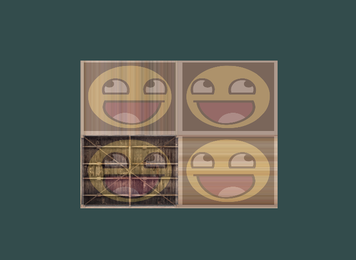

- 尝试在矩形上只显示纹理图像的中间一部分，修改纹理坐标，达到能看见单个的像素的效果。尝试使用GL_NEAREST的纹理过滤方式让像素显示得更清晰：[参考解答](https://learnopengl.com/code_viewer_gh.php?code=src/1.getting_started/4.4.textures_exercise3/textures_exercise3.cpp)

  - 修改纹理坐标

  ```c++
  float vertices[] = {
  	//     ---- 位置 ----       ---- 颜色 ----     - 纹理坐标 -
  		 0.5f,  0.5f, 0.0f,   1.0f, 0.0f, 0.0f,   0.55f, 0.55f,   // 右上
  		 0.5f, -0.5f, 0.0f,   0.0f, 1.0f, 0.0f,   0.55f, 0.45f,   // 右下
  		-0.5f, -0.5f, 0.0f,   0.0f, 0.0f, 1.0f,   0.45f, 0.45f,   // 左下
  		-0.5f,  0.5f, 0.0f,   1.0f, 1.0f, 0.0f,   0.45f, 0.55f    // 左上
  };
  ```

  

  - 修改过滤方式

  ```c++
  	glTexParameteri(GL_TEXTURE_2D, GL_TEXTURE_MIN_FILTER, GL_NEAREST);
  	glTexParameteri(GL_TEXTURE_2D, GL_TEXTURE_MAG_FILTER, GL_NEAREST);
  ```

  

  - 结果(第一种为GL_LINEAR，第二个为GL_NEAREST)

  

  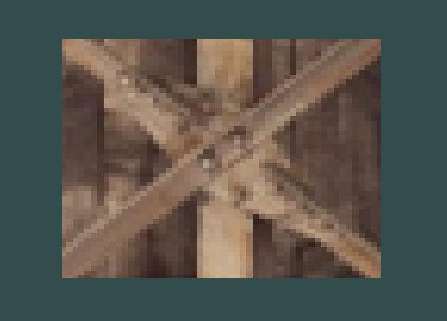

- 使用一个uniform变量作为mix函数的第三个参数来改变两个纹理可见度，使用上和下键来改变箱子或笑脸的可见度：[参考解答](https://learnopengl.com/code_viewer_gh.php?code=src/1.getting_started/4.5.textures_exercise4/textures_exercise4.cpp)。

  - 修改片段着色器

  ```glsl
  #version 330 core
  out vec4 FragColor;
  
  in vec3 ourColor;
  in vec2 TexCoord;
  
  
  uniform sampler2D texture1;
  uniform sampler2D texture2;
  uniform float parm;
  void main()
  {
      FragColor = mix(texture(texture1, TexCoord), texture(texture2, vec2(1.0-TexCoord.x,TexCoord.y)), parm);
  }
  ```

  

  - 设置uniform和按键

```c++
float parm = 0.2f;

/*......*/

//if (parm >= 1.0f)
//	parm = 1.0f;
//if (parm <= 0.0f)
//	parm = 0.0f;
ourShader.setFloat("parm", parm);
if (glfwGetKey(window, GLFW_KEY_UP) == GLFW_PRESS)
parm += 0.01;
else if(glfwGetKey(window, GLFW_KEY_DOWN) == GLFW_PRESS)
parm -= 0.01;
```

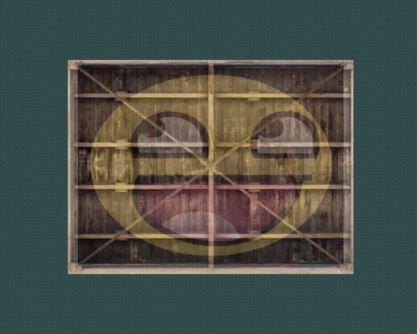

## 变换

### 向量的点乘和叉乘

1. 点乘(Dot Product)

   ​	两个向量的点乘等于它们的数乘结果乘以两个向量之间夹角的余弦值。可能听起来有点费解，我们来看一下公式：
   $$
   \bar{v}⋅\bar{k}=||\bar{v}||⋅||\bar{k}||⋅cosθ
   $$
   ​	它们之间的夹角记作$$θ$$。为什么这很有用？想象如果$\bar{v}$和$\bar{k}$都是单位向量，它们的长度会等于1。这样公式会有效简化成：
   $$
   \bar{v}⋅\bar{k}=1⋅1⋅cosθ=cosθ
   $$
   

​	你也可以通过点乘的结果计算两个非单位向量的夹角，点乘的结果除以两个向量的长度之积，得到的结果就是夹角的余弦值，即cosθ。
$$
\cos \theta = \frac{\bar{v} \cdot \bar{k}}{||\bar{v}|| \cdot ||\bar{k}||}
$$
​	点乘是通过将对应分量逐个相乘，然后再把所得积相加来计算的。两个单位向量的（你可以验证它们的长度都为1）点乘会像是这样：
$$
\begin{pmatrix} \color{red}{0.6} \\ -\color{green}{0.8} \\ \color{blue}0 \end{pmatrix} \cdot \begin{pmatrix} \color{red}0 \\ \color{green}1 \\ \color{blue}0 \end{pmatrix} = (\color{red}{0.6} * \color{red}0) + (-\color{green}{0.8} * \color{green}1) + (\color{blue}0 * \color{blue}0) = -0.8
$$
​	2.叉乘(Cross Product)

​	叉乘只在3D空间中有定义，它需要两个不平行向量作为输入，生成一个正交于两个输入向量的第三个向量。如果输入的两个向量也是正交的，那么叉乘之后将会产生3个互相正交的向量。接下来的教程中这会非常有用。下面的图片展示了3D空间中叉乘的样子：


两个正交向量A和B叉积：
$$
\begin{pmatrix} \color{red}{A_{x}} \\ \color{green}{A_{y}} \\ \color{blue}{A_{z}} \end{pmatrix} \times \begin{pmatrix} \color{red}{B_{x}} \\ \color{green}{B_{y}} \\ \color{blue}{B_{z}}  \end{pmatrix} = \begin{pmatrix} \color{green}{A_{y}} \cdot \color{blue}{B_{z}} - \color{blue}{A_{z}} \cdot \color{green}{B_{y}} \\ \color{blue}{A_{z}} \cdot \color{red}{B_{x}} - \color{red}{A_{x}} \cdot \color{blue}{B_{z}} \\ \color{red}{A_{x}} \cdot \color{green}{B_{y}} - \color{green}{A_{y}} \cdot \color{red}{B_{x}} \end{pmatrix}
$$

### 矩阵

向量，它其实就是一个**N×1**矩阵，N表示向量分量的个数（也叫N维(N-dimensional)向量）

#### 单位矩阵

在OpenGL中，由于某些原因我们通常使用**4×4**的变换矩阵，而其中最重要的原因就是大部分的向量都是4分量的。我们能想到的最简单的变换矩阵就是单位矩阵(Identity Matrix)。单位矩阵是一个除了对角线以外都是0的**N×N**矩阵。在下式中可以看到，这种变换矩阵使一个向量完全不变：
$$
\begin{bmatrix} \color{red}1 & \color{red}0 & \color{red}0 & \color{red}0 \\ \color{green}0 & \color{green}1 & \color{green}0 & \color{green}0 \\ \color{blue}0 & \color{blue}0 & \color{blue}1 & \color{blue}0 \\ \color{purple}0 & \color{purple}0 & \color{purple}0 & \color{purple}1 \end{bmatrix} \cdot \begin{bmatrix} 1 \\ 2 \\ 3 \\ 4 \end{bmatrix} = \begin{bmatrix} \color{red}1 \cdot 1 \\ \color{green}1 \cdot 2 \\ \color{blue}1 \cdot 3 \\ \color{purple}1 \cdot 4 \end{bmatrix} = \begin{bmatrix} 1 \\ 2 \\ 3 \\ 4 \end{bmatrix}
$$
向量看起来完全没变。从乘法法则来看就很容易理解来：第一个结果元素是矩阵的第一行的每个元素乘以向量的每个对应元素。因为每行的元素除了第一个都是0，可得：$$\color{red}1\cdot1 + \color{red}0\cdot2 + \color{red}0\cdot3 + \color{red}0\cdot4 = 1$$，向量的其他3个元素同理。

> 单位矩阵通常是生成其他变换矩阵的起点。

#### 缩放矩阵

对一个向量进行缩放(Scaling)就是对向量的长度进行缩放，而保持它的方向不变。由于我们进行的是2维或3维操作，我们可以分别定义一个有2或3个缩放变量的向量，每个变量缩放一个轴(x、y或z)。

> 记住，OpenGL通常是在3D空间进行操作的，对于2D的情况我们可以把z轴缩放1倍，这样z轴的值就不变了。我们刚刚的缩放操作是不均匀(Non-uniform)缩放，因为每个轴的缩放因子(Scaling Factor)都不一样。如果每个轴的缩放因子都一样那么就叫均匀缩放(Uniform Scale)。

$$
\begin{bmatrix} \color{red}{S_1} & \color{red}0 & \color{red}0 & \color{red}0 \\ \color{green}0 & \color{green}{S_2} & \color{green}0 & \color{green}0 \\ \color{blue}0 & \color{blue}0 & \color{blue}{S_3} & \color{blue}0 \\ \color{purple}0 & \color{purple}0 & \color{purple}0 & \color{purple}1 \end{bmatrix} \cdot \begin{pmatrix} x \\ y \\ z \\ 1 \end{pmatrix} = \begin{pmatrix} \color{red}{S_1} \cdot x \\ \color{green}{S_2} \cdot y \\ \color{blue}{S_3} \cdot z \\ 1 \end{pmatrix}
$$

记住，OpenGL通常是在3D空间进行操作的，对于2D的情况我们可以把z轴缩放1倍，这样z轴的值就不变了。我们刚刚的缩放操作是不均匀(Non-uniform)缩放，因为每个轴的缩放因子(Scaling Factor)都不一样。如果每个轴的缩放因子都一样那么就叫均匀缩放(Uniform Scale)。

#### 位移矩阵

位移(Translation)是在原始向量的基础上加上另一个向量从而获得一个在不同位置的新向量的过程，从而在位移向量基础上**移动**了原始向量。我们已经讨论了向量加法，所以这应该不会太陌生。

和缩放矩阵一样，在4×4矩阵上有几个特别的位置用来执行特定的操作，对于位移来说它们是第四列最上面的3个值。如果我们把位移向量表示为$$(\color{red}{T_x},\color{green}{T_y},\color{blue}{T_z})$$，我们就能把位移矩阵定义为：
$$
\begin{bmatrix}  \color{red}1 & \color{red}0 & \color{red}0 & \color{red}{T_x} \\ \color{green}0 & \color{green}1 & \color{green}0 & \color{green}{T_y} \\ \color{blue}0 & \color{blue}0 & \color{blue}1 & \color{blue}{T_z} \\ \color{purple}0 & \color{purple}0 & \color{purple}0 & \color{purple}1 \end{bmatrix} \cdot \begin{pmatrix} x \\ y \\ z \\ 1 \end{pmatrix} = \begin{pmatrix} x + \color{red}{T_x} \\ y + \color{green}{T_y} \\ z + \color{blue}{T_z} \\ 1 \end{pmatrix}
$$
这样是能工作的，因为所有的位移值都要乘以向量的**w**行，所以位移值会加到向量的原始值上（想想矩阵乘法法则）。而如果你用3x3矩阵我们的位移值就没地方放也没地方乘了，所以是不行的。

> **齐次坐标(Homogeneous Coordinates)**
>
> 向量的w分量也叫齐次坐标。想要从齐次向量得到3D向量，我们可以把x、y和z坐标分别除以w坐标。我们通常不会注意这个问题，因为w分量通常是1.0。使用齐次坐标有几点好处：它允许我们在3D向量上进行位移（如果没有w分量我们是不能位移向量的），而且下一章我们会用w值创建3D视觉效果。
>
> 如果一个向量的齐次坐标是0，这个坐标就是方向向量(Direction Vector)，因为w坐标是0，这个向量就不能位移

有了位移矩阵我们就可以在3个方向(x、y、z)上移动物体，它是我们的变换工具箱中非常有用的一个变换矩阵。

#### 旋转矩阵

2D或3D空间中的旋转用角(Angle)来表示。角可以是角度制或弧度制的，周角是360角度或2 [PI](https://en.wikipedia.org/wiki/Pi)弧度。

> 大多数旋转函数需要用弧度制的角，但幸运的是角度制的角也可以很容易地转化为弧度制的：
>
> - 弧度转角度：`角度 = 弧度 * (180.0f / PI)`
> - 角度转弧度：`弧度 = 角度 * (PI / 180.0f)`
>
> `PI`约等于3.14159265359。

转半圈会旋转360/2 = 180度，向右旋转1/5圈表示向右旋转360/5 = 72度。下图中展示的2D向量$\bar{v}$是由$\bar{k}$向右旋转72度所得的：


在3D空间中旋转需要定义一个角**和**一个旋转轴(Rotation Axis)。物体会沿着给定的旋转轴旋转特定角度。如果你想要更形象化的感受，可以试试向下看着一个特定的旋转轴，同时将你的头部旋转一定角度。当2D向量在3D空间中旋转时，我们把旋转轴设为z轴（尝试想象这种情况）。

使用三角学，给定一个角度，可以把一个向量变换为一个经过旋转的新向量。这通常是使用一系列正弦和余弦函数（一般简称sin和cos）各种巧妙的组合得到的。当然，讨论如何生成变换矩阵超出了这个教程的范围。

旋转矩阵在3D空间中每个单位轴都有不同定义，旋转角度用$θ$表示：

沿x轴旋转：
$$
\begin{bmatrix} \color{red}1 & \color{red}0 & \color{red}0 & \color{red}0 \\ \color{green}0 & \color{green}{\cos \theta} & - \color{green}{\sin \theta} & \color{green}0 \\ \color{blue}0 & \color{blue}{\sin \theta} & \color{blue}{\cos \theta} & \color{blue}0 \\ \color{purple}0 & \color{purple}0 & \color{purple}0 & \color{purple}1 \end{bmatrix} \cdot \begin{pmatrix} x \\ y \\ z \\ 1 \end{pmatrix} = \begin{pmatrix} x \\ \color{green}{\cos \theta} \cdot y - \color{green}{\sin \theta} \cdot z \\ \color{blue}{\sin \theta} \cdot y + \color{blue}{\cos \theta} \cdot z \\ 1 \end{pmatrix}
$$


沿y轴旋转：
$$
\begin{bmatrix} \color{red}{\cos \theta} & \color{red}0 & \color{red}{\sin \theta} & \color{red}0 \\ \color{green}0 & \color{green}1 & \color{green}0 & \color{green}0 \\ - \color{blue}{\sin \theta} & \color{blue}0 & \color{blue}{\cos \theta} & \color{blue}0 \\ \color{purple}0 & \color{purple}0 & \color{purple}0 & \color{purple}1 \end{bmatrix} \cdot \begin{pmatrix} x \\ y \\ z \\ 1 \end{pmatrix} = \begin{pmatrix} \color{red}{\cos \theta} \cdot x + \color{red}{\sin \theta} \cdot z \\ y \\ - \color{blue}{\sin \theta} \cdot x + \color{blue}{\cos \theta} \cdot z \\ 1 \end{pmatrix}
$$


沿z轴旋转：
$$
\begin{bmatrix} \color{red}{\cos \theta} & - \color{red}{\sin \theta} & \color{red}0 & \color{red}0 \\ \color{green}{\sin \theta} & \color{green}{\cos \theta} & \color{green}0 & \color{green}0 \\ \color{blue}0 & \color{blue}0 & \color{blue}1 & \color{blue}0 \\ \color{purple}0 & \color{purple}0 & \color{purple}0 & \color{purple}1 \end{bmatrix} \cdot \begin{pmatrix} x \\ y \\ z \\ 1 \end{pmatrix} = \begin{pmatrix} \color{red}{\cos \theta} \cdot x - \color{red}{\sin \theta} \cdot y  \\ \color{green}{\sin \theta} \cdot x + \color{green}{\cos \theta} \cdot y \\ z \\ 1 \end{pmatrix}
$$
利用旋转矩阵我们可以把任意位置向量沿一个单位旋转轴进行旋转。也可以将多个矩阵复合，比如先沿着x轴旋转再沿着y轴旋转。但是这会很快导致一个问题——万向节死锁（Gimbal Lock，可以看看[这个视频](https://www.youtube.com/watch?v=zc8b2Jo7mno)[（优酷）](http://v.youku.com/v_show/id_XNzkyOTIyMTI=.html)来了解）。在这里我们不会讨论它的细节，但是对于3D空间中的旋转，一个更好的模型是沿着任意的一个轴，比如单位向量$(0.662, 0.2, 0.7222)$旋转，而不是对一系列旋转矩阵进行复合。这样的一个（超级麻烦的）矩阵是存在的，见下面这个公式，其中$(\color{red}{R_x}, \color{green}{R_y}, \color{blue}{R_z})$代表任意旋转轴：
$$
\begin{bmatrix} \cos \theta + \color{red}{R_x}^2(1 - \cos \theta) & \color{red}{R_x}\color{green}{R_y}(1 - \cos \theta) - \color{blue}{R_z} \sin \theta & \color{red}{R_x}\color{blue}{R_z}(1 - \cos \theta) + \color{green}{R_y} \sin \theta & 0 \\ \color{green}{R_y}\color{red}{R_x} (1 - \cos \theta) + \color{blue}{R_z} \sin \theta & \cos \theta + \color{green}{R_y}^2(1 - \cos \theta) & \color{green}{R_y}\color{blue}{R_z}(1 - \cos \theta) - \color{red}{R_x} \sin \theta & 0 \\ \color{blue}{R_z}\color{red}{R_x}(1 - \cos \theta) - \color{green}{R_y} \sin \theta & \color{blue}{R_z}\color{green}{R_y}(1 - \cos \theta) + \color{red}{R_x} \sin \theta & \cos \theta + \color{blue}{R_z}^2(1 - \cos \theta) & 0 \\ 0 & 0 & 0 & 1 \end{bmatrix}
$$
在数学上讨论如何生成这样的矩阵仍然超出了本节内容。但是记住，即使这样一个矩阵也不能完全解决万向节死锁问题（尽管会极大地避免）。避免万向节死锁的真正解决方案是使用四元数(Quaternion)，它不仅更安全，而且计算会更有效率。四元数可能会在后面的教程中讨论。

#### 矩阵的组合

使用矩阵进行变换的真正力量在于，根据矩阵之间的乘法，我们可以把多个变换组合到一个矩阵中。让我们看看我们是否能生成一个变换矩阵，让它组合多个变换。假设我们有一个顶点(x, y, z)，我们希望将其缩放2倍，然后位移(1, 2, 3)个单位。我们需要一个位移和缩放矩阵来完成这些变换。结果的变换矩阵看起来像这样：
$$
Trans . Scale = \begin{bmatrix} \color{red}1 & \color{red}0 & \color{red}0 & \color{red}1 \\ \color{green}0 & \color{green}1 & \color{green}0 & \color{green}2 \\ \color{blue}0 & \color{blue}0 & \color{blue}1 & \color{blue}3 \\ \color{purple}0 & \color{purple}0 & \color{purple}0 & \color{purple}1 \end{bmatrix} . \begin{bmatrix} \color{red}2 & \color{red}0 & \color{red}0 & \color{red}0 \\ \color{green}0 & \color{green}2 & \color{green}0 & \color{green}0 \\ \color{blue}0 & \color{blue}0 & \color{blue}2 & \color{blue}0 \\ \color{purple}0 & \color{purple}0 & \color{purple}0 & \color{purple}1 \end{bmatrix} = \begin{bmatrix} \color{red}2 & \color{red}0 & \color{red}0 & \color{red}1 \\ \color{green}0 & \color{green}2 & \color{green}0 & \color{green}2 \\ \color{blue}0 & \color{blue}0 & \color{blue}2 & \color{blue}3 \\ \color{purple}0 & \color{purple}0 & \color{purple}0 & \color{purple}1 \end{bmatrix}
$$
注意，当矩阵相乘时我们先写位移再写缩放变换的。矩阵乘法是不遵守交换律的，这意味着它们的顺序很重要。当矩阵相乘时，在最右边的矩阵是第一个与向量相乘的，所以你应该从右向左读这个乘法。建议您在组合矩阵时，先进行缩放操作，然后是旋转，最后才是位移，否则它们会（消极地）互相影响。比如，如果你先位移再缩放，位移的向量也会同样被缩放（译注：比如向某方向移动2米，2米也许会被缩放成1米）！

用最终的变换矩阵左乘我们的向量会得到以下结果：
$$
\begin{bmatrix} \color{red}2 & \color{red}0 & \color{red}0 & \color{red}1 \\ \color{green}0 & \color{green}2 & \color{green}0 & \color{green}2 \\ \color{blue}0 & \color{blue}0 & \color{blue}2 & \color{blue}3 \\ \color{purple}0 & \color{purple}0 & \color{purple}0 & \color{purple}1 \end{bmatrix} . \begin{bmatrix} x \\ y \\ z \\ 1 \end{bmatrix} = \begin{bmatrix} \color{red}2x + \color{red}1 \\ \color{green}2y + \color{green}2  \\ \color{blue}2z + \color{blue}3 \\ 1 \end{bmatrix}
$$
向量先缩放2倍，然后位移了(1, 2, 3)个单位。

### 实践

GLM是Open**GL** **M**athematics的缩写，它是一个**只有头文件的**库，也就是说我们只需包含对应的头文件就行了，不用链接和编译。GLM可以在它们的[网站](https://glm.g-truc.net/0.9.8/index.html)上下载。把头文件的根目录复制到你的**includes**文件夹，然后你就可以使用这个库了。

> GLM库从0.9.9版本起，默认会将矩阵类型初始化为一个零矩阵（所有元素均为0），而不是单位矩阵（对角元素为1，其它元素为0）。如果你使用的是0.9.9或0.9.9以上的版本，你需要将所有的矩阵初始化改为 `glm::mat4 mat = glm::mat4(1.0f)`。如果你想与本教程的代码保持一致，请使用低于0.9.9版本的GLM，或者改用上述代码初始化所有的矩阵。

我们需要的GLM的大多数功能都可以从下面这3个头文件中找到：

```c++
#include <glm/glm.hpp>
#include <glm/gtc/matrix_transform.hpp>
#include <glm/gtc/type_ptr.hpp>
```

我们来看看是否可以利用我们刚学的变换知识把一个向量(1, 0, 0)位移(1, 1, 0)个单位（注意，我们把它定义为一个`glm::vec4`类型的值，齐次坐标设定为1.0）：

```c++
glm::vec4 vec(1.0f, 0.0f, 0.0f, 1.0f);
glm::mat4 trans = glm::mat4(1.0f);
trans = glm::translate(trans, glm::vec3(1.0f, 1.0f, 0.0f));
vec = trans * vec;
std::cout << vec.x << vec.y << vec.z << std::endl;
```

我们先用GLM内建的向量类定义一个叫做`vec`的向量。接下来定义一个`mat4`类型的`trans`，默认是一个4×4单位矩阵。下一步是创建一个变换矩阵，我们是把单位矩阵和一个位移向量传递给`glm::translate`函数来完成这个工作的（然后用给定的矩阵乘以位移矩阵就能获得最后需要的矩阵）。 之后我们把向量乘以位移矩阵并且输出最后的结果。如果你仍记得位移矩阵是如何工作的话，得到的向量应该是(1 + 1, 0 + 1, 0 + 0)，也就是(2, 1, 0)。这个代码片段将会输出`210`，所以这个位移矩阵是正确的。

我们来做些更有意思的事情，让我们来旋转和缩放之前教程中的那个箱子。首先我们把箱子逆时针旋转90度。然后缩放0.5倍，使它变成原来的一半大。我们先来创建变换矩阵：

```c++
glm::mat4 trans = glm::mat4(1.0f);
trans = glm::rotate(trans, glm::radians(90.0f), glm::vec3(0.0, 0.0, 1.0));
trans = glm::scale(trans, glm::vec3(0.5, 0.5, 0.5));  
```

首先，我们把箱子在每个轴都缩放到0.5倍，然后沿z轴旋转90度。GLM希望它的角度是弧度制的(Radian)，所以我们使用`glm::radians`将角度转化为弧度。注意有纹理的那面矩形是在XY平面上的，所以我们需要把它绕着z轴旋转。因为我们把这个矩阵传递给了GLM的每个函数，GLM会自动将矩阵相乘，返回的结果是一个包括了多个变换的变换矩阵。

下一个大问题是：如何把矩阵传递给着色器？我们在前面简单提到过GLSL里也有一个`mat4`类型。所以我们将修改顶点着色器让其接收一个`mat4`的uniform变量，然后再用矩阵uniform乘以位置向量：

```c++
#version 330 core
layout (location = 0) in vec3 aPos;
layout (location = 1) in vec2 aTexCoord;//注意这里只使用了两个location属性，而之前的纹理使用了三个，出了问题，需要在cpp文件中修改渲染顶点步长，和属性个数

out vec2 TexCoord;

uniform mat4 transform;

void main()
{
    gl_Position = transform * vec4(aPos, 1.0f);
    TexCoord = vec2(aTexCoord.x, 1.0 - aTexCoord.y);
}
```

GLSL也有`mat2`和`mat3`类型从而允许了像向量一样的混合运算。前面提到的所有数学运算（像是标量-矩阵相乘，矩阵-向量相乘和矩阵-矩阵相乘）在矩阵类型里都可以使用。当出现特殊的矩阵运算的时候我们会特别说明。

在把位置向量传给gl_Position之前，我们先添加一个uniform，并且将其与变换矩阵相乘。我们的箱子现在应该是原来的二分之一大小并（向左）旋转了90度。当然，我们仍需要把变换矩阵传递给着色器：

```c++
unsigned int transformLoc = glGetUniformLocation(ourShader.ID, "transform");
glUniformMatrix4fv(transformLoc, 1, GL_FALSE, glm::value_ptr(trans));
```

我们首先查询uniform变量的地址，然后用有`Matrix4fv`后缀的glUniform函数把矩阵数据发送给着色器。第一个参数你现在应该很熟悉了，它是uniform的位置值。第二个参数告诉OpenGL我们将要发送多少个矩阵，这里是1。第三个参数询问我们我们是否希望对我们的矩阵进行置换(Transpose)，也就是说交换我们矩阵的行和列。OpenGL开发者通常使用一种内部矩阵布局，叫做列主序(Column-major Ordering)布局。GLM的默认布局就是列主序，所以并不需要置换矩阵，我们填`GL_FALSE`。最后一个参数是真正的矩阵数据，但是GLM并不是把它们的矩阵储存为OpenGL所希望接受的那种，因此我们要先用GLM的自带的函数value_ptr来变换这些数据。

我们创建了一个变换矩阵，在顶点着色器中声明了一个uniform，并把矩阵发送给了着色器，着色器会变换我们的顶点坐标。最后的结果应该看起来像这样：

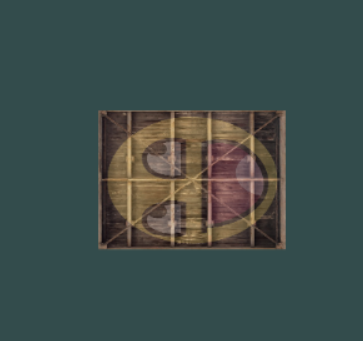

完美！我们的箱子向左侧旋转，并是原来的一半大小，所以变换成功了。我们现在做些更有意思的，看看我们是否可以让箱子随着时间旋转，我们还会重新把箱子放在窗口的右下角。要让箱子随着时间推移旋转，我们必须在游戏循环中更新变换矩阵，因为它在每一次渲染迭代中都要更新。我们使用GLFW的时间函数来获取不同时间的角度：

```c++
glm::mat4 trans = glm::mat4(1.0f);
trans = glm::translate(trans, glm::vec3(0.5f, -0.5f, 0.0f));
trans = glm::rotate(trans, (float)glfwGetTime(), glm::vec3(0.0f, 0.0f, 1.0f));
```

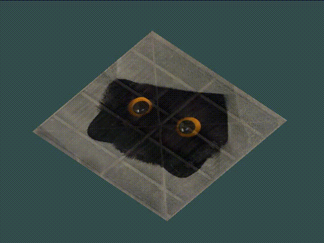

### 练习

- 使用应用在箱子上的最后一个变换，尝试将其改变为先旋转，后位移。看看发生了什么，试着想想为什么会发生这样的事情：[参考解答](https://learnopengl.com/code_viewer.php?code=getting-started/transformations-exercise1)

```c++
glm::mat4 trans = glm::mat4(1.0f);
trans = glm::rotate(trans, (float)glm::radians(36.0f), glm::vec3(0.0f, 0.0f, 1.0f));
trans = glm::translate(trans, glm::vec3(0.5f, 0.0f, 0.0f));
//回答：旋转会修改坐标轴，会让位移的方向发生变化
```

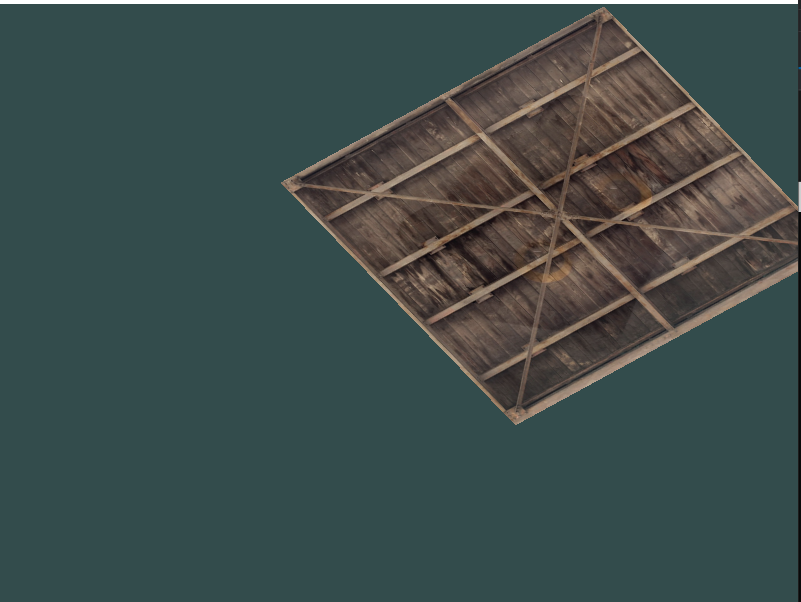


- 尝试再次调用glDrawElements画出第二个箱子，**只**使用变换将其摆放在不同的位置。让这个箱子被摆放在窗口的左上角，并且会不断的缩放（而不是旋转）。（`sin`函数在这里会很有用，不过注意使用`sin`函数时应用负值会导致物体被翻转）：[参考解答](https://learnopengl.com/code_viewer_gh.php?code=src/1.getting_started/5.2.transformations_exercise2/transformations_exercise2.cpp)

```c++
ourShader.use();
//第一个箱子
glm::mat4 trans = glm::mat4(1.0f);
trans = glm::rotate(trans, (float)glfwGetTime(), glm::vec3(0.0f, 0.0f, 1.0f));
unsigned int transformLoc = glGetUniformLocation(ourShader.ID, "transform");
glUniformMatrix4fv(transformLoc, 1, GL_FALSE, glm::value_ptr(trans));
glBindVertexArray(VAO);
glDrawElements(GL_TRIANGLES, 6, GL_UNSIGNED_INT, 0);
//第二个箱子
trans = glm::mat4(1.0f); 
trans = glm::translate(trans, glm::vec3(-0.5f, 0.5f, 0.0f));
float scaleAmount = static_cast<float>(sin(glfwGetTime()))/2 + 0.5f;
trans = glm::scale(trans, glm::vec3(scaleAmount, scaleAmount, scaleAmount));
glUniformMatrix4fv(transformLoc, 1, GL_FALSE, glm::value_ptr(trans));
glDrawElements(GL_TRIANGLES, 6, GL_UNSIGNED_INT, 0);
```

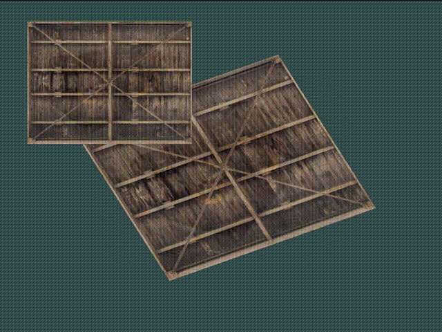

## 坐标系统

OpenGL希望在每次顶点着色器运行后，我们可见的所有顶点都为标准化设备坐标(Normalized Device Coordinate, NDC)。也就是说，每个顶点的**x**，**y**，**z**坐标都应该在**-1.0**到**1.0**之间，超出这个坐标范围的顶点都将不可见。我们通常会自己设定一个坐标的范围，之后再在顶点着色器中将这些坐标变换为标准化设备坐标。然后将这些标准化设备坐标传入光栅器(Rasterizer)，将它们变换为屏幕上的二维坐标或像素。

将坐标变换为标准化设备坐标，接着再转化为屏幕坐标的过程通常是分步进行的，也就是类似于流水线那样子。在流水线中，物体的顶点在最终转化为屏幕坐标之前还会被变换到多个坐标系统(Coordinate System)。将物体的坐标变换到几个**过渡**坐标系(Intermediate Coordinate System)的优点在于，在这些特定的坐标系统中，一些操作或运算更加方便和容易，这一点很快就会变得很明显。对我们来说比较重要的总共有5个不同的坐标系统：

- 局部空间(Local Space，或者称为物体空间(Object Space))
- 世界空间(World Space)
- 观察空间(View Space，或者称为视觉空间(Eye Space))
- 裁剪空间(Clip Space)
- 屏幕空间(Screen Space)

这就是一个顶点在最终被转化为片段之前需要经历的所有不同状态。

### 概述

为了将坐标从一个坐标系变换到另一个坐标系，我们需要用到几个变换矩阵，最重要的几个分别是模型(Model)、观察(View)、投影(Projection)三个矩阵。我们的顶点坐标起始于局部空间(Local Space)，在这里它称为局部坐标(Local Coordinate)，它在之后会变为世界坐标(World Coordinate)，观察坐标(View Coordinate)，裁剪坐标(Clip Coordinate)，并最后以屏幕坐标(Screen Coordinate)的形式结束。下面的这张图展示了整个流程以及各个变换过程做了什么：


1. 局部坐标是对象相对于局部原点的坐标，也是物体起始的坐标。
2. 下一步是将局部坐标变换为世界空间坐标，世界空间坐标是处于一个更大的空间范围的。这些坐标相对于世界的全局原点，它们会和其它物体一起相对于世界的原点进行摆放。
3. 接下来我们将世界坐标变换为观察空间坐标，使得每个坐标都是从摄像机或者说观察者的角度进行观察的。
4. 坐标到达观察空间之后，我们需要将其投影到裁剪坐标。裁剪坐标会被处理至-1.0到1.0的范围内，并判断哪些顶点将会出现在屏幕上。
5. 最后，我们将裁剪坐标变换为屏幕坐标，我们将使用一个叫做视口变换(Viewport Transform)的过程。视口变换将位于-1.0到1.0范围的坐标变换到由glViewport函数所定义的坐标范围内。最后变换出来的坐标将会送到光栅器，将其转化为片段。

### 局部空间

局部空间是指物体所在的坐标空间，即对象最开始所在的地方。想象你在一个建模软件（比如说Blender）中创建了一个立方体。你创建的立方体的原点有可能位于(0, 0, 0)，即便它有可能最后在程序中处于完全不同的位置。甚至有可能你创建的所有模型都以(0, 0, 0)为初始位置（译注：然而它们会最终出现在世界的不同位置）。所以，你的模型的所有顶点都是在**局部**空间中：它们相对于你的物体来说都是局部的。

我们一直使用的那个箱子的顶点是被设定在-0.5到0.5的坐标范围中，(0, 0)是它的原点。这些都是局部坐标。

### 世界空间

如果我们将我们所有的物体导入到程序当中，它们有可能会全挤在世界的原点(0, 0, 0)上，这并不是我们想要的结果。我们想为每一个物体定义一个位置，从而能在更大的世界当中放置它们。世界空间中的坐标正如其名：是指顶点相对于（游戏）世界的坐标。如果你希望将物体分散在世界上摆放（特别是非常真实的那样），这就是你希望物体变换到的空间。物体的坐标将会从局部变换到世界空间；该变换是由模型矩阵(Model Matrix)实现的。

模型矩阵是一种变换矩阵，它能通过对物体进行位移、缩放、旋转来将它置于它本应该在的位置或朝向。你可以将它想像为变换一个房子，你需要先将它缩小（它在局部空间中太大了），并将其位移至郊区的一个小镇，然后在y轴上往左旋转一点以搭配附近的房子。你也可以把上一节将箱子到处摆放在场景中用的那个矩阵大致看作一个模型矩阵；我们将箱子的局部坐标变换到场景/世界中的不同位置。

### 观察空间

观察空间经常被人们称之OpenGL的摄像机(Camera)（所以有时也称为摄像机空间(Camera Space)或视觉空间(Eye Space)）。观察空间是将世界空间坐标转化为用户视野前方的坐标而产生的结果。因此观察空间就是从摄像机的视角所观察到的空间。而这通常是由一系列的位移和旋转的组合来完成，平移/旋转场景从而使得特定的对象被变换到摄像机的前方。这些组合在一起的变换通常存储在一个观察矩阵(View Matrix)里，它被用来将世界坐标变换到观察空间。在下一节中我们将深入讨论如何创建一个这样的观察矩阵来模拟一个摄像机。

### 裁剪空间

在一个顶点着色器运行的最后，OpenGL期望所有的坐标都能落在一个特定的范围内，且任何在这个范围之外的点都应该被裁剪掉(Clipped)。被裁剪掉的坐标就会被忽略，所以剩下的坐标就将变为屏幕上可见的片段。这也就是裁剪空间(Clip Space)名字的由来。

因为将所有可见的坐标都指定在-1.0到1.0的范围内不是很直观，所以我们会指定自己的坐标集(Coordinate Set)并将它变换回标准化设备坐标系，就像OpenGL期望的那样。

为了将顶点坐标从观察变换到裁剪空间，我们需要定义一个投影矩阵(Projection Matrix)，它指定了一个范围的坐标，比如在每个维度上的-1000到1000。投影矩阵接着会将在这个指定的范围内的坐标变换为标准化设备坐标的范围(-1.0, 1.0)。所有在范围外的坐标不会被映射到在-1.0到1.0的范围之间，所以会被裁剪掉。在上面这个投影矩阵所指定的范围内，坐标(1250, 500, 750)将是不可见的，这是由于它的x坐标超出了范围，它被转化为一个大于1.0的标准化设备坐标，所以被裁剪掉了。

> 如果只是图元(Primitive)，例如三角形，的一部分超出了裁剪体积(Clipping Volume)，则OpenGL会重新构建这个三角形为一个或多个三角形让其能够适合这个裁剪范围。组合空间

由投影矩阵创建的**观察箱**(Viewing Box)被称为平截头体(Frustum)，每个出现在平截头体范围内的坐标都会最终出现在用户的屏幕上。将特定范围内的坐标转化到标准化设备坐标系的过程（而且它很容易被映射到2D观察空间坐标）被称之为投影(Projection)，因为使用投影矩阵能将3D坐标投影(Project)到很容易映射到2D的标准化设备坐标系中。

一旦所有顶点被变换到裁剪空间，最终的操作——透视除法(Perspective Division)将会执行，在这个过程中我们将位置向量的x，y，z分量分别除以向量的齐次w分量；透视除法是将4D裁剪空间坐标变换为3D标准化设备坐标的过程。这一步会在每一个顶点着色器运行的最后被自动执行。

在这一阶段之后，最终的坐标将会被映射到屏幕空间中（使用glViewport中的设定），并被变换成片段。

将观察坐标变换为裁剪坐标的投影矩阵可以为两种不同的形式，每种形式都定义了不同的平截头体。我们可以选择创建一个正射投影矩阵(Orthographic Projection Matrix)或一个透视投影矩阵(Perspective Projection Matrix)。

### 组合

我们为上述的每一个步骤都创建了一个变换矩阵：模型矩阵、观察矩阵和投影矩阵。一个顶点坐标将会根据以下过程被变换到裁剪坐标：
$$
V_{clip} = M_{projection} \cdot M_{view} \cdot M_{model} \cdot V_{local}
$$
注意矩阵运算的顺序是相反的（记住我们需要从右往左阅读矩阵的乘法）。最后的顶点应该被赋值到顶点着色器中的gl_Position，OpenGL将会自动进行透视除法和裁剪。

> 顶点着色器的输出要求所有的顶点都在裁剪空间内，这正是我们刚才使用变换矩阵所做的。OpenGL然后对**裁剪坐标**执行**透视除法**从而将它们变换到**标准化设备坐标**。OpenGL会使用glViewPort内部的参数来将标准化设备坐标映射到**屏幕坐标**，每个坐标都关联了一个屏幕上的点（在我们的例子中是一个800x600的屏幕）。这个过程称为视口变换。

### 进入3D

在开始进行3D绘图时，我们首先创建一个模型矩阵。这个模型矩阵包含了位移、缩放与旋转操作，它们会被应用到所有物体的顶点上，以**变换**它们到全局的世界空间。让我们变换一下我们的平面，将其绕着x轴旋转，使它看起来像放在地上一样。这个模型矩阵看起来是这样的：

```c++
glm::mat4 model;
model = glm::rotate(model, glm::radians(-55.0f), glm::vec3(1.0f, 0.0f, 0.0f));
```

通过将顶点坐标乘以这个模型矩阵，我们将该顶点坐标变换到世界坐标。我们的平面看起来就是在地板上，代表全局世界里的平面。

接下来我们需要创建一个观察矩阵。我们想要在场景里面稍微往后移动，以使得物体变成可见的（当在世界空间时，我们位于原点(0,0,0)）。要想在场景里面移动，先仔细想一想下面这个句子：

- 将摄像机向后移动，和将整个场景向前移动是一样的。

这正是观察矩阵所做的，我们以相反于摄像机移动的方向移动整个场景。因为我们想要往后移动，并且OpenGL是一个右手坐标系(Right-handed System)，所以我们需要沿着z轴的正方向移动。我们会通过将场景沿着z轴负方向平移来实现。它会给我们一种我们在往后移动的感觉。

> **右手坐标系(Right-handed System)**
>
> 按照惯例，OpenGL是一个右手坐标系。简单来说，就是正x轴在你的右手边，正y轴朝上，而正z轴是朝向后方的。想象你的屏幕处于三个轴的中心，则正z轴穿过你的屏幕朝向你。坐标系画起来如下：
>
> 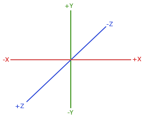
>
> 为了理解为什么被称为右手坐标系，按如下的步骤做：
>
> - 沿着正y轴方向伸出你的右臂，手指着上方。
> - 大拇指指向右方。
> - 食指指向上方。
> - 中指向下弯曲90度。
>
> 如果你的动作正确，那么你的大拇指指向正x轴方向，食指指向正y轴方向，中指指向正z轴方向。如果你用左臂来做这些动作，你会发现z轴的方向是相反的。这个叫做左手坐标系，它被DirectX广泛地使用。注意在标准化设备坐标系中OpenGL实际上使用的是左手坐标系（投影矩阵交换了左右手）。

在下一个教程中我们将会详细讨论如何在场景中移动。就目前来说，观察矩阵是这样的：

```c++
glm::mat4 view;
// 注意，我们将矩阵向我们要进行移动场景的反方向移动。
view = glm::translate(view, glm::vec3(0.0f, 0.0f, -3.0f));
```

最后我们需要做的是定义一个投影矩阵。我们希望在场景中使用透视投影，所以像这样声明一个投影矩阵：

```c++
glm::mat4 projection;
projection = glm::perspective(glm::radians(45.0f), screenWidth / screenHeight, 0.1f, 100.0f);
```

既然我们已经创建了变换矩阵，我们应该将它们传入着色器。首先，让我们在顶点着色器中声明一个uniform变换矩阵然后将它乘以顶点坐标：

```c++
#version 330 core
layout (location = 0) in vec3 aPos;
...
uniform mat4 model;
uniform mat4 view;
uniform mat4 projection;

void main()
{
    // 注意乘法要从右向左读
    gl_Position = projection * view * model * vec4(aPos, 1.0);
    ...
}
```

我们还应该将矩阵传入着色器（这通常在每次的渲染迭代中进行，因为变换矩阵会经常变动）：

```c++
int modelLoc = glGetUniformLocation(ourShader.ID, "model"));
glUniformMatrix4fv(modelLoc, 1, GL_FALSE, glm::value_ptr(model));
... // 观察矩阵和投影矩阵与之类似
```

我们的顶点坐标已经使用模型、观察和投影矩阵进行变换了，最终的物体应该会：

- 稍微向后倾斜至地板方向。
- 离我们有一些距离。
- 有透视效果（顶点越远，变得越小）。

### Z缓冲

OpenGL存储它的所有深度信息于一个Z缓冲(Z-buffer)中，也被称为深度缓冲(Depth Buffer)。GLFW会自动为你生成这样一个缓冲（就像它也有一个颜色缓冲来存储输出图像的颜色）。深度值存储在每个片段里面（作为片段的**z**值），当片段想要输出它的颜色时，OpenGL会将它的深度值和z缓冲进行比较，如果当前的片段在其它片段之后，它将会被丢弃，否则将会覆盖。这个过程称为深度测试(Depth Testing)，它是由OpenGL自动完成的。

然而，如果我们想要确定OpenGL真的执行了深度测试，首先我们要告诉OpenGL我们想要启用深度测试；它默认是关闭的。我们可以通过glEnable函数来开启深度测试。glEnable和glDisable函数允许我们启用或禁用某个OpenGL功能。这个功能会一直保持启用/禁用状态，直到另一个调用来禁用/启用它。现在我们想启用深度测试，需要开启GL_DEPTH_TEST：

```c++
glEnable(GL_DEPTH_TEST);
```

因为我们使用了深度测试，我们也想要在每次渲染迭代之前清除深度缓冲（否则前一帧的深度信息仍然保存在缓冲中）。就像清除颜色缓冲一样，我们可以通过在glClear函数中指定DEPTH_BUFFER_BIT位来清除深度缓冲：

```c++
glClear(GL_COLOR_BUFFER_BIT | GL_DEPTH_BUFFER_BIT);
```

### 练习

- 对GLM的`projection`函数中的`FoV`和`aspect-ratio`参数进行实验。看能否搞懂它们是如何影响透视平截头体的。
- 将观察矩阵在各个方向上进行位移，来看看场景是如何改变的。注意把观察矩阵当成摄像机对象。

- 使用模型矩阵只让是3倍数的箱子旋转（以及第1个箱子），而让剩下的箱子保持静止。[参考解答](https://learnopengl.com/code_viewer.php?code=getting-started/coordinate_systems-exercise3)。

```c++
glBindVertexArray(VAO);
for (unsigned int i = 0; i < 10; i++)
{
    glm::mat4 model = glm::mat4(1.0f);
    model = glm::translate(model, cubePositions[i]);
    float angle = 20.0f * i;
    if(i%3==0)
        angle = glfwGetTime()*25.0f;
    model = glm::rotate(model, glm::radians(angle), glm::vec3(1.0f, 0.3f, 0.5f));
    ourShader.setMat4("model",  model);

    glDrawArrays(GL_TRIANGLES, 0, 36);
}
```

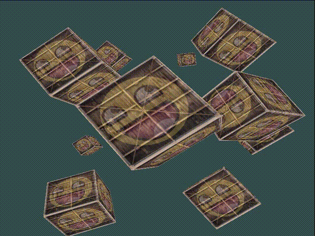

## 摄像机

OpenGL本身没有**摄像机**(Camera)的概念，但我们可以通过把场景中的所有物体往相反方向移动的方式来模拟出摄像机，产生一种**我们**在移动的感觉，而不是场景在移动。

### 摄像机/观察空间

当我们讨论摄像机/观察空间(Camera/View Space)的时候，是在讨论以摄像机的视角作为场景原点时场景中所有的顶点坐标：观察矩阵把所有的世界坐标变换为相对于摄像机位置与方向的观察坐标。要定义一个摄像机，我们需要它在世界空间中的位置、观察的方向、一个指向它右测的向量以及一个指向它上方的向量。细心的读者可能已经注意到我们实际上创建了一个三个单位轴相互垂直的、以摄像机的位置为原点的坐标系。


#### 1. 摄像机位置

获取摄像机位置很简单。摄像机位置简单来说就是世界空间中一个指向摄像机位置的向量。我们把摄像机位置设置为上一节中的那个相同的位置：

> 不要忘记正z轴是从屏幕指向你的，如果我们希望摄像机向后移动，我们就沿着z轴的正方向移动。

#### 2. 摄像机方向

下一个需要的向量是摄像机的方向，这里指的是摄像机指向哪个方向。现在我们让摄像机指向场景原点：(0, 0, 0)。还记得如果将两个矢量相减，我们就能得到这两个矢量的差吗？用场景原点向量减去摄像机位置向量的结果就是摄像机的指向向量。由于我们知道摄像机指向z轴负方向，但我们希望方向向量(Direction Vector)指向摄像机的z轴正方向。如果我们交换相减的顺序，我们就会获得一个指向摄像机正z轴方向的向量：

> **方向**向量(Direction Vector)并不是最好的名字，因为它实际上指向从它到目标向量的相反方向（译注：注意看前面的那个图，蓝色的方向向量大概指向z轴的正方向，与摄像机实际指向的方向是正好相反的）。

#### 3. 右轴

我们需要的另一个向量是一个**右向量**(Right Vector)，它代表摄像机空间的x轴的正方向。为获取右向量我们需要先使用一个小技巧：先定义一个**上向量**(Up Vector)。接下来把上向量和第二步得到的方向向量进行叉乘。两个向量叉乘的结果会同时垂直于两向量，因此我们会得到指向x轴正方向的那个向量（如果我们交换两个向量叉乘的顺序就会得到相反的指向x轴负方向的向量）：

#### 4. 上轴

现在我们已经有了x轴向量和z轴向量，获取一个指向摄像机的正y轴向量就相对简单了：我们把右向量和方向向量进行叉乘：

```c++
//摄像机位置
glm::vec3 cameraPos = glm::vec3(0.0f, 0.0f, 3.0f);
//摄像机方向
glm::vec3 cameraTarget = glm::vec3(0.0f, 0.0f, 0.0f); //朝向原点
glm::vec3 cameraDirection = glm::normalize(cameraPos - cameraTarget);
//摄像机右轴R
glm::vec3 up = glm::vec3(0.0f, 1.0f, 0.0f); 
glm::vec3 cameraRight = glm::normalize(glm::cross(up, cameraDirection));
//摄像机上轴
glm::vec3 cameraUp = glm::cross(cameraDirection, cameraRight);
```

### Look At

使用矩阵的好处之一是如果你使用3个相互垂直（或非线性）的轴定义了一个坐标空间，你可以用这3个轴外加一个平移向量来创建一个矩阵，并且你可以用这个矩阵乘以任何向量来将其变换到那个坐标空间。这正是**LookAt**矩阵所做的，现在我们有了3个相互垂直的轴和一个定义摄像机空间的位置坐标，我们可以创建我们自己的LookAt矩阵了：
$$
LookAt = \begin{bmatrix} \color{red}{R_x} & \color{red}{R_y} & \color{red}{R_z} & 0 \\ \color{green}{U_x} & \color{green}{U_y} & \color{green}{U_z} & 0 \\ \color{blue}{D_x} & \color{blue}{D_y} & \color{blue}{D_z} & 0 \\ 0 & 0 & 0  & 1 \end{bmatrix} * \begin{bmatrix} 1 & 0 & 0 & -\color{purple}{P_x} \\ 0 & 1 & 0 & -\color{purple}{P_y} \\ 0 & 0 & 1 & -\color{purple}{P_z} \\ 0 & 0 & 0  & 1 \end{bmatrix}
$$
其中$\color{red}R$$是右向量，$$\color{green}U$$是是上向量，$$\color{blue}D$$是是方向向量，$$\color{purple}P$是是摄像机位置向量。注意，位置向量是相反的，因为我们最终希望把世界平移到与我们自身移动的相反方向。把这个LookAt矩阵作为观察矩阵可以很高效地把所有世界坐标变换到刚刚定义的观察空间。LookAt矩阵就像它的名字表达的那样：它会创建一个看着(Look at)给定目标的观察矩阵。

幸运的是，GLM已经提供了这些支持。我们要做的只是定义一个摄像机位置，一个目标位置和一个表示世界空间中的上向量的向量（我们计算右向量使用的那个上向量）。接着GLM就会创建一个LookAt矩阵，我们可以把它当作我们的观察矩阵：

```c++
glm::mat4 view = glm::mat4(1.0f);
view = glm::lookAt(glm::vec3(0.0f, 0.0f, 3.0f), 
           glm::vec3(0.0f, 0.0f, 0.0f), 
           glm::vec3(0.0f, 1.0f, 0.0f));
```

###  自由移动

设置几个和摄像机有关的变量

```c++
glm::vec3 cameraPos   = glm::vec3(0.0f, 0.0f,  3.0f);
glm::vec3 cameraFront = glm::vec3(0.0f, 0.0f, -1.0f);
glm::vec3 cameraUp    = glm::vec3(0.0f, 1.0f,  0.0f);
```

这个时候LookAt函数变为了

```c++
view = glm::lookAt(cameraPos, cameraPos + cameraFront, cameraUp);
```

设置相机的位置为Pos，方向为摄像机的位置加上之前的方向向量(其实刚好相反)，这样可以保证无论是在各种时候都能保持和目标方向的不变。之前已经有了按键按下的函数，现在在函数中增加几个案件命令。

```c++
void processInput(GLFWwindow *window)
{
    ...
    float cameraSpeed = 0.05f; // adjust accordingly
    if (glfwGetKey(window, GLFW_KEY_W) == GLFW_PRESS)
        cameraPos += cameraSpeed * cameraFront;
    if (glfwGetKey(window, GLFW_KEY_S) == GLFW_PRESS)
        cameraPos -= cameraSpeed * cameraFront;
    if (glfwGetKey(window, GLFW_KEY_A) == GLFW_PRESS)
        cameraPos -= glm::normalize(glm::cross(cameraFront, cameraUp)) * cameraSpeed;
    if (glfwGetKey(window, GLFW_KEY_D) == GLFW_PRESS)
        cameraPos += glm::normalize(glm::cross(cameraFront, cameraUp)) * cameraSpeed;
}
```

当我们按下**WASD**键的任意一个，摄像机的位置都会相应更新。如果我们希望向前或向后移动，我们就把位置向量加上或减去方向向量。如果我们希望向左右移动，我们使用叉乘来创建一个**右向量**(Right Vector)，并沿着它相应移动就可以了。这样就创建了使用摄像机时熟悉的横移(Strafe)效果。

> 注意，我们对**右向量**进行了标准化。如果我们没对这个向量进行标准化，最后的叉乘结果会根据cameraFront变量返回大小不同的向量。如果我们不对向量进行标准化，我们就得根据摄像机的朝向不同加速或减速移动了，但如果进行了标准化移动就是匀速的。

#### 移动速度

之前可以控制移动的方向，现在来调整移动的速度(cameraSpeed)。

目前我们的移动速度是个常量。理论上没什么问题，但是实际情况下根据处理器的能力不同，有些人可能会比其他人每秒绘制更多帧，也就是以更高的频率调用processInput函数。结果就是，根据配置的不同，有些人可能移动很快，而有些人会移动很慢。当你发布你的程序的时候，你必须确保它在所有硬件上移动速度都一样。

图形程序和游戏通常会跟踪一个时间差(Deltatime)变量，它储存了渲染上一帧所用的时间。我们把所有速度都去乘以deltaTime值。结果就是，如果我们的deltaTime很大，就意味着上一帧的渲染花费了更多时间，所以这一帧的速度需要变得更高来平衡渲染所花去的时间。使用这种方法时，无论你的电脑快还是慢，摄像机的速度都会相应平衡，这样每个用户的体验就都一样了。

我们跟踪两个**全局变量**来计算出deltaTime值：

```c++
float deltaTime = 0.0f; // 当前帧与上一帧的时间差 
float lastFrame = 0.0f; // 上一帧的时间
```

在每一帧我们计算出对应的Deltatime备用。

```c++
float currentFrame = glfwGetTime();
deltaTime = currentFrame - lastFrame;
lastFrame = currentFrame;
```

现在我们有了deltaTime，在计算速度的时候可以将其考虑进去了：

```c++
void processInput(GLFWwindow *window)
{
  float cameraSpeed = 2.5f * deltaTime;
  ...
}
```

#### 视角移动

只用键盘移动没什么意思。特别是我们还不能转向，移动很受限制。是时候加入鼠标了！

为了能够改变视角，我们需要根据鼠标的输入改变cameraFront向量。然而，根据鼠标移动改变方向向量有点复杂，需要一些三角学知识。如果你对三角学知之甚少，别担心，你可以跳过这一部分，直接复制粘贴我们的代码；当你想了解更多的时候再回来看。

##### 欧拉角

欧拉角(Euler Angle)是可以表示3D空间中任何旋转的3个值，由莱昂哈德·欧拉(Leonhard Euler)在18世纪提出。一共有3种欧拉角：俯仰角(Pitch)、偏航角(Yaw)和滚转角(Roll)，下面的图片展示了它们的含义：


俯仰角是描述我们如何往上或往下看的角，可以在第一张图中看到。第二张图展示了偏航角，偏航角表示我们往左和往右看的程度。滚转角代表我们如何**翻滚**摄像机，通常在太空飞船的摄像机中使用。每个欧拉角都有一个值来表示，把三个角结合起来我们就能够计算3D空间中任何的旋转向量了。

对于我们的摄像机系统来说，我们只关心俯仰角和偏航角，所以我们不会讨论滚转角。给定一个俯仰角和偏航角，我们可以把它们转换为一个代表新的方向向量的3D向量。俯仰角和偏航角转换为方向向量的处理需要一些三角学知识，我们先从最基本的情况开始：


如果我们把斜边边长定义为1，我们就能知道邻边的长度是$$\cos \ \color{red}x/\color{purple}h = \cos \ \color{red}x/\color{purple}1 = \cos\ \color{red}x$$，它的对边是$$\sin \ \color{green}y/\color{purple}h = \sin \ \color{green}y/\color{purple}1 = \sin\ \color{green}y。$$这样我们获得了能够得到x和y方向长度的通用公式，它们取决于所给的角度。我们使用它来计算方向向量的分量：


这个三角形看起来和前面的三角形很像，所以如果我们想象自己在xz平面上，看向y轴，我们可以基于第一个三角形计算来计算它的长度/y方向的强度(Strength)（我们往上或往下看多少）。从图中我们可以看到对于一个给定俯仰角的y值等于sin θsin⁡ �：

```c++
direction.y = sin(glm::radians(pitch)); // 注意我们先把角度转为弧度
```

这里我们只更新了y值，仔细观察x和z分量也被影响了。从三角形中我们可以看到它们的值等于：

```c++
direction.x = cos(glm::radians(pitch));
direction.z = cos(glm::radians(pitch));
```

看看我们是否能够为偏航角找到需要的分量：


就像俯仰角的三角形一样，我们可以看到x分量取决于`cos(yaw)`的值，z值同样取决于偏航角的正弦值。把这个加到前面的值中，会得到基于俯仰角和偏航角的方向向量：

```c++
direction.x = cos(glm::radians(pitch)) * cos(glm::radians(yaw)); // 译注：direction代表摄像机的前轴(Front)，这个前轴是和本文第一幅图片的第二个摄像机的方向向量是相反的
direction.y = sin(glm::radians(pitch));
direction.z = cos(glm::radians(pitch)) * sin(glm::radians(yaw));
```

这样我们就有了一个可以把俯仰角和偏航角转化为用来自由旋转视角的摄像机的3维方向向量了。你可能会奇怪：我们怎么得到俯仰角和偏航角？

##### 鼠标输入

偏航角和俯仰角是通过鼠标（或手柄）移动获得的，水平的移动影响偏航角，竖直的移动影响俯仰角。它的原理就是，储存上一帧鼠标的位置，在当前帧中我们当前计算鼠标位置与上一帧的位置相差多少。如果水平/竖直差别越大那么俯仰角或偏航角就改变越大，也就是摄像机需要移动更多的距离。

首先我们要告诉GLFW，它应该隐藏光标，并捕捉(Capture)它。捕捉光标表示的是，如果焦点在你的程序上（译注：即表示你正在操作这个程序，Windows中拥有焦点的程序标题栏通常是有颜色的那个，而失去焦点的程序标题栏则是灰色的），光标应该停留在窗口中（除非程序失去焦点或者退出）。我们可以用一个简单地配置调用来完成：

```c++
glfwSetInputMode(window, GLFW_CURSOR, GLFW_CURSOR_DISABLED);
```

在调用这个函数之后，无论我们怎么去移动鼠标，光标都不会显示了，它也不会离开窗口。对于FPS摄像机系统来说非常完美。

为了计算俯仰角和偏航角，我们需要让GLFW监听鼠标移动事件。（和键盘输入相似）我们会用一个回调函数来完成，函数的原型如下：

```c++
void mouse_callback(GLFWwindow* window, double xpos, double ypos);
```

这里的xpos和ypos代表当前鼠标的位置。当我们用GLFW注册了回调函数之后，鼠标一移动mouse_callback函数就会被调用：

```c++
glfwSetCursorPosCallback(window, mouse_callback);
```

在处理FPS风格摄像机的鼠标输入的时候，我们必须在最终获取方向向量之前做下面这几步：

1. 计算鼠标距上一帧的偏移量。
2. 把偏移量添加到摄像机的俯仰角和偏航角中。
3. 对偏航角和俯仰角进行最大和最小值的限制。
4. 计算方向向量。

第一步是计算鼠标自上一帧的偏移量。我们必须先在程序中储存上一帧的鼠标位置，我们把它的初始值设置为屏幕的中心（屏幕的尺寸是800x600）：

```c++
float lastX = 400, lastY = 300;
```

然后在鼠标的回调函数中我们计算当前帧和上一帧鼠标位置的偏移量：

```c++
float xoffset = xpos - lastX;
float yoffset = lastY - ypos; // 注意这里是相反的，因为y坐标是从底部往顶部依次增大的
lastX = xpos;
lastY = ypos;

float sensitivity = 0.05f;
xoffset *= sensitivity;
yoffset *= sensitivity;
```

注意我们把偏移量乘以了sensitivity（灵敏度）值。如果我们忽略这个值，鼠标移动就会太大了；你可以自己实验一下，找到适合自己的灵敏度值。

接下来我们把偏移量加到全局变量pitch和yaw上：

```c++
yaw   += xoffset;
pitch += yoffset;
```

第三步，我们需要给摄像机添加一些限制，这样摄像机就不会发生奇怪的移动了（这样也会避免一些奇怪的问题）。对于俯仰角，要让用户不能看向高于89度的地方（在90度时视角会发生逆转，所以我们把89度作为极限），同样也不允许小于-89度。这样能够保证用户只能看到天空或脚下，但是不能超越这个限制。我们可以在值超过限制的时候将其改为极限值来实现：

```c++
if(pitch > 89.0f)
  pitch =  89.0f;
if(pitch < -89.0f)
  pitch = -89.0f;
```

注意我们没有给偏航角设置限制，这是因为我们不希望限制用户的水平旋转。当然，给偏航角设置限制也很容易，如果你愿意可以自己实现。

第四也是最后一步，就是通过俯仰角和偏航角来计算以得到真正的方向向量：

```c++
glm::vec3 front;
front.x = cos(glm::radians(pitch)) * cos(glm::radians(yaw));
front.y = sin(glm::radians(pitch));
front.z = cos(glm::radians(pitch)) * sin(glm::radians(yaw));
cameraFront = glm::normalize(front);
```

计算出来的方向向量就会包含根据鼠标移动计算出来的所有旋转了。由于cameraFront向量已经包含在GLM的lookAt函数中，我们这就没什么问题了。

如果你现在运行代码，你会发现在窗口第一次获取焦点的时候摄像机会突然跳一下。这个问题产生的原因是，在你的鼠标移动进窗口的那一刻，鼠标回调函数就会被调用，这时候的xpos和ypos会等于鼠标刚刚进入屏幕的那个位置。这通常是一个距离屏幕中心很远的地方，因而产生一个很大的偏移量，所以就会跳了。我们可以简单的使用一个`bool`变量检验我们是否是第一次获取鼠标输入，如果是，那么我们先把鼠标的初始位置更新为xpos和ypos值，这样就能解决这个问题；接下来的鼠标移动就会使用刚进入的鼠标位置坐标来计算偏移量了：

```c++
if(firstMouse) // 这个bool变量初始时是设定为true的
{
    lastX = xpos;
    lastY = ypos;
    firstMouse = false;
}
```

最后的代码应该是这样的：

```c++
void mouse_callback(GLFWwindow* window, double xpos, double ypos)
{
    if(firstMouse)
    {
        lastX = xpos;
        lastY = ypos;
        firstMouse = false;
    }

    float xoffset = xpos - lastX;
    float yoffset = lastY - ypos; 
    lastX = xpos;
    lastY = ypos;

    float sensitivity = 0.05;
    xoffset *= sensitivity;
    yoffset *= sensitivity;

    yaw   += xoffset;
    pitch += yoffset;

    if(pitch > 89.0f)
        pitch = 89.0f;
    if(pitch < -89.0f)
        pitch = -89.0f;

    glm::vec3 front;
    front.x = cos(glm::radians(yaw)) * cos(glm::radians(pitch));
    front.y = sin(glm::radians(pitch));
    front.z = sin(glm::radians(yaw)) * cos(glm::radians(pitch));
    cameraFront = glm::normalize(front);
}
```

现在我们就可以自由地在3D场景中移动了！

##### 缩放

作为我们摄像机系统的一个附加内容，我们还会来实现一个缩放(Zoom)接口。在之前的教程中我们说**视野**(Field of View)或**fov**定义了我们可以看到场景中多大的范围。当视野变小时，场景投影出来的空间就会减小，产生放大(Zoom In)了的感觉。我们会使用鼠标的滚轮来放大。与鼠标移动、键盘输入一样，我们需要一个鼠标滚轮的回调函数：

```c++
void scroll_callback(GLFWwindow* window, double xoffset, double yoffset)
{
  if(fov >= 1.0f && fov <= 45.0f)
    fov -= yoffset;
  if(fov <= 1.0f)
    fov = 1.0f;
  if(fov >= 45.0f)
    fov = 45.0f;
}
```

当滚动鼠标滚轮的时候，yoffset值代表我们竖直滚动的大小。当scroll_callback函数被调用后，我们改变全局变量fov变量的内容。因为`45.0f`是默认的视野值，我们将会把缩放级别(Zoom Level)限制在`1.0f`到`45.0f`。

我们现在在每一帧都必须把透视投影矩阵上传到GPU，但现在使用fov变量作为它的视野：

```c++
projection = glm::perspective(glm::radians(fov), 800.0f / 600.0f, 0.1f, 100.0f);
```

最后不要忘记注册鼠标滚轮的回调函数：

```c++
glfwSetScrollCallback(window, scroll_callback);
```

现在，我们就实现了一个简单的摄像机系统了，它能够让我们在3D环境中自由移动。


#### 摄像机类

封装制作一个摄像机类

### 练习

- 看看你是否能够修改摄像机类，使得其能够变成一个**真正的**FPS摄像机（也就是说不能够随意飞行）；你只能够呆在xz平面上：[参考解答](https://learnopengl.com/code_viewer.php?code=getting-started/camera-exercise1)

```c++
void ProcessKeyboard(Camera_Movement direction, float deltaTime)
    {
        float velocity = MovementSpeed * deltaTime;
        if (direction == FORWARD)
            Position += Front * velocity;
        if (direction == BACKWARD)
            Position -= Front * velocity;
        if (direction == LEFT)
            Position -= Right * velocity;
        if (direction == RIGHT)
            Position += Right * velocity;
        Position.y = 0.0f;
    }
```


- 试着创建你自己的LookAt函数，其中你需要手动创建一个我们在一开始讨论的观察矩阵。用你的函数实现来替换GLM的LookAt函数，看看它是否还能一样地工作：[参考解答](https://learnopengl.com/code_viewer.php?code=getting-started/camera-exercise2)

## 复习

#### 词汇表

- **OpenGL**： 一个定义了函数布局和输出的图形API的正式规范。
- **GLAD**： 一个拓展加载库，用来为我们加载并设定所有OpenGL函数指针，从而让我们能够使用所有（现代）OpenGL函数。
- **视口(Viewport)**： 我们需要渲染的窗口。
- **图形管线(Graphics Pipeline)**： 一个顶点在呈现为像素之前经过的全部过程。
- **着色器(Shader)**： 一个运行在显卡上的小型程序。很多阶段的图形管道都可以使用自定义的着色器来代替原有的功能。
- **标准化设备坐标(Normalized Device Coordinates, NDC)**： 顶点在通过在剪裁坐标系中剪裁与透视除法后最终呈现在的坐标系。所有位置在NDC下-1.0到1.0的顶点将不会被丢弃并且可见。
- **顶点缓冲对象(Vertex Buffer Object)**： 一个调用显存并存储所有顶点数据供显卡使用的缓冲对象。
- **顶点数组对象(Vertex Array Object)**： 存储缓冲区和顶点属性状态。
- **索引缓冲对象(Element Buffer Object)**： 一个存储索引供索引化绘制使用的缓冲对象。
- **Uniform**： 一个特殊类型的GLSL变量。它是全局的（在一个着色器程序中每一个着色器都能够访问uniform变量），并且只需要被设定一次。
- **纹理(Texture)**： 一种包裹着物体的特殊类型图像，给物体精细的视觉效果。
- **纹理缠绕(Texture Wrapping)**： 定义了一种当纹理顶点超出范围(0, 1)时指定OpenGL如何采样纹理的模式。
- **纹理过滤(Texture Filtering)**： 定义了一种当有多种纹素选择时指定OpenGL如何采样纹理的模式。这通常在纹理被放大情况下发生。
- **多级渐远纹理(Mipmaps)**： 被存储的材质的一些缩小版本，根据距观察者的距离会使用材质的合适大小。
- **stb_image.h**： 图像加载库。
- **纹理单元(Texture Units)**： 通过绑定纹理到不同纹理单元从而允许多个纹理在同一对象上渲染。
- **向量(Vector)**： 一个定义了在空间中方向和/或位置的数学实体。
- **矩阵(Matrix)**： 一个矩形阵列的数学表达式。
- **GLM**： 一个为OpenGL打造的数学库。
- **局部空间(Local Space)**： 一个物体的初始空间。所有的坐标都是相对于物体的原点的。
- **世界空间(World Space)**： 所有的坐标都相对于全局原点。
- **观察空间(View Space)**： 所有的坐标都是从摄像机的视角观察的。
- **裁剪空间(Clip Space)**： 所有的坐标都是从摄像机视角观察的，但是该空间应用了投影。这个空间应该是一个顶点坐标最终的空间，作为顶点着色器的输出。OpenGL负责处理剩下的事情（裁剪/透视除法）。
- **屏幕空间(Screen Space)**： 所有的坐标都由屏幕视角来观察。坐标的范围是从0到屏幕的宽/高。
- **LookAt矩阵**： 一种特殊类型的观察矩阵，它创建了一个坐标系，其中所有坐标都根据从一个位置正在观察目标的用户旋转或者平移。
- **欧拉角(Euler Angles)**： 被定义为偏航角(Yaw)，俯仰角(Pitch)，和滚转角(Roll)从而允许我们通过这三个值构造任何3D方向。

# 光照章

## 颜色

### 创建光照场景

在接下来的教程中，我们将会广泛地使用颜色来模拟现实世界中的光照效果，创造出一些有趣的视觉效果。由于我们现在将会使用光源了，我们希望将它们显示为可见的物体，并在场景中至少加入一个物体来测试模拟光照的效果。

首先我们需要一个物体来作为被投光(Cast the light)的对象，我们将使用前面教程中的那个著名的立方体箱子。我们还需要一个物体来代表光源在3D场景中的位置。简单起见，我们依然使用一个立方体来代表光源（我们已拥有立方体的[顶点数据](https://learnopengl.com/code_viewer.php?code=getting-started/cube_vertices)是吧？）。

填一个顶点缓冲对象(VBO)，设定一下顶点属性指针和其它一些乱七八糟的东西现在对你来说应该很容易了，所以我们就不再赘述那些步骤了。如果你仍然觉得这很困难，我建议你复习[之前的教程](https://learnopengl-cn.gitee.io/01 Getting started/04 Hello Triangle/)，并且在继续学习之前先把练习过一遍。

我们首先需要一个顶点着色器来绘制箱子。与之前的顶点着色器相比，容器的顶点位置是保持不变的（虽然这一次我们不需要纹理坐标了），因此顶点着色器中没有新的代码。我们将会使用之前教程顶点着色器的精简版：

```c++
#version 330 core
layout (location = 0) in vec3 aPos;

uniform mat4 model;
uniform mat4 view;
uniform mat4 projection;

void main()
{
    gl_Position = projection * view * model * vec4(aPos, 1.0);
}
```

记得更新你的顶点数据和属性指针使其与新的顶点着色器保持一致（当然你可以继续留着纹理数据和属性指针。在这一节中我们将不会用到它们，但有一个全新的开始也不是什么坏主意）。

因为我们还要创建一个表示灯（光源）的立方体，所以我们还要为这个灯创建一个专门的VAO。当然我们也可以让这个灯和其它物体使用同一个VAO，简单地对它的model（模型）矩阵做一些变换就好了，然而接下来的教程中我们会频繁地对顶点数据和属性指针做出修改，我们并不想让这些修改影响到灯（我们只关心灯的顶点位置），因此我们有必要为灯创建一个新的VAO。

```c++
unsigned int lightVAO;
glGenVertexArrays(1, &lightVAO);
glBindVertexArray(lightVAO);
// 只需要绑定VBO不用再次设置VBO的数据，因为箱子的VBO数据中已经包含了正确的立方体顶点数据
glBindBuffer(GL_ARRAY_BUFFER, VBO);
// 设置灯立方体的顶点属性（对我们的灯来说仅仅只有位置数据）
glVertexAttribPointer(0, 3, GL_FLOAT, GL_FALSE, 3 * sizeof(float), (void*)0);
glEnableVertexAttribArray(0);
```

这段代码对你来说应该非常直观。现在我们已经创建了表示灯和被照物体箱子，我们只需要再定义一个片段着色器就行了：

```c++
#version 330 core
out vec4 FragColor;

uniform vec3 objectColor;
uniform vec3 lightColor;

void main()
{
    FragColor = vec4(lightColor * objectColor, 1.0);
}
```

这个片段着色器从uniform变量中接受物体的颜色和光源的颜色。正如本节一开始所讨论的那样，我们将光源的颜色和物体（反射的）颜色相乘。这个着色器理解起来应该很容易。我们把物体的颜色设置为之前提到的珊瑚红色，并把光源设置为白色。

```c++
// 在此之前不要忘记首先 use 对应的着色器程序（来设定uniform）
lightingShader.use();
lightingShader.setVec3("objectColor", 1.0f, 0.5f, 0.31f);
lightingShader.setVec3("lightColor",  1.0f, 1.0f, 1.0f);
```

要注意的是，当我们修改顶点或者片段着色器后，灯的位置或颜色也会随之改变，这并不是我们想要的效果。我们不希望灯的颜色在接下来的教程中因光照计算的结果而受到影响，而是希望它能够与其它的计算分离。我们希望灯一直保持明亮，不受其它颜色变化的影响（这样它才更像是一个真实的光源）。

为了实现这个目标，我们需要为灯的绘制创建另外的一套着色器，从而能保证它能够在其它光照着色器发生改变的时候不受影响。顶点着色器与我们当前的顶点着色器是一样的，所以你可以直接把现在的顶点着色器用在灯上。灯的片段着色器给灯定义了一个不变的常量白色，保证了灯的颜色一直是亮的：

```c++
#version 330 core
out vec4 FragColor;

void main()
{
    FragColor = vec4(1.0); // 将向量的四个分量全部设置为1.0
}
```

当我们想要绘制我们的物体的时候，我们需要使用刚刚定义的光照着色器来绘制箱子（或者可能是其它的物体）。当我们想要绘制灯的时候，我们会使用灯的着色器。在之后的教程里我们会逐步更新这个光照着色器，从而能够慢慢地实现更真实的效果。

使用这个灯立方体的主要目的是为了让我们知道光源在场景中的具体位置。我们通常在场景中定义一个光源的位置，但这只是一个位置，它并没有视觉意义。为了显示真正的灯，我们将表示光源的立方体绘制在与光源相同的位置。我们将使用我们为它新建的片段着色器来绘制它，让它一直处于白色的状态，不受场景中的光照影响。

我们声明一个全局`vec3`变量来表示光源在场景的世界空间坐标中的位置：

```c++
glm::vec3 lightPos(1.2f, 1.0f, 2.0f);
```

然后我们把灯位移到这里，然后将它缩小一点，让它不那么明显：

```c++
model = glm::mat4();
model = glm::translate(model, lightPos);
model = glm::scale(model, glm::vec3(0.2f));
```

绘制灯立方体的代码应该与下面的类似：

```c++
lampShader.use();
// 设置模型、视图和投影矩阵uniform
...
// 绘制灯立方体对象
glBindVertexArray(lightVAO);
glDrawArrays(GL_TRIANGLES, 0, 36);
```


## 基础光照

现实世界的光照是极其复杂的，而且会受到诸多因素的影响，这是我们有限的计算能力所无法模拟的。因此OpenGL的光照使用的是简化的模型，对现实的情况进行近似，这样处理起来会更容易一些，而且看起来也差不多一样。这些光照模型都是基于我们对光的物理特性的理解。其中一个模型被称为冯氏光照模型(Phong Lighting Model)。冯氏光照模型的主要结构由3个分量组成：环境(Ambient)、漫反射(Diffuse)和镜面(Specular)光照。下面这张图展示了这些光照分量看起来的样子：


- 环境光照(Ambient Lighting)：即使在黑暗的情况下，世界上通常也仍然有一些光亮（月亮、远处的光），所以物体几乎永远不会是完全黑暗的。为了模拟这个，我们会使用一个环境光照常量，它永远会给物体一些颜色。
- 漫反射光照(Diffuse Lighting)：模拟光源对物体的方向性影响(Directional Impact)。它是冯氏光照模型中视觉上最显著的分量。物体的某一部分越是正对着光源，它就会越亮。
- 镜面光照(Specular Lighting)：模拟有光泽物体上面出现的亮点。镜面光照的颜色相比于物体的颜色会更倾向于光的颜色。

为了创建有趣的视觉场景，我们希望模拟至少这三种光照分量。我们将以最简单的一个开始：**环境光照**。

### 环境光照

光通常都不是来自于同一个光源，而是来自于我们周围分散的很多光源，即使它们可能并不是那么显而易见。光的一个属性是，它可以向很多方向发散并反弹，从而能够到达不是非常直接临近的点。所以，光能够在其它的表面上**反射**，对一个物体产生间接的影响。考虑到这种情况的算法叫做全局照明(Global Illumination)算法，但是这种算法既开销高昂又极其复杂。

由于我们现在对那种又复杂又开销高昂的算法不是很感兴趣，所以我们将会先使用一个简化的全局照明模型，即环境光照。正如你在上一节所学到的，我们使用一个很小的常量（光照）颜色，添加到物体片段的最终颜色中，这样子的话即便场景中没有直接的光源也能看起来存在有一些发散的光。

把环境光照添加到场景里非常简单。我们用光的颜色乘以一个很小的常量环境因子，再乘以物体的颜色，然后将最终结果作为片段的颜色：

```
void main()
{
    float ambientStrength = 0.1;
    vec3 ambient = ambientStrength * lightColor;

    vec3 result = ambient * objectColor;
    FragColor = vec4(result, 1.0);
}
```

如果你现在运行你的程序，你会注意到冯氏光照的第一个阶段已经应用到你的物体上了。这个物体非常暗，但由于应用了环境光照（注意光源立方体没受影响是因为我们对它使用了另一个着色器），也不是完全黑的。它看起来应该像这样：


### 漫反射关照

向越接近的片段能从光源处获得更多的亮度。为了能够更好的理解漫反射光照，请看下图：


图左上方有一个光源，它所发出的光线落在物体的一个片段上。我们需要测量这个光线是以什么角度接触到这个片段的。如果光线垂直于物体表面，这束光对物体的影响会最大化（译注：更亮）。为了测量光线和片段的角度，我们使用一个叫做法向量(Normal Vector)的东西，它是垂直于片段表面的一个向量（这里以黄色箭头表示），我们在后面再讲这个东西。这两个向量之间的角度很容易就能够通过点乘计算出来。

你可能记得在[变换](https://learnopengl-cn.gitee.io/01 Getting started/07 Transformations/)那一节教程里，我们知道两个单位向量的夹角越小，它们点乘的结果越倾向于1。当两个向量的夹角为90度的时候，点乘会变为0。这同样适用于θ�，θ�越大，光对片段颜色的影响就应该越小。

注意，为了（只）得到两个向量夹角的余弦值，我们使用的是单位向量（长度为1的向量），所以我们需要确保所有的向量都是标准化的，否则点乘返回的就不仅仅是余弦值了（见[变换](https://learnopengl-cn.gitee.io/01 Getting started/07 Transformations/)）。

点乘返回一个标量，我们可以用它计算光线对片段颜色的影响。不同片段朝向光源的方向的不同，这些片段被照亮的情况也不同。

所以，计算漫反射光照需要什么？

- 法向量：一个垂直于顶点表面的向量。
- 定向的光线：作为光源的位置与片段的位置之间向量差的方向向量。为了计算这个光线，我们需要光的位置向量和片段的位置向量。

### 法向量

法向量是一个垂直于顶点表面的（单位）向量。由于顶点本身并没有表面（它只是空间中一个独立的点），我们利用它周围的顶点来计算出这个顶点的表面。我们能够使用一个小技巧，使用叉乘对立方体所有的顶点计算法向量，但是由于3D立方体不是一个复杂的形状，所以我们可以简单地把法线数据手工添加到顶点数据中。更新后的顶点数据数组可以在[这里](https://learnopengl.com/code_viewer.php?code=lighting/basic_lighting_vertex_data)找到。试着去想象一下，这些法向量真的是垂直于立方体各个平面的表面的（一个立方体由6个平面组成）。

由于我们向顶点数组添加了额外的数据，所以我们应该更新光照的顶点着色器：

```c++
#version 330 core
layout (location = 0) in vec3 aPos;
layout (location = 1) in vec3 aNormal;
...
```

现在我们已经向每个顶点添加了一个法向量并更新了顶点着色器，我们还要更新顶点属性指针。注意，灯使用同样的顶点数组作为它的顶点数据，然而灯的着色器并没有使用新添加的法向量。我们不需要更新灯的着色器或者是属性的配置，但是我们必须至少修改一下顶点属性指针来适应新的顶点数组的大小：

```c++
glVertexAttribPointer(0, 3, GL_FLOAT, GL_FALSE, 6 * sizeof(float), (void*)0);
glEnableVertexAttribArray(0);
```

我们只想使用每个顶点的前三个float，并且忽略后三个float，所以我们只需要把**步长**参数改成`float`大小的6倍就行了。

虽然对灯的着色器使用不能完全利用的顶点数据看起来不是那么高效，但这些顶点数据已经从箱子对象载入后开始就储存在GPU的内存里了，所以我们并不需要储存新数据到GPU内存中。这实际上比给灯专门分配一个新的VBO更高效了。

所有光照的计算都是在片段着色器里进行，所以我们需要将法向量由顶点着色器传递到片段着色器。我们这么做：

```c++
out vec3 Normal;

void main()
{
    gl_Position = projection * view * model * vec4(aPos, 1.0);
    Normal = aNormal;
}
```

接下来，在片段着色器中定义相应的输入变量：

```c++
in vec3 Normal;
```

### 计算漫反射光照

法向量是一个垂直于顶点表面的（单位）向量。由于顶点本身并没有表面（它只是空间中一个独立的点），我们利用它周围的顶点来计算出这个顶点的表面。我们能够使用一个小技巧，使用叉乘对立方体所有的顶点计算法向量，但是由于3D立方体不是一个复杂的形状，所以我们可以简单地把法线数据手工添加到顶点数据中。更新后的顶点数据数组可以在[这里](https://learnopengl.com/code_viewer.php?code=lighting/basic_lighting_vertex_data)找到。试着去想象一下，这些法向量真的是垂直于立方体各个平面的表面的（一个立方体由6个平面组成）。

由于我们向顶点数组添加了额外的数据，所以我们应该更新光照的顶点着色器：

```c++
#version 330 core
layout (location = 0) in vec3 aPos;
layout (location = 1) in vec3 aNormal;
...
```

现在我们已经向每个顶点添加了一个法向量并更新了顶点着色器，我们还要更新顶点属性指针。注意，灯使用同样的顶点数组作为它的顶点数据，然而灯的着色器并没有使用新添加的法向量。我们不需要更新灯的着色器或者是属性的配置，但是我们必须至少修改一下顶点属性指针来适应新的顶点数组的大小：

```c++
glVertexAttribPointer(0, 3, GL_FLOAT, GL_FALSE, 6 * sizeof(float), (void*)0);
glEnableVertexAttribArray(0);
```

我们只想使用每个顶点的前三个float，并且忽略后三个float，所以我们只需要把**步长**参数改成`float`大小的6倍就行了。

虽然对灯的着色器使用不能完全利用的顶点数据看起来不是那么高效，但这些顶点数据已经从箱子对象载入后开始就储存在GPU的内存里了，所以我们并不需要储存新数据到GPU内存中。这实际上比给灯专门分配一个新的VBO更高效了。

所有光照的计算都是在片段着色器里进行，所以我们需要将法向量由顶点着色器传递到片段着色器。我们这么做：

```c++
out vec3 Normal;

void main()
{
    gl_Position = projection * view * model * vec4(aPos, 1.0);
    Normal = aNormal;
}
```

接下来，在片段着色器中定义相应的输入变量：

```c++
in vec3 Normal;
```

### 最后一件事

现在我们已经把法向量从顶点着色器传到了片段着色器。可是，目前片段着色器里的计算都是在世界空间坐标中进行的。所以，我们是不是应该把法向量也转换为世界空间坐标？基本正确，但是这不是简单地把它乘以一个模型矩阵就能搞定的。

首先，法向量只是一个方向向量，不能表达空间中的特定位置。同时，法向量没有齐次坐标（顶点位置中的w分量）。这意味着，位移不应该影响到法向量。因此，如果我们打算把法向量乘以一个模型矩阵，我们就要从矩阵中移除位移部分，只选用模型矩阵左上角3×3的矩阵（注意，我们也可以把法向量的w分量设置为0，再乘以4×4矩阵；这同样可以移除位移）。对于法向量，我们只希望对它实施缩放和旋转变换。

其次，如果模型矩阵执行了不等比缩放，顶点的改变会导致法向量不再垂直于表面了。因此，我们不能用这样的模型矩阵来变换法向量。下面的图展示了应用了不等比缩放的模型矩阵对法向量的影响：


每当我们应用一个不等比缩放时（注意：等比缩放不会破坏法线，因为法线的方向没被改变，仅仅改变了法线的长度，而这很容易通过标准化来修复），法向量就不会再垂直于对应的表面了，这样光照就会被破坏。

修复这个行为的诀窍是使用一个为法向量专门定制的模型矩阵。这个矩阵称之为法线矩阵(Normal Matrix)，它使用了一些线性代数的操作来移除对法向量错误缩放的影响。如果你想知道这个矩阵是如何计算出来的，建议去阅读这个[文章](http://www.lighthouse3d.com/tutorials/glsl-tutorial/the-normal-matrix/)。

法线矩阵被定义为「模型矩阵左上角的逆矩阵的转置矩阵」。真是拗口，如果你不明白这是什么意思，别担心，我们还没有讨论逆矩阵(Inverse Matrix)和转置矩阵(Transpose Matrix)。注意，大部分的资源都会将法线矩阵定义为应用到模型-观察矩阵(Model-view Matrix)上的操作，但是由于我们只在世界空间中进行操作（不是在观察空间），我们只使用模型矩阵。

在顶点着色器中，我们可以使用inverse和transpose函数自己生成这个法线矩阵，这两个函数对所有类型矩阵都有效。注意我们还要把被处理过的矩阵强制转换为3×3矩阵，来保证它失去了位移属性以及能够乘以`vec3`的法向量。

```
Normal = mat3(transpose(inverse(model))) * aNormal;
```

在漫反射光照部分，光照表现并没有问题，这是因为我们没有对物体本身执行任何缩放操作，所以并不是必须要使用一个法线矩阵，仅仅让模型矩阵乘以法线也可以。可是，如果你进行了不等比缩放，使用法线矩阵去乘以法向量就是必不可少的了。

> 即使是对于着色器来说，逆矩阵也是一个开销比较大的运算，因此，只要可能就应该避免在着色器中进行逆矩阵运算，它们必须为你场景中的每个顶点都进行这样的处理。用作学习目这样做是可以的，但是对于一个对效率有要求的应用来说，在绘制之前你最好用CPU计算出法线矩阵，然后通过uniform把值传递给着色器（像模型矩阵一样）。

### 镜面光照

如果你还没被这些光照计算搞得精疲力尽，我们就再把镜面高光(Specular Highlight)加进来，这样冯氏光照才算完整。

和漫反射光照一样，镜面光照也是依据光的方向向量和物体的法向量来决定的，但是它也依赖于观察方向，例如玩家是从什么方向看着这个片段的。镜面光照是基于光的反射特性。如果我们想象物体表面像一面镜子一样，那么，无论我们从哪里去看那个表面所反射的光，镜面光照都会达到最大化。你可以从下面的图片看到效果：


我们通过反射法向量周围光的方向来计算反射向量。然后我们计算反射向量和视线方向的角度差，如果夹角越小，那么镜面光的影响就会越大。它的作用效果就是，当我们去看光被物体所反射的那个方向的时候，我们会看到一个高光。

观察向量是镜面光照附加的一个变量，我们可以使用观察者世界空间位置和片段的位置来计算它。之后，我们计算镜面光强度，用它乘以光源的颜色，再将它加上环境光和漫反射分量。

我们选择在世界空间进行光照计算，但是大多数人趋向于在观察空间进行光照计算。在观察空间计算的好处是，观察者的位置总是(0, 0, 0)，所以这样你直接就获得了观察者位置。可是我发现在学习的时候在世界空间中计算光照更符合直觉。如果你仍然希望在观察空间计算光照的话，你需要将所有相关的向量都用观察矩阵进行变换（记得也要改变法线矩阵）。

为了得到观察者的世界空间坐标，我们简单地使用摄像机对象的位置坐标代替（它当然就是观察者）。所以我们把另一个uniform添加到片段着色器，把相应的摄像机位置坐标传给片段着色器：

```
uniform vec3 viewPos;
lightingShader.setVec3("viewPos", camera.Position);
```

现在我们已经获得所有需要的变量，可以计算高光强度了。首先，我们定义一个镜面强度(Specular Intensity)变量，给镜面高光一个中等亮度颜色，让它不要产生过度的影响。

```
float specularStrength = 0.5;
```

如果我们把它设置为1.0f，我们会得到一个非常亮的镜面光分量，这对于一个珊瑚色的立方体来说有点太多了。下一节教程中我们会讨论如何合理设置这些光照强度，以及它们是如何影响物体的。下一步，我们计算视线方向向量，和对应的沿着法线轴的反射向量：

```
vec3 viewDir = normalize(viewPos - FragPos);
vec3 reflectDir = reflect(-lightDir, norm);
```

需要注意的是我们对`lightDir`向量进行了取反。`reflect`函数要求第一个向量是**从**光源指向片段位置的向量，但是`lightDir`当前正好相反，是从片段**指向**光源（由先前我们计算`lightDir`向量时，减法的顺序决定）。为了保证我们得到正确的`reflect`向量，我们通过对`lightDir`向量取反来获得相反的方向。第二个参数要求是一个法向量，所以我们提供的是已标准化的`norm`向量。

剩下要做的是计算镜面分量。下面的代码完成了这件事：

```
float spec = pow(max(dot(viewDir, reflectDir), 0.0), 32);
vec3 specular = specularStrength * spec * lightColor;
```

我们先计算视线方向与反射方向的点乘（并确保它不是负值），然后取它的32次幂。这个32是高光的反光度(Shininess)。一个物体的反光度越高，反射光的能力越强，散射得越少，高光点就会越小。在下面的图片里，你会看到不同反光度的视觉效果影响：


我们不希望镜面成分过于显眼，所以我们把指数保持为32。剩下的最后一件事情是把它加到环境光分量和漫反射分量里，再用结果乘以物体的颜色：

```
vec3 result = (ambient + diffuse + specular) * objectColor;
FragColor = vec4(result, 1.0);
```

我们现在为冯氏光照计算了全部的光照分量。根据你的视角，你可以看到类似下面的画面：


你可以在[这里](https://learnopengl.com/code_viewer_gh.php?code=src/2.lighting/2.2.basic_lighting_specular/basic_lighting_specular.cpp)找到完整源码。


> 在光照着色器的早期，开发者曾经在顶点着色器中实现冯氏光照模型。在顶点着色器中做光照的优势是，相比片段来说，顶点要少得多，因此会更高效，所以（开销大的）光照计算频率会更低。然而，顶点着色器中的最终颜色值是仅仅只是那个顶点的颜色值，片段的颜色值是由插值光照颜色所得来的。结果就是这种光照看起来不会非常真实，除非使用了大量顶点。
>
> 
>
> 在顶点着色器中实现的冯氏光照模型叫做Gouraud着色(Gouraud Shading)，而不是冯氏着色(Phong Shading)。记住，由于插值，这种光照看起来有点逊色。冯氏着色能产生更平滑的光照效果。

现在你应该能够看到着色器的强大之处了。只用很少的信息，着色器就能计算出光照如何影响到所有物体的片段颜色。[下一节](https://learnopengl-cn.gitee.io/02 Lighting/03 Materials/)中，我们会更深入的研究光照模型，看看我们还能做些什么。

### 练习

- 目前，我们的光源时静止的，你可以尝试使用sin或cos函数让光源在场景中来回移动。观察光照随时间的改变能让你更容易理解冯氏光照模型。[参考解答](https://learnopengl.com/code_viewer.php?code=lighting/basic_lighting-exercise1)。
- 尝试使用不同的环境光、漫反射和镜面强度，观察它们怎么是影响光照效果的。同样，尝试实验一下镜面光照的反光度因子。尝试理解为什么某一个值能够有着某一种视觉输出。
- 在观察空间（而不是世界空间）中计算冯氏光照：[参考解答](https://learnopengl.com/code_viewer.php?code=lighting/basic_lighting-exercise2)。
- 尝试实现一个Gouraud着色（而不是冯氏着色）。如果你做对了话，立方体的光照应该会[看起来有些奇怪](https://learnopengl-cn.gitee.io/img/02/02/basic_lighting_exercise3.png)，尝试推理为什么它会看起来这么奇怪：[参考解答](https://learnopengl.com/code_viewer.php?code=lighting/basic_lighting-exercise3)。
