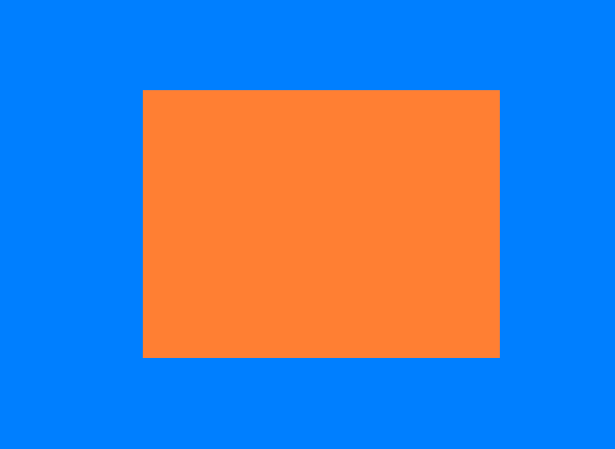

## OpenGL-GLFW-GLAD

OpenGL自身是一个巨大的状态机
OpenGl的状态通常被称为上下文

GLFW解决操作系统层面的不同
-创建窗口
-定义上下文
-处理用户输入
GLAD使得代码可以用于不同的OpenGL驱动
-OpenGl本身只是标准/规范
-各个厂家具体实现方法可以不同
-不同操作系统处理方法也不同
GLFW
https://www.glfw.org/download.html
GLAD使用了一个web服务器，通过输入想要为使用的OpenGL版本和相关信息转到GLAD服务器网站（[https://glad.dav1d.de](https://glad.dav1d.de/)）

glfwWindowHint(target, Hint);

把某一种target设置成hint


片段：包含渲染单个像素所需的所有数据。

显卡上有数千个小型处理器（核），可以在渲染管线中快速处理数据。核在GPU上为管线的每一步运行小程序。这些小程序成为着色器。

渲染管线 每一步执行完 后再执行下一步。

顶点着色器处理后，顶点值应该是NDC坐标；NDC坐标使用glViewport提供的数据，通过视口转换变为屏幕坐标。生成的屏幕空间左边将转换为片段，作为片段着色器的输入。

标准化设备坐标（Normalized Device Coordinates，NDC）

顶点着色器中处理过后，就应该是标准化设备坐标了，x、y和z的值在-1.0到1.0的一小段空间（立方体）。落在范围外的坐标都会被裁剪。

## VAO、VBO

顶点输入

在GPU上创建内存，储存的顶点数据

- 通过顶点缓冲对象（Vertex Buffer Objecits，VBO）管理
- 顶点缓冲对象的缓冲类型是GL_ARRAY_BUFFER

配置OpenGL如何解释这些内存

- 通过顶点数组对象（Vertex Array Objects，VAO）管理

使用缓冲区对象的优点是，可以一次将大量数据发送到显卡，不必一次发送一个数据。

用着色器语言GLSL（OpenGL Shading Language）编写顶点着色器，然后进行编译。

## 添加着色器


### 对着色器进行编译

为了让OpenGL使用着色器，必须在运行时从源码中动态编译着色器。首先创建着色器对象。

各个阶段的着色器需要通过着色器程序对象链接起来。着色器程序对象是多个着色器组成的最终链接版本。

```c++
const char *vertexShaderSource = 
"#version 330 core\n"
"layout(location = 0) in vec3 aPos;\n"
"void main()\n"
"{\n"
"gl_Position = vec4(aPos.x,aPos.y,aPos.z,1.0);\n"
"}\0";
```

```c++
const char *fragmentShaderSource = 
"#version 330 core\n"
"out vec4 FragColor;\n"
"void main()\n"
"{\n"
"FragColor = vec4(1.0f,0.5f,0.2f,1.0f);\n"
"}\n\0";
```

将着色器链接到程序时，会将每个着色器的输出连接到下一个着色器的输入.如果输出和输入不匹配，会出现链接错误。

```c++
//创建和编译着色器程序
	//顶点着色器
	unsigned int vertexShader = glCreateShader(GL_VERTEX_SHADER);
	glShaderSource(vertexShader, 1, &vertexShaderSource, NULL);
	glCompileShader(vertexShader);
	//检查编译错误 
	int success;
	char infoLog[512];
	glGetShaderiv(vertexShader, GL_COMPILE_STATUS, &success);
	if (!success)
	{
		glGetShaderInfoLog(vertexShader, 512, NULL, infoLog);
		std::cout << "ERROR::Shader::VERTEX::COMPILATION_FAIED\n" << infoLog << std::endl;
	}
	//片段着色器
	unsigned int fragmentShader = glCreateShader(GL_FRAGMENT_SHADER);
	glShaderSource(fragmentShader, 1, &fragmentShaderSource, NULL);
	glCompileShader(fragmentShader);
	//检查编译错误
	glGetShaderiv(fragmentShader, GL_COMPILE_STATUS, &success);
	if (!success)
	{
		glGetShaderInfoLog(fragmentShader, 512, NULL, infoLog);
		std::cout << "ERROR::Shader::FRAGMENT::COMPILATION_FAIED\n" << infoLog << std::endl;
	}
	//着色器程序
	unsigned int shaderProgram = glCreateProgram();
	glAttachShader(shaderProgram, vertexShader);
	glAttachShader(shaderProgram, fragmentShader);
	glLinkProgram(shaderProgram);
	//链接错误检查
	glGetProgramiv(shaderProgram, GL_LINK_STATUS, &success);
	if (!success)
	{
		glGetProgramInfoLog(shaderProgram, 512, NULL, infoLog);
		std::cout << "ERROR::SHADER::PROGRAM::LINKING_FAILED\n" << infoLog << std::endl;
	}
	glDeleteShader(vertexShader);
	glDeleteShader(fragmentShader);
```

创建着色器程序

### 元素缓冲对象EBO

EBO:Element Buffer Object

绘制两个三角形来组成一个矩形，可以使用下面的顶点的集合

```c++
float vertices[] =
{
	//第一个三角形
	0.5f,0.5f,0.0f,//右上
	0.5f,-0.5f,0.0f,//右下
	-0.5f,0.5f,0.0f,//左上
	//第二个三角形
	0.5f,-0.5f,0.0f,//右下
	-0.5f,-0.5f,0.0f,//左下
	-0.5f,0.5f,0.0f//左上
};
```

通过下面修改顶点数进行绘制

```c++
glDrawArrays(GL_TRIANGLES, 0, 6);
```

可以获得以下图像



修改光栅化模式，改为GL_LINE后

```
glPolygonMode(GL_FRONT_AND_BACK, GL_LINE);
```


在这种情况下，有两个左上的点，两个右下的点，其中有两个点是多余的。

换一种方式，用索引的方式，使用四个点的坐标

```c++
float vertices[] = {
	0.5f,0.5f,0.0f,// 右上
	0.5f,-0.5f,0.0f,// 右下
	-0.5f,-0.5f,0.0f,// 左下
	-0.5f,0.5f,0.0f// 左上
};
unsigned int indices[] = {
	0,1,3,//第一个三角形
	1,2,3//第二个三角形
};
```

选择使用索引渲染的函数，这样就可以绘出和上图一样的图像

```c++
glDrawElements(GL_TRIANGLES, 6, GL_UNSIGNED_INT, indices); //选择索引的方式
```

PS:采用了EBO时，则需要用glDrawElements函数来代替glDrawArrays函数，来指明我们从索引缓冲渲染。

参照[glDrawArrays 和 glDrawElements](https://www.cnblogs.com/keguniang/p/9866065.html)

这样写还不是整个的流程，还需要配置EBO

```c++
unsigned int EBO;
	glGenBuffers(1, &EBO);//创建缓冲区对象名字
	glBindBuffer(GL_ELEMENT_ARRAY_BUFFER, EBO);//绑定EBO缓冲
	glBufferData(GL_ELEMENT_ARRAY_BUFFER, sizeof(indices), indices, GL_STATIC_DRAW);//设置缓冲区数据
```

修改参数

```c++
glDrawElements(GL_TRIANGLES, 6, GL_UNSIGNED_INT, 0/*indices*/);
```

然后使用绑定，之后注销

### 视口

调整窗口的时候，也应该同时调整视口。在窗口上注册一个回调函数，每次调用窗口大小时都调用该函数

```c++
void frameBuffer_size_callback(GLFWwindow* window, int width, int height)
{
	glViewport(0, 0, width, height);
}
```

注册回调函数

```c++
//注册回调函数
glfwSetFramebufferSizeCallback(window, frameBuffer_size_callback);
```

PS：OpenGL中使用的坐标介于-1和1之间和屏幕空间坐标不同。例如：如果屏幕右下角为（800，600），（-0.5，0.5）将映射到屏幕空间的（200，450）

### 练习

1. 通过添加更多的顶点数据，使用glDrawArrays绘制两个挨在一起的三角形
2. 创建相同的两个三角形，但对它们的数据使用不同的VAO和VBO
3. 创建两个着色器，其中一个使用片段做着色器输出黄色

## 着色器Shader

着色器是基于GPU的小程序，这些小程序针对渲染管线中的每个特定步骤运行。从本质上说，着色器只不过是将输入转换为输出的程序。着色器也是非常孤立的程序，他们之间唯一的交流是通过输入和输出。

GLSL：OpenGL SHading Language

PS:Shader Language目前主要有3种语言：

1. 基于 OpenGL 的 **OpenGL Shading Language**，简称 **GLSL**;
2. 基于 DirectX 的 **High Level Shading Language**,简称 **HLSL**;
3. 还有 NVIDIA 公司的 **C for Graphic**，简称 **Cg** 语言。

这是GLSL程序的典型结构


### 类型

GLSL中包含C等其它语言大部分的默认基础数据类型

- int、float、double、uint和bool

GLSL也有两种容器类型

- 向量(Vector)
  - vecn: the default vector of n floats
  - bvecn: a vector of n booleans
  - ivecn: a vector of n integers
  - uvecn: a vector of n unsigned integers
  - dvecn: a vector of n double components 
- 矩阵(Matrix)

> 向量的分量可以通过xyzw分别访问。GLSL还允许对颜色使用rgba，或对纹理坐标使用stpq。

向量允许一些有趣而灵活的分量选择方式，叫做重组(Swizzling):

```glsl
vec2 vect = vec2(0.5,0.7);
vec4 result = vec4(vect,0.0,0.0);
vec4 otherResult = vect(result.xyz,1.0);
```

顶点着色器接受的是一种特殊形式的输入，否则就会效率低下

从顶点数据中直接接受输出。为了顶点数据该如何管理，使用location这一元数据（metadata）指定输入变量，这样才可以在CPU端配置顶点属性。例如：`layout (location = 0)`。layout这个的标识，使得能把它链接到顶点数据。

可以忽略`layout(location = 0)`标识符，通过在OpenGL代码中使用`glGenAttribLocation`查询属性位置值(Location)，通过`glBindAttribLocation`绑定属性位置值(Location)。但是推荐在着色器中设置它们，这样会更容易理解和节省工作量。

输入输出：

- 在发生方着色器中声明一个输出
- 在接受方着色器中声明一个类似的输入
- 当类型和名字都一致，OpenGL将把变量连接到一起（在链接程序对象时完成）

### Uniform:

 另一种从CPU的应用，向GPU中的着色器发送数据的方式

- uniform是全局的(Global)，可以被任意着色器程序在任意阶段访问

  

如果声明了一个uniform却没用过，编译器会默认移除这个变量，导致最后编译出的版本并不会包含它，这可能导致一些非常麻烦的错误，切记！

不去给像素传递一个单一的颜色，而是让它随着时间改变颜色

设置着色器，使用uniform

```c++
const char *vertexShaderSource = 
	"#version 330 core\n"
	"layout(location = 0) in vec3 aPos;\n"
	"void main()\n"
	"{\n"
	"gl_Position = vec4(aPos,1.0);\n"
	"}\0";
const char *fragmentShaderSource = 
	"#version 330 core\n"
	"out vec4 FragColor;\n"
	"uniform vec4 ourColor;\n"
	"void main()\n"
	"{\n"
	"FragColor = ourColor;\n"
	"}\n\0";
```

最后通过sin和cos实现颜色渐变

```c++
glUseProgram(shaderProgram);
//设置uniform值
float timeValue = glfwGetTime();
float greenValue = sin(timeValue) / 2.0f + 0.5F;
float redValue = cos(timeValue) / 2.0f + 0.5F;
float blueValue = cos(timeValue+45) / 2.0f + 0.5F;
int vertexColorLocation = glGetUniformLocation(shaderProgram, "ourColor");
glUniform4f(vertexColorLocation, redValue, greenValue, blueValue, 1.0f);
```

给顶点不同的颜色：

```c++
float vertices[] =  // 位置 // 颜色
{
	-0.5f,-0.5f,0.0f,1.0f,0.0f,0.0f,//右下
	0.5f,-0.5f,0.0f,0.0f,1.0f,0.0f,//左下
	0.0f,0.5,0.0f,0.0f,0.0f,1.0f//上
};
const char *vertexShaderSource = 
	"#version 330 core\n"
	"layout(location = 0) in vec3 aPos;\n"
	"layout(location = 1) in vec3 aColor;\n"
	"out vec3 ourColor;\n"
	"void main()\n"
	"{\n"
	"gl_Position = vec4(aPos,1.0);\n"
	"ourColor = aColor;\n"
	"}\0";
const char *fragmentShaderSource = 
	"#version 330 core\n"
	"out vec4 FragColor;\n"
	"uniform vec4 ourColor;\n"
	"void main()\n"
	"{\n"
	"FragColor = ourColor;\n"
	"}\n\0";
```

```c++
	glBufferData(GL_ARRAY_BUFFER, sizeof(vertices), vertices, GL_STATIC_DRAW);
	//告知Shader如何解析缓冲里的属性值
	glVertexAttribPointer(0, 3, GL_FLOAT, GL_FALSE, 6 * sizeof(float), (void*)0);
	//开启VAI管理的第一个属性值
	glEnableVertexAttribArray(0);
	//告知Shader如何解析缓冲里的属性值
	glVertexAttribPointer(1, 3, GL_FLOAT, GL_FALSE, 6 * sizeof(float), (void*)(3*4));
	//开启VAI管理的第一个属性值
	glEnableVertexAttribArray(1);
```


## 编写自己的着色器类

把着色器类全部放在在头文件里，主要是为了学习用途，当然也方便移植。添加必要的include，并定义类结构：

```c++
#ifndef SHADER_H
#define SHADER_H

#include <glad/glad.h>; // 包含glad来获取所有的必须OpenGL头文件

#include <string>
#include <fstream>
#include <sstream>
#include <iostream>


class Shader
{
public:
    // 程序ID
    unsigned int ID;

    // 构造器读取并构建着色器
    Shader(const GLchar* vertexPath, const GLchar* fragmentPath);
    // 使用/激活程序
    void use();
    // uniform工具函数
    void setBool(const std::string &name, bool value) const;  
    void setInt(const std::string &name, int value) const;   
    void setFloat(const std::string &name, float value) const;
};

#endif
```

下一步，我们需要编译和链接着色器。

```g
        // 2. 编译着色器
        unsigned int vertex, fragment;
        // vertex shader 顶点
        vertex = glCreateShader(GL_VERTEX_SHADER);
        glShaderSource(vertex, 1, &vShaderCode, NULL);
        glCompileShader(vertex);
        checkCompileErrors(vertex, "VERTEX");
        // fragment Shader 片元
        fragment = glCreateShader(GL_FRAGMENT_SHADER);
        glShaderSource(fragment, 1, &fShaderCode, NULL);
        glCompileShader(fragment);
        checkCompileErrors(fragment, "FRAGMENT");
        // shader Program 
        ID = glCreateProgram();
        glAttachShader(ID, vertex); //附加vertex对象给ID
        glAttachShader(ID, fragment);
        glLinkProgram(ID);
        checkCompileErrors(ID, "PROGRAM");
        // delete the shaders as they're linked into our program now and no longer necessary
        // 因为它们已经链接程序，不再需要，然后就删除这些着色器
        glDeleteShader(vertex);
        glDeleteShader(fragment);
```

设置use函数

```c++
    void use()
    {
        glUseProgram(ID);
    }
```

```c++
    // 一些有用Uniform函数
    // ------------------------------------------------------------------------
    void setBool(const std::string& name, bool value) const
    {
        glUniform1i(glGetUniformLocation(ID, name.c_str()), (int)value);
    }
    // ------------------------------------------------------------------------
    void setInt(const std::string& name, int value) const
    {
        glUniform1i(glGetUniformLocation(ID, name.c_str()), value);
    }
    // ------------------------------------------------------------------------
    void setFloat(const std::string& name, float value) const
    {
        glUniform1f(glGetUniformLocation(ID, name.c_str()), value);
    }
```

最后创建着色器对象，再使用

### 着色器练习

- 修改顶点着色器让三角形上下颠倒：

  ```glsl
  #version 330 core
  layout (location = 0) in vec3 aPos;
  layout (location = 1) in vec3 aColor;
  
  out vec3 ourColor;
  //修改顶点着色器，让aPos.y变成负值
  void main()
  {
      gl_Position = vec4(aPos.x,- aPos.y,aPos.z, 1.0);
      ourColor = aColor;
  }
  ```

  

- 使用uniform定义一个水平偏移量，在顶点着色器中使用这个偏移量把三角形移动到屏幕右侧：

  - 在C++代码设置

  ```c++
  float offset = 0.5f;
  ourShader.setFloat("xOffset", offset);
  ```

  - ​	在顶点着色器

    ```glsl
    #version 330 core
    layout (location = 0) in vec3 aPos;
    layout (location = 1) in vec3 aColor;
    
    out vec3 ourColor;
    
    uniform float xOffset;
    
    void main()
    {
        gl_Position = vec4(aPos.x + xOffset, aPos.y, aPos.z, 1.0); // add the xOffset to the x position of the vertex position
        ourColor = aColor;
    }
    ```

    

- 使用`out`关键字把顶点位置输出到片段着色器，并将片段的颜色设置为与顶点位置相等（来看看连顶点位置值都在三角形中被插值的结果）。做完这些后，尝试回答下面的问题：为什么在三角形的左下角是黑的?：

```glsl
//顶点
#version 330 core
layout (location = 0) in vec3 aPos;
layout (location = 1) in vec3 aColor;

// out vec3 ourColor;
out vec3 ourPosition;

void main()
{
    gl_Position = vec4(aPos, 1.0); 
    // ourColor = aColor;
    ourPosition = aPos;
}
```

```glsl
//片元
#version 330 core
layout (location = 0) in vec3 aPos;
layout (location = 1) in vec3 aColor;

// out vec3 ourColor;
out vec3 ourPosition;

void main()
{
    gl_Position = vec4(aPos, 1.0); 
    // ourColor = aColor;
    ourPosition = aPos;
}
```

回答：因为左下角的顶点的坐标为`(-0.5f,-0.5f,0.0f)`,在作为颜色显示的时候负值被固定为0，而(0,0,0,1)就是黑色，而这一直发生那个顶点插值到其他顶点的过程，所以导致了左下角为黑边。

## 纹理

纹理是一个2D图片(其实也有1D和3D的纹理)，它可以用来添加物体的细节。			

> 纹理也可以用来存储大量数据。

### 纹理坐标

纹理坐标(Texture Coordinate)：每一个顶点会关联一个纹理坐标，用来标明该从纹理图像的哪个部分采样。之后再图形的其它片段进行片段插值(Fragment Interpolation)。

纹理坐标也是在x和y轴，分别范围也为[0,1]；

采样(Sampling)：使用纹理坐标获取纹理颜色。

### 纹理环绕方式(Texture Wrapping)

纹理坐标的范围通常是从(0,0)到(1,1)，当外面设置的纹理坐标超出了范围，OpenGL的行为是重复这个纹理图像，也提供了一下可以选择的方式

| 环绕方式           | 描述                                                         |
| ------------------ | ------------------------------------------------------------ |
| GL_REPEAT          | 对纹理的默认行为。重复纹理图像。                             |
| GL_MIRRORED_REPEAT | 和GL_REPEAT一样，但每次重复图片是镜像放置的。                |
| GL_CLAMP_TO_EDGE   | 纹理坐标会被约束在0到1之间，超出的部分会重复纹理坐标的边缘，产生一种边缘被拉伸的效果。 |
| GL_CLAMP_TO_BORDER | 超出的坐标为用户指定的边缘颜色。                             |

通过使用glTexParameter*函数，可以使用上面提及的每一个选项来对单独的坐标系(s、t、r(如果使用3D纹理的话))，它们和x、y、z等价

```c++
glTexParameteri(GL_TEXTURE_2D, GL_TEXTURE_WRAP_S, GL_MIRRORED_REPEAT); 
glTexParameteri(GL_TEXTURE_2D, GL_TEXTURE_WRAP_T, GL_MIRRORED_REPEAT);
```

第一个参数指定纹理目标，这里使用2D纹理，所以这里使用GL_TEXTURE_2D。第二个参数要求我们提供我们需要设置的纹理坐标系，这里我们选择S轴和T轴，最后一个参数指定纹理环绕方式。

如果选择了GL_CLAMP_TO_BORDERGL_CLAMP_TO_BORDER的选项，我们还需要选择外围的颜色。这里需要使用glTexParameter函数带fv后置的形式来设置当超出边界后外围的颜色。

```c++
float borderColor[] = { 1.0f, 1.0f, 0.0f, 1.0f };
glTexParameterfv(GL_TEXTURE_2D, GL_TEXTURE_BORDER_COLOR, borderColor); 
```

### 纹理过滤(Texture Filtering)

纹理坐标不依赖分辨率，它可以是任意浮点值，所以OpenGl需要知道怎么样将纹理像素(Texture Pixel,也叫Texel)映射到纹理坐标，当有一个很大的物体但是纹理的分辨率很低的时候这就变得很重要了。所以OpenGL也有对于纹理过滤(Texture Filtering)的选项，纹理过滤有很多选项，这里只讨论最重要的两种：GL_NEARET和GL_LINEAR.

> Texture Pixel也叫Texel，你可以想象你打开一张`.jpg`格式图片，不断放大你会发现它是由无数像素点组成的，这个点就是纹理像素；注意不要和纹理坐标搞混，纹理坐标是你给模型顶点设置的那个数组，OpenGL以这个顶点的纹理坐标数据去查找纹理图像上的像素，然后进行采样提取纹理像素的颜色。

GL_NEAREST（也叫邻近过滤，Nearest Neighbor Filtering）是OpenGL默认的纹理过滤方式。当设置为GL_NEAREST的时候，OpenGL会选择中心点最接近纹理坐标的那个像素。下图中你可以看到四个像素，加号代表纹理坐标。左上角那个纹理像素的中心距离纹理坐标最近，所以它会被选择为样本颜色：


GL_LINEAR（也叫线性过滤，(Bi)linear Filtering）它会基于纹理坐标附近的纹理像素，计算出一个插值，近似出这些纹理像素之间的颜色。一个纹理像素的中心距离纹理坐标越近，那么这个纹理像素的颜色对最终的样本颜色的贡献越大。下图中你可以看到返回的颜色是邻近像素的混合色：


这两种纹理过滤方式的视觉效果，用一个很大的物体上应用一张低分辨率纹理，（纹理被放大了，每个纹理像素都能看到）：


### 多级渐远纹理

OpenGL使用一种叫做多级渐远纹理(Mipmap)的概念来解决这个问题，它简单来说就是一系列的纹理图像，后一个纹理图像是前一个的二分之一。多级渐远纹理背后的理念很简单：距观察者的距离超过一定的阈值，OpenGL会使用不同的多级渐远纹理，即最适合物体的距离的那个。由于距离远，解析度不高也不会被用户注意到。同时，多级渐远纹理另一加分之处是它的性能非常好。让我们看一下多级渐远纹理是什么样子的：


OpenGL有一个glGenerateMipmaps函数，可以在创建完一个纹理后调用 OpenGL就会自动接着干这些事。

在渲染过程中切换多级渐远纹理级别时，OpenGL在两个不同级别的多级渐远纹理层之间会产生不真实的生硬边界。像普通的纹理过滤，不同的纹理级别切换也可以使用NEAREST和LINEAR过滤。

| 过滤方式                  | **描述**                                                     |
| ------------------------- | ------------------------------------------------------------ |
| GL_NEAREST_MIPMAP_NEAREST | 使用最邻近的多级渐远纹理来匹配像素大小，并使用邻近插值进行纹理采样 |
| GL_LINEAR_MIPMAP_NEAREST  | 使用最邻近的多级渐远纹理级别，并使用线性插值进行采样         |
| GL_NEAREST_MIPMAP_LINEAR  | 在两个最匹配像素大小的多级渐远纹理之间进行线性插值，使用邻近插值进行采样 |
| GL_LINEAR_MIPMAP_LINEAR   | 在两个邻近的多级渐远纹理之间使用线性插值，并使用线性插值进行采样 |

就像纹理过滤一样，我们可以使用glTexParameteri将过滤方式设置为前面四种提到的方法之一：

```c++
glTexParameteri(GL_TEXTURE_2D, GL_TEXTURE_MIN_FILTER, GL_LINEAR_MIPMAP_LINEAR);
glTexParameteri(GL_TEXTURE_2D, GL_TEXTURE_MAG_FILTER, GL_LINEAR);
```

### 加载与创建纹理

### 纹理单元

你可能会奇怪为什么`sampler2D`变量是个uniform，我们却不用glUniform给它赋值。使用glUniform1i，我们可以给纹理采样器分配一个位置值，这样的话我们能够在一个片段着色器中设置多个纹理。一个纹理的位置值通常称为一个纹理单元(Texture Unit)。一个纹理的默认纹理单元是0，它是默认的激活纹理单元

纹理单元的主要目的是让我们在着色器中可以使用多于一个的纹理。通过把纹理单元赋值给采样器，我们可以一次绑定多个纹理，只要我们首先激活对应的纹理单元。就像glBindTexture一样，我们可以使用glActiveTexture激活纹理单元，传入我们需要使用的纹理单元：

```c++
glActiveTexture(GL_TEXTURE0); // 在绑定纹理之前先激活纹理单元
glBindTexture(GL_TEXTURE_2D, texture);
```

激活纹理单元之后，接下来的glBindTexture函数调用会绑定这个纹理到当前激活的纹理单元，纹理单元GL_TEXTURE0默认总是被激活，所以我们在前面的例子里当我们使用`glBindTexture`的时候，无需激活任何纹理单元。

> OpenGL至少保证有16个纹理单元供你使用，也就是说你可以激活从GL_TEXTURE0到GL_TEXTRUE15。它们都是按顺序定义的，所以我们也可以通过GL_TEXTURE0 + 8的方式获得GL_TEXTURE8，这在当我们需要循环一些纹理单元的时候会很有用。

### 练习

- 修改片段着色器，**仅**让笑脸图案朝另一个方向看，[参考解答](https://learnopengl.com/code_viewer.php?code=getting-started/textures-exercise1)

```glsl
#version 330 core
out vec4 FragColor;

in vec3 ourColor;
in vec2 TexCoord;


uniform sampler2D texture1;
uniform sampler2D texture2;

void main()
{
    FragColor = mix(texture(texture1, TexCoord), texture(texture2, vec2(1.0-TexCoord.x,TexCoord.y)), 0.2);
}
```

- 尝试用不同的纹理环绕方式，设定一个从`0.0f`到`2.0f`范围内的（而不是原来的`0.0f`到`1.0f`）纹理坐标。试试看能不能在箱子的角落放置4个笑脸：[参考解答](https://learnopengl.com/code_viewer_gh.php?code=src/1.getting_started/4.3.textures_exercise2/textures_exercise2.cpp)，[结果](https://learnopengl-cn.gitee.io/img/01/06/textures_exercise2.png)。记得一定要试试其它的环绕方式。

  - 修改纹理坐标	

  ```c++
  float vertices[] = {
  	//     ---- 位置 ----       ---- 颜色 ----     - 纹理坐标 -
  		 0.5f,  0.5f, 0.0f,   1.0f, 0.0f, 0.0f,   2.0f, 2.0f,   // 右上
  		 0.5f, -0.5f, 0.0f,   0.0f, 1.0f, 0.0f,   2.0f, 0.0f,   // 右下
  		-0.5f, -0.5f, 0.0f,   0.0f, 0.0f, 1.0f,   0.0f, 0.0f,   // 左下
  		-0.5f,  0.5f, 0.0f,   1.0f, 1.0f, 0.0f,   0.0f, 2.0f    // 左上
  };		
  ```

  - 修改第一个纹理的环绕方式

  ```c++
  	glTexParameteri(GL_TEXTURE_2D, GL_TEXTURE_WRAP_S, GL_CLAMP_TO_EDGE);
  	glTexParameteri(GL_TEXTURE_2D, GL_TEXTURE_WRAP_T, GL_CLAMP_TO_EDGE);
  ```

  - 修改第二个纹理的环绕方式

    ```c++
    	glTexParameteri(GL_TEXTURE_2D, GL_TEXTURE_WRAP_S, GL_MIRRORED_REPEAT);
    	glTexParameteri(GL_TEXTURE_2D, GL_TEXTURE_WRAP_T, GL_REPEAT);
    ```

  - 结果

    

- 尝试在矩形上只显示纹理图像的中间一部分，修改纹理坐标，达到能看见单个的像素的效果。尝试使用GL_NEAREST的纹理过滤方式让像素显示得更清晰：[参考解答](https://learnopengl.com/code_viewer_gh.php?code=src/1.getting_started/4.4.textures_exercise3/textures_exercise3.cpp)

  - 修改纹理坐标

  ```c++
  float vertices[] = {
  	//     ---- 位置 ----       ---- 颜色 ----     - 纹理坐标 -
  		 0.5f,  0.5f, 0.0f,   1.0f, 0.0f, 0.0f,   0.55f, 0.55f,   // 右上
  		 0.5f, -0.5f, 0.0f,   0.0f, 1.0f, 0.0f,   0.55f, 0.45f,   // 右下
  		-0.5f, -0.5f, 0.0f,   0.0f, 0.0f, 1.0f,   0.45f, 0.45f,   // 左下
  		-0.5f,  0.5f, 0.0f,   1.0f, 1.0f, 0.0f,   0.45f, 0.55f    // 左上
  };
  ```

  

  - 修改过滤方式

  ```c++
  	glTexParameteri(GL_TEXTURE_2D, GL_TEXTURE_MIN_FILTER, GL_NEAREST);
  	glTexParameteri(GL_TEXTURE_2D, GL_TEXTURE_MAG_FILTER, GL_NEAREST);
  ```

  

  - 结果(第一种为GL_LINEAR，第二个为GL_NEAREST)

  

  

- 使用一个uniform变量作为mix函数的第三个参数来改变两个纹理可见度，使用上和下键来改变箱子或笑脸的可见度：[参考解答](https://learnopengl.com/code_viewer_gh.php?code=src/1.getting_started/4.5.textures_exercise4/textures_exercise4.cpp)。

  - 修改片段着色器

  ```glsl
  #version 330 core
  out vec4 FragColor;
  
  in vec3 ourColor;
  in vec2 TexCoord;
  
  
  uniform sampler2D texture1;
  uniform sampler2D texture2;
  uniform float parm;
  void main()
  {
      FragColor = mix(texture(texture1, TexCoord), texture(texture2, vec2(1.0-TexCoord.x,TexCoord.y)), parm);
  }
  ```

  

  - 设置uniform和按键

```c++
float parm = 0.2f;

/*......*/

//if (parm >= 1.0f)
//	parm = 1.0f;
//if (parm <= 0.0f)
//	parm = 0.0f;
ourShader.setFloat("parm", parm);
if (glfwGetKey(window, GLFW_KEY_UP) == GLFW_PRESS)
parm += 0.01;
else if(glfwGetKey(window, GLFW_KEY_DOWN) == GLFW_PRESS)
parm -= 0.01;
```


## 变换

### 向量的点乘和叉乘

1. 点乘(Dot Product)

   ​	两个向量的点乘等于它们的数乘结果乘以两个向量之间夹角的余弦值。可能听起来有点费解，我们来看一下公式：
   $$
   \bar{v}⋅\bar{k}=||\bar{v}||⋅||\bar{k}||⋅cosθ
   $$
   ​	它们之间的夹角记作$$θ$$。为什么这很有用？想象如果$\bar{v}$和$\bar{k}$都是单位向量，它们的长度会等于1。这样公式会有效简化成：
   $$
   \bar{v}⋅\bar{k}=1⋅1⋅cosθ=cosθ
   $$
   

​	你也可以通过点乘的结果计算两个非单位向量的夹角，点乘的结果除以两个向量的长度之积，得到的结果就是夹角的余弦值，即cosθ。
$$
\cos \theta = \frac{\bar{v} \cdot \bar{k}}{||\bar{v}|| \cdot ||\bar{k}||}
$$
​	点乘是通过将对应分量逐个相乘，然后再把所得积相加来计算的。两个单位向量的（你可以验证它们的长度都为1）点乘会像是这样：
$$
\begin{pmatrix} \color{red}{0.6} \\ -\color{green}{0.8} \\ \color{blue}0 \end{pmatrix} \cdot \begin{pmatrix} \color{red}0 \\ \color{green}1 \\ \color{blue}0 \end{pmatrix} = (\color{red}{0.6} * \color{red}0) + (-\color{green}{0.8} * \color{green}1) + (\color{blue}0 * \color{blue}0) = -0.8
$$
​	2.叉乘(Cross Product)

​	叉乘只在3D空间中有定义，它需要两个不平行向量作为输入，生成一个正交于两个输入向量的第三个向量。如果输入的两个向量也是正交的，那么叉乘之后将会产生3个互相正交的向量。接下来的教程中这会非常有用。下面的图片展示了3D空间中叉乘的样子：


两个正交向量A和B叉积：
$$
\begin{pmatrix} \color{red}{A_{x}} \\ \color{green}{A_{y}} \\ \color{blue}{A_{z}} \end{pmatrix} \times \begin{pmatrix} \color{red}{B_{x}} \\ \color{green}{B_{y}} \\ \color{blue}{B_{z}}  \end{pmatrix} = \begin{pmatrix} \color{green}{A_{y}} \cdot \color{blue}{B_{z}} - \color{blue}{A_{z}} \cdot \color{green}{B_{y}} \\ \color{blue}{A_{z}} \cdot \color{red}{B_{x}} - \color{red}{A_{x}} \cdot \color{blue}{B_{z}} \\ \color{red}{A_{x}} \cdot \color{green}{B_{y}} - \color{green}{A_{y}} \cdot \color{red}{B_{x}} \end{pmatrix}
$$

### 矩阵

向量，它其实就是一个**N×1**矩阵，N表示向量分量的个数（也叫N维(N-dimensional)向量）

#### 单位矩阵

在OpenGL中，由于某些原因我们通常使用**4×4**的变换矩阵，而其中最重要的原因就是大部分的向量都是4分量的。我们能想到的最简单的变换矩阵就是单位矩阵(Identity Matrix)。单位矩阵是一个除了对角线以外都是0的**N×N**矩阵。在下式中可以看到，这种变换矩阵使一个向量完全不变：
$$
\begin{bmatrix} \color{red}1 & \color{red}0 & \color{red}0 & \color{red}0 \\ \color{green}0 & \color{green}1 & \color{green}0 & \color{green}0 \\ \color{blue}0 & \color{blue}0 & \color{blue}1 & \color{blue}0 \\ \color{purple}0 & \color{purple}0 & \color{purple}0 & \color{purple}1 \end{bmatrix} \cdot \begin{bmatrix} 1 \\ 2 \\ 3 \\ 4 \end{bmatrix} = \begin{bmatrix} \color{red}1 \cdot 1 \\ \color{green}1 \cdot 2 \\ \color{blue}1 \cdot 3 \\ \color{purple}1 \cdot 4 \end{bmatrix} = \begin{bmatrix} 1 \\ 2 \\ 3 \\ 4 \end{bmatrix}
$$
向量看起来完全没变。从乘法法则来看就很容易理解来：第一个结果元素是矩阵的第一行的每个元素乘以向量的每个对应元素。因为每行的元素除了第一个都是0，可得：$$\color{red}1\cdot1 + \color{red}0\cdot2 + \color{red}0\cdot3 + \color{red}0\cdot4 = 1$$，向量的其他3个元素同理。

> 单位矩阵通常是生成其他变换矩阵的起点。

#### 缩放矩阵

对一个向量进行缩放(Scaling)就是对向量的长度进行缩放，而保持它的方向不变。由于我们进行的是2维或3维操作，我们可以分别定义一个有2或3个缩放变量的向量，每个变量缩放一个轴(x、y或z)。

> 记住，OpenGL通常是在3D空间进行操作的，对于2D的情况我们可以把z轴缩放1倍，这样z轴的值就不变了。我们刚刚的缩放操作是不均匀(Non-uniform)缩放，因为每个轴的缩放因子(Scaling Factor)都不一样。如果每个轴的缩放因子都一样那么就叫均匀缩放(Uniform Scale)。

$$
\begin{bmatrix} \color{red}{S_1} & \color{red}0 & \color{red}0 & \color{red}0 \\ \color{green}0 & \color{green}{S_2} & \color{green}0 & \color{green}0 \\ \color{blue}0 & \color{blue}0 & \color{blue}{S_3} & \color{blue}0 \\ \color{purple}0 & \color{purple}0 & \color{purple}0 & \color{purple}1 \end{bmatrix} \cdot \begin{pmatrix} x \\ y \\ z \\ 1 \end{pmatrix} = \begin{pmatrix} \color{red}{S_1} \cdot x \\ \color{green}{S_2} \cdot y \\ \color{blue}{S_3} \cdot z \\ 1 \end{pmatrix}
$$

记住，OpenGL通常是在3D空间进行操作的，对于2D的情况我们可以把z轴缩放1倍，这样z轴的值就不变了。我们刚刚的缩放操作是不均匀(Non-uniform)缩放，因为每个轴的缩放因子(Scaling Factor)都不一样。如果每个轴的缩放因子都一样那么就叫均匀缩放(Uniform Scale)。

#### 位移矩阵

位移(Translation)是在原始向量的基础上加上另一个向量从而获得一个在不同位置的新向量的过程，从而在位移向量基础上**移动**了原始向量。我们已经讨论了向量加法，所以这应该不会太陌生。

和缩放矩阵一样，在4×4矩阵上有几个特别的位置用来执行特定的操作，对于位移来说它们是第四列最上面的3个值。如果我们把位移向量表示为$$(\color{red}{T_x},\color{green}{T_y},\color{blue}{T_z})$$，我们就能把位移矩阵定义为：
$$
\begin{bmatrix}  \color{red}1 & \color{red}0 & \color{red}0 & \color{red}{T_x} \\ \color{green}0 & \color{green}1 & \color{green}0 & \color{green}{T_y} \\ \color{blue}0 & \color{blue}0 & \color{blue}1 & \color{blue}{T_z} \\ \color{purple}0 & \color{purple}0 & \color{purple}0 & \color{purple}1 \end{bmatrix} \cdot \begin{pmatrix} x \\ y \\ z \\ 1 \end{pmatrix} = \begin{pmatrix} x + \color{red}{T_x} \\ y + \color{green}{T_y} \\ z + \color{blue}{T_z} \\ 1 \end{pmatrix}
$$
这样是能工作的，因为所有的位移值都要乘以向量的**w**行，所以位移值会加到向量的原始值上（想想矩阵乘法法则）。而如果你用3x3矩阵我们的位移值就没地方放也没地方乘了，所以是不行的。

> **齐次坐标(Homogeneous Coordinates)**
>
> 向量的w分量也叫齐次坐标。想要从齐次向量得到3D向量，我们可以把x、y和z坐标分别除以w坐标。我们通常不会注意这个问题，因为w分量通常是1.0。使用齐次坐标有几点好处：它允许我们在3D向量上进行位移（如果没有w分量我们是不能位移向量的），而且下一章我们会用w值创建3D视觉效果。
>
> 如果一个向量的齐次坐标是0，这个坐标就是方向向量(Direction Vector)，因为w坐标是0，这个向量就不能位移

有了位移矩阵我们就可以在3个方向(x、y、z)上移动物体，它是我们的变换工具箱中非常有用的一个变换矩阵。

#### 旋转矩阵

2D或3D空间中的旋转用角(Angle)来表示。角可以是角度制或弧度制的，周角是360角度或2 [PI](https://en.wikipedia.org/wiki/Pi)弧度。

> 大多数旋转函数需要用弧度制的角，但幸运的是角度制的角也可以很容易地转化为弧度制的：
>
> - 弧度转角度：`角度 = 弧度 * (180.0f / PI)`
> - 角度转弧度：`弧度 = 角度 * (PI / 180.0f)`
>
> `PI`约等于3.14159265359。

转半圈会旋转360/2 = 180度，向右旋转1/5圈表示向右旋转360/5 = 72度。下图中展示的2D向量$\bar{v}$是由$\bar{k}$向右旋转72度所得的：


在3D空间中旋转需要定义一个角**和**一个旋转轴(Rotation Axis)。物体会沿着给定的旋转轴旋转特定角度。如果你想要更形象化的感受，可以试试向下看着一个特定的旋转轴，同时将你的头部旋转一定角度。当2D向量在3D空间中旋转时，我们把旋转轴设为z轴（尝试想象这种情况）。

使用三角学，给定一个角度，可以把一个向量变换为一个经过旋转的新向量。这通常是使用一系列正弦和余弦函数（一般简称sin和cos）各种巧妙的组合得到的。当然，讨论如何生成变换矩阵超出了这个教程的范围。

旋转矩阵在3D空间中每个单位轴都有不同定义，旋转角度用$θ$表示：

沿x轴旋转：
$$
\begin{bmatrix} \color{red}1 & \color{red}0 & \color{red}0 & \color{red}0 \\ \color{green}0 & \color{green}{\cos \theta} & - \color{green}{\sin \theta} & \color{green}0 \\ \color{blue}0 & \color{blue}{\sin \theta} & \color{blue}{\cos \theta} & \color{blue}0 \\ \color{purple}0 & \color{purple}0 & \color{purple}0 & \color{purple}1 \end{bmatrix} \cdot \begin{pmatrix} x \\ y \\ z \\ 1 \end{pmatrix} = \begin{pmatrix} x \\ \color{green}{\cos \theta} \cdot y - \color{green}{\sin \theta} \cdot z \\ \color{blue}{\sin \theta} \cdot y + \color{blue}{\cos \theta} \cdot z \\ 1 \end{pmatrix}
$$


沿y轴旋转：
$$
\begin{bmatrix} \color{red}{\cos \theta} & \color{red}0 & \color{red}{\sin \theta} & \color{red}0 \\ \color{green}0 & \color{green}1 & \color{green}0 & \color{green}0 \\ - \color{blue}{\sin \theta} & \color{blue}0 & \color{blue}{\cos \theta} & \color{blue}0 \\ \color{purple}0 & \color{purple}0 & \color{purple}0 & \color{purple}1 \end{bmatrix} \cdot \begin{pmatrix} x \\ y \\ z \\ 1 \end{pmatrix} = \begin{pmatrix} \color{red}{\cos \theta} \cdot x + \color{red}{\sin \theta} \cdot z \\ y \\ - \color{blue}{\sin \theta} \cdot x + \color{blue}{\cos \theta} \cdot z \\ 1 \end{pmatrix}
$$


沿z轴旋转：
$$
\begin{bmatrix} \color{red}{\cos \theta} & - \color{red}{\sin \theta} & \color{red}0 & \color{red}0 \\ \color{green}{\sin \theta} & \color{green}{\cos \theta} & \color{green}0 & \color{green}0 \\ \color{blue}0 & \color{blue}0 & \color{blue}1 & \color{blue}0 \\ \color{purple}0 & \color{purple}0 & \color{purple}0 & \color{purple}1 \end{bmatrix} \cdot \begin{pmatrix} x \\ y \\ z \\ 1 \end{pmatrix} = \begin{pmatrix} \color{red}{\cos \theta} \cdot x - \color{red}{\sin \theta} \cdot y  \\ \color{green}{\sin \theta} \cdot x + \color{green}{\cos \theta} \cdot y \\ z \\ 1 \end{pmatrix}
$$
利用旋转矩阵我们可以把任意位置向量沿一个单位旋转轴进行旋转。也可以将多个矩阵复合，比如先沿着x轴旋转再沿着y轴旋转。但是这会很快导致一个问题——万向节死锁（Gimbal Lock，可以看看[这个视频](https://www.youtube.com/watch?v=zc8b2Jo7mno)[（优酷）](http://v.youku.com/v_show/id_XNzkyOTIyMTI=.html)来了解）。在这里我们不会讨论它的细节，但是对于3D空间中的旋转，一个更好的模型是沿着任意的一个轴，比如单位向量$(0.662, 0.2, 0.7222)$旋转，而不是对一系列旋转矩阵进行复合。这样的一个（超级麻烦的）矩阵是存在的，见下面这个公式，其中$(\color{red}{R_x}, \color{green}{R_y}, \color{blue}{R_z})$代表任意旋转轴：
$$
\begin{bmatrix} \cos \theta + \color{red}{R_x}^2(1 - \cos \theta) & \color{red}{R_x}\color{green}{R_y}(1 - \cos \theta) - \color{blue}{R_z} \sin \theta & \color{red}{R_x}\color{blue}{R_z}(1 - \cos \theta) + \color{green}{R_y} \sin \theta & 0 \\ \color{green}{R_y}\color{red}{R_x} (1 - \cos \theta) + \color{blue}{R_z} \sin \theta & \cos \theta + \color{green}{R_y}^2(1 - \cos \theta) & \color{green}{R_y}\color{blue}{R_z}(1 - \cos \theta) - \color{red}{R_x} \sin \theta & 0 \\ \color{blue}{R_z}\color{red}{R_x}(1 - \cos \theta) - \color{green}{R_y} \sin \theta & \color{blue}{R_z}\color{green}{R_y}(1 - \cos \theta) + \color{red}{R_x} \sin \theta & \cos \theta + \color{blue}{R_z}^2(1 - \cos \theta) & 0 \\ 0 & 0 & 0 & 1 \end{bmatrix}
$$
在数学上讨论如何生成这样的矩阵仍然超出了本节内容。但是记住，即使这样一个矩阵也不能完全解决万向节死锁问题（尽管会极大地避免）。避免万向节死锁的真正解决方案是使用四元数(Quaternion)，它不仅更安全，而且计算会更有效率。四元数可能会在后面的教程中讨论。

#### 矩阵的组合

使用矩阵进行变换的真正力量在于，根据矩阵之间的乘法，我们可以把多个变换组合到一个矩阵中。让我们看看我们是否能生成一个变换矩阵，让它组合多个变换。假设我们有一个顶点(x, y, z)，我们希望将其缩放2倍，然后位移(1, 2, 3)个单位。我们需要一个位移和缩放矩阵来完成这些变换。结果的变换矩阵看起来像这样：
$$
Trans . Scale = \begin{bmatrix} \color{red}1 & \color{red}0 & \color{red}0 & \color{red}1 \\ \color{green}0 & \color{green}1 & \color{green}0 & \color{green}2 \\ \color{blue}0 & \color{blue}0 & \color{blue}1 & \color{blue}3 \\ \color{purple}0 & \color{purple}0 & \color{purple}0 & \color{purple}1 \end{bmatrix} . \begin{bmatrix} \color{red}2 & \color{red}0 & \color{red}0 & \color{red}0 \\ \color{green}0 & \color{green}2 & \color{green}0 & \color{green}0 \\ \color{blue}0 & \color{blue}0 & \color{blue}2 & \color{blue}0 \\ \color{purple}0 & \color{purple}0 & \color{purple}0 & \color{purple}1 \end{bmatrix} = \begin{bmatrix} \color{red}2 & \color{red}0 & \color{red}0 & \color{red}1 \\ \color{green}0 & \color{green}2 & \color{green}0 & \color{green}2 \\ \color{blue}0 & \color{blue}0 & \color{blue}2 & \color{blue}3 \\ \color{purple}0 & \color{purple}0 & \color{purple}0 & \color{purple}1 \end{bmatrix}
$$
注意，当矩阵相乘时我们先写位移再写缩放变换的。矩阵乘法是不遵守交换律的，这意味着它们的顺序很重要。当矩阵相乘时，在最右边的矩阵是第一个与向量相乘的，所以你应该从右向左读这个乘法。建议您在组合矩阵时，先进行缩放操作，然后是旋转，最后才是位移，否则它们会（消极地）互相影响。比如，如果你先位移再缩放，位移的向量也会同样被缩放（译注：比如向某方向移动2米，2米也许会被缩放成1米）！

用最终的变换矩阵左乘我们的向量会得到以下结果：
$$
\begin{bmatrix} \color{red}2 & \color{red}0 & \color{red}0 & \color{red}1 \\ \color{green}0 & \color{green}2 & \color{green}0 & \color{green}2 \\ \color{blue}0 & \color{blue}0 & \color{blue}2 & \color{blue}3 \\ \color{purple}0 & \color{purple}0 & \color{purple}0 & \color{purple}1 \end{bmatrix} . \begin{bmatrix} x \\ y \\ z \\ 1 \end{bmatrix} = \begin{bmatrix} \color{red}2x + \color{red}1 \\ \color{green}2y + \color{green}2  \\ \color{blue}2z + \color{blue}3 \\ 1 \end{bmatrix}
$$
向量先缩放2倍，然后位移了(1, 2, 3)个单位。

### 实践

GLM是Open**GL** **M**athematics的缩写，它是一个**只有头文件的**库，也就是说我们只需包含对应的头文件就行了，不用链接和编译。GLM可以在它们的[网站](https://glm.g-truc.net/0.9.8/index.html)上下载。把头文件的根目录复制到你的**includes**文件夹，然后你就可以使用这个库了。

> GLM库从0.9.9版本起，默认会将矩阵类型初始化为一个零矩阵（所有元素均为0），而不是单位矩阵（对角元素为1，其它元素为0）。如果你使用的是0.9.9或0.9.9以上的版本，你需要将所有的矩阵初始化改为 `glm::mat4 mat = glm::mat4(1.0f)`。如果你想与本教程的代码保持一致，请使用低于0.9.9版本的GLM，或者改用上述代码初始化所有的矩阵。

我们需要的GLM的大多数功能都可以从下面这3个头文件中找到：

```c++
#include <glm/glm.hpp>
#include <glm/gtc/matrix_transform.hpp>
#include <glm/gtc/type_ptr.hpp>
```

我们来看看是否可以利用我们刚学的变换知识把一个向量(1, 0, 0)位移(1, 1, 0)个单位（注意，我们把它定义为一个`glm::vec4`类型的值，齐次坐标设定为1.0）：

```c++
glm::vec4 vec(1.0f, 0.0f, 0.0f, 1.0f);
glm::mat4 trans = glm::mat4(1.0f);
trans = glm::translate(trans, glm::vec3(1.0f, 1.0f, 0.0f));
vec = trans * vec;
std::cout << vec.x << vec.y << vec.z << std::endl;
```

我们先用GLM内建的向量类定义一个叫做`vec`的向量。接下来定义一个`mat4`类型的`trans`，默认是一个4×4单位矩阵。下一步是创建一个变换矩阵，我们是把单位矩阵和一个位移向量传递给`glm::translate`函数来完成这个工作的（然后用给定的矩阵乘以位移矩阵就能获得最后需要的矩阵）。 之后我们把向量乘以位移矩阵并且输出最后的结果。如果你仍记得位移矩阵是如何工作的话，得到的向量应该是(1 + 1, 0 + 1, 0 + 0)，也就是(2, 1, 0)。这个代码片段将会输出`210`，所以这个位移矩阵是正确的。

我们来做些更有意思的事情，让我们来旋转和缩放之前教程中的那个箱子。首先我们把箱子逆时针旋转90度。然后缩放0.5倍，使它变成原来的一半大。我们先来创建变换矩阵：

```c++
glm::mat4 trans = glm::mat4(1.0f);
trans = glm::rotate(trans, glm::radians(90.0f), glm::vec3(0.0, 0.0, 1.0));
trans = glm::scale(trans, glm::vec3(0.5, 0.5, 0.5));  
```

首先，我们把箱子在每个轴都缩放到0.5倍，然后沿z轴旋转90度。GLM希望它的角度是弧度制的(Radian)，所以我们使用`glm::radians`将角度转化为弧度。注意有纹理的那面矩形是在XY平面上的，所以我们需要把它绕着z轴旋转。因为我们把这个矩阵传递给了GLM的每个函数，GLM会自动将矩阵相乘，返回的结果是一个包括了多个变换的变换矩阵。

下一个大问题是：如何把矩阵传递给着色器？我们在前面简单提到过GLSL里也有一个`mat4`类型。所以我们将修改顶点着色器让其接收一个`mat4`的uniform变量，然后再用矩阵uniform乘以位置向量：

```c++
#version 330 core
layout (location = 0) in vec3 aPos;
layout (location = 1) in vec2 aTexCoord;//注意这里只使用了两个location属性，而之前的纹理使用了三个，出了问题，需要在cpp文件中修改渲染顶点步长，和属性个数

out vec2 TexCoord;

uniform mat4 transform;

void main()
{
    gl_Position = transform * vec4(aPos, 1.0f);
    TexCoord = vec2(aTexCoord.x, 1.0 - aTexCoord.y);
}
```

GLSL也有`mat2`和`mat3`类型从而允许了像向量一样的混合运算。前面提到的所有数学运算（像是标量-矩阵相乘，矩阵-向量相乘和矩阵-矩阵相乘）在矩阵类型里都可以使用。当出现特殊的矩阵运算的时候我们会特别说明。

在把位置向量传给gl_Position之前，我们先添加一个uniform，并且将其与变换矩阵相乘。我们的箱子现在应该是原来的二分之一大小并（向左）旋转了90度。当然，我们仍需要把变换矩阵传递给着色器：

```c++
unsigned int transformLoc = glGetUniformLocation(ourShader.ID, "transform");
glUniformMatrix4fv(transformLoc, 1, GL_FALSE, glm::value_ptr(trans));
```

我们首先查询uniform变量的地址，然后用有`Matrix4fv`后缀的glUniform函数把矩阵数据发送给着色器。第一个参数你现在应该很熟悉了，它是uniform的位置值。第二个参数告诉OpenGL我们将要发送多少个矩阵，这里是1。第三个参数询问我们我们是否希望对我们的矩阵进行置换(Transpose)，也就是说交换我们矩阵的行和列。OpenGL开发者通常使用一种内部矩阵布局，叫做列主序(Column-major Ordering)布局。GLM的默认布局就是列主序，所以并不需要置换矩阵，我们填`GL_FALSE`。最后一个参数是真正的矩阵数据，但是GLM并不是把它们的矩阵储存为OpenGL所希望接受的那种，因此我们要先用GLM的自带的函数value_ptr来变换这些数据。

我们创建了一个变换矩阵，在顶点着色器中声明了一个uniform，并把矩阵发送给了着色器，着色器会变换我们的顶点坐标。最后的结果应该看起来像这样：


完美！我们的箱子向左侧旋转，并是原来的一半大小，所以变换成功了。我们现在做些更有意思的，看看我们是否可以让箱子随着时间旋转，我们还会重新把箱子放在窗口的右下角。要让箱子随着时间推移旋转，我们必须在游戏循环中更新变换矩阵，因为它在每一次渲染迭代中都要更新。我们使用GLFW的时间函数来获取不同时间的角度：

```c++
glm::mat4 trans = glm::mat4(1.0f);
trans = glm::translate(trans, glm::vec3(0.5f, -0.5f, 0.0f));
trans = glm::rotate(trans, (float)glfwGetTime(), glm::vec3(0.0f, 0.0f, 1.0f));
```


### 练习

- 使用应用在箱子上的最后一个变换，尝试将其改变为先旋转，后位移。看看发生了什么，试着想想为什么会发生这样的事情：[参考解答](https://learnopengl.com/code_viewer.php?code=getting-started/transformations-exercise1)

```c++
glm::mat4 trans = glm::mat4(1.0f);
trans = glm::rotate(trans, (float)glm::radians(36.0f), glm::vec3(0.0f, 0.0f, 1.0f));
trans = glm::translate(trans, glm::vec3(0.5f, 0.0f, 0.0f));
//回答：旋转会修改坐标轴，会让位移的方向发生变化
```


- 尝试再次调用glDrawElements画出第二个箱子，**只**使用变换将其摆放在不同的位置。让这个箱子被摆放在窗口的左上角，并且会不断的缩放（而不是旋转）。（`sin`函数在这里会很有用，不过注意使用`sin`函数时应用负值会导致物体被翻转）：[参考解答](https://learnopengl.com/code_viewer_gh.php?code=src/1.getting_started/5.2.transformations_exercise2/transformations_exercise2.cpp)

```c++
ourShader.use();
//第一个箱子
glm::mat4 trans = glm::mat4(1.0f);
trans = glm::rotate(trans, (float)glfwGetTime(), glm::vec3(0.0f, 0.0f, 1.0f));
unsigned int transformLoc = glGetUniformLocation(ourShader.ID, "transform");
glUniformMatrix4fv(transformLoc, 1, GL_FALSE, glm::value_ptr(trans));
glBindVertexArray(VAO);
glDrawElements(GL_TRIANGLES, 6, GL_UNSIGNED_INT, 0);
//第二个箱子
trans = glm::mat4(1.0f); 
trans = glm::translate(trans, glm::vec3(-0.5f, 0.5f, 0.0f));
float scaleAmount = static_cast<float>(sin(glfwGetTime()))/2 + 0.5f;
trans = glm::scale(trans, glm::vec3(scaleAmount, scaleAmount, scaleAmount));
glUniformMatrix4fv(transformLoc, 1, GL_FALSE, glm::value_ptr(trans));
glDrawElements(GL_TRIANGLES, 6, GL_UNSIGNED_INT, 0);
```


