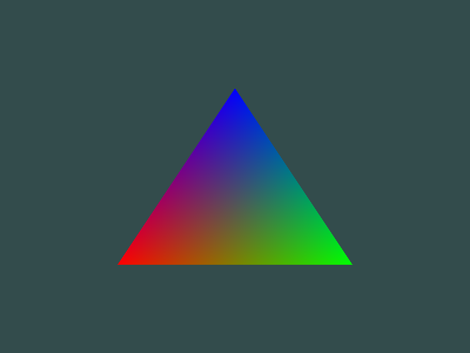

## OpenGL-GLFW-GLAD

OpenGL自身是一个巨大的状态机
OpenGl的状态通常被称为上下文

GLFW解决操作系统层面的不同
-创建窗口
-定义上下文
-处理用户输入
GLAD使得代码可以用于不同的OpenGL驱动
-OpenGl本身只是标准/规范
-各个厂家具体实现方法可以不同
-不同操作系统处理方法也不同
GLFW
https://www.glfw.org/download.html
GLAD使用了一个web服务器，通过输入想要为使用的OpenGL版本和相关信息转到GLAD服务器网站（[https://glad.dav1d.de](https://glad.dav1d.de/)）

glfwWindowHint(target, Hint);

把某一种target设置成hint


片段：包含渲染单个像素所需的所有数据。

显卡上有数千个小型处理器（核），可以在渲染管线中快速处理数据。核在GPU上为管线的每一步运行小程序。这些小程序成为着色器。

渲染管线 每一步执行完 后再执行下一步。

顶点着色器处理后，顶点值应该是NDC坐标；NDC坐标使用glViewport提供的数据，通过视口转换变为屏幕坐标。生成的屏幕空间左边将转换为片段，作为片段着色器的输入。

标准化设备坐标（Normalized Device Coordinates，NDC）

顶点着色器中处理过后，就应该是标准化设备坐标了，x、y和z的值在-1.0到1.0的一小段空间（立方体）。落在范围外的坐标都会被裁剪。

## VAO、VBO

顶点输入

在GPU上创建内存，储存的顶点数据

- 通过顶点缓冲对象（Vertex Buffer Objecits，VBO）管理
- 顶点缓冲对象的缓冲类型是GL_ARRAY_BUFFER

配置OpenGL如何解释这些内存

- 通过顶点数组对象（Vertex Array Objects，VAO）管理

使用缓冲区对象的优点是，可以一次将大量数据发送到显卡，不必一次发送一个数据。

用着色器语言GLSL（OpenGL Shading Language）编写顶点着色器，然后进行编译。

## 添加着色器


### 对着色器进行编译

为了让OpenGL使用着色器，必须在运行时从源码中动态编译着色器。首先创建着色器对象。

各个阶段的着色器需要通过着色器程序对象链接起来。着色器程序对象是多个着色器组成的最终链接版本。

```c++
const char *vertexShaderSource = 
"#version 330 core\n"
"layout(location = 0) in vec3 aPos;\n"
"void main()\n"
"{\n"
"gl_Position = vec4(aPos.x,aPos.y,aPos.z,1.0);\n"
"}\0";
```

```c++
const char *fragmentShaderSource = 
"#version 330 core\n"
"out vec4 FragColor;\n"
"void main()\n"
"{\n"
"FragColor = vec4(1.0f,0.5f,0.2f,1.0f);\n"
"}\n\0";
```

将着色器链接到程序时，会将每个着色器的输出连接到下一个着色器的输入.如果输出和输入不匹配，会出现链接错误。

```c++
//创建和编译着色器程序
	//顶点着色器
	unsigned int vertexShader = glCreateShader(GL_VERTEX_SHADER);
	glShaderSource(vertexShader, 1, &vertexShaderSource, NULL);
	glCompileShader(vertexShader);
	//检查编译错误 
	int success;
	char infoLog[512];
	glGetShaderiv(vertexShader, GL_COMPILE_STATUS, &success);
	if (!success)
	{
		glGetShaderInfoLog(vertexShader, 512, NULL, infoLog);
		std::cout << "ERROR::Shader::VERTEX::COMPILATION_FAIED\n" << infoLog << std::endl;
	}
	//片段着色器
	unsigned int fragmentShader = glCreateShader(GL_FRAGMENT_SHADER);
	glShaderSource(fragmentShader, 1, &fragmentShaderSource, NULL);
	glCompileShader(fragmentShader);
	//检查编译错误
	glGetShaderiv(fragmentShader, GL_COMPILE_STATUS, &success);
	if (!success)
	{
		glGetShaderInfoLog(fragmentShader, 512, NULL, infoLog);
		std::cout << "ERROR::Shader::FRAGMENT::COMPILATION_FAIED\n" << infoLog << std::endl;
	}
	//着色器程序
	unsigned int shaderProgram = glCreateProgram();
	glAttachShader(shaderProgram, vertexShader);
	glAttachShader(shaderProgram, fragmentShader);
	glLinkProgram(shaderProgram);
	//链接错误检查
	glGetProgramiv(shaderProgram, GL_LINK_STATUS, &success);
	if (!success)
	{
		glGetProgramInfoLog(shaderProgram, 512, NULL, infoLog);
		std::cout << "ERROR::SHADER::PROGRAM::LINKING_FAILED\n" << infoLog << std::endl;
	}
	glDeleteShader(vertexShader);
	glDeleteShader(fragmentShader);
```

创建着色器程序

## 元素缓冲对象EBO

EBO:Element Buffer Object

绘制两个三角形来组成一个矩形，可以使用下面的顶点的集合

```c++
float vertices[] =
{
	//第一个三角形
	0.5f,0.5f,0.0f,//右上
	0.5f,-0.5f,0.0f,//右下
	-0.5f,0.5f,0.0f,//左上
	//第二个三角形
	0.5f,-0.5f,0.0f,//右下
	-0.5f,-0.5f,0.0f,//左下
	-0.5f,0.5f,0.0f//左上
};
```

通过下面修改顶点数进行绘制

```c++
glDrawArrays(GL_TRIANGLES, 0, 6);
```

可以获得以下图像


修改光栅化模式，改为GL_LINE后

```
glPolygonMode(GL_FRONT_AND_BACK, GL_LINE);
```


在这种情况下，有两个左上的点，两个右下的点，其中有两个点是多余的。

换一种方式，用索引的方式，使用四个点的坐标

```c++
float vertices[] = {
	0.5f,0.5f,0.0f,// 右上
	0.5f,-0.5f,0.0f,// 右下
	-0.5f,-0.5f,0.0f,// 左下
	-0.5f,0.5f,0.0f// 左上
};
unsigned int indices[] = {
	0,1,3,//第一个三角形
	1,2,3//第二个三角形
};
```

选择使用索引渲染的函数，这样就可以绘出和上图一样的图像

```c++
glDrawElements(GL_TRIANGLES, 6, GL_UNSIGNED_INT, indices); //选择索引的方式
```

PS:采用了EBO时，则需要用glDrawElements函数来代替glDrawArrays函数，来指明我们从索引缓冲渲染。

参照[glDrawArrays 和 glDrawElements](https://www.cnblogs.com/keguniang/p/9866065.html)

这样写还不是整个的流程，还需要配置EBO

```c++
unsigned int EBO;
	glGenBuffers(1, &EBO);//创建缓冲区对象名字
	glBindBuffer(GL_ELEMENT_ARRAY_BUFFER, EBO);//绑定EBO缓冲
	glBufferData(GL_ELEMENT_ARRAY_BUFFER, sizeof(indices), indices, GL_STATIC_DRAW);//设置缓冲区数据
```

修改参数

```c++
glDrawElements(GL_TRIANGLES, 6, GL_UNSIGNED_INT, 0/*indices*/);
```

然后使用绑定，之后注销

## 视口

调整窗口的时候，也应该同时调整视口。在窗口上注册一个回调函数，每次调用窗口大小时都调用该函数

```c++
void frameBuffer_size_callback(GLFWwindow* window, int width, int height)
{
	glViewport(0, 0, width, height);
}
```

注册回调函数

```c++
//注册回调函数
glfwSetFramebufferSizeCallback(window, frameBuffer_size_callback);
```

PS：OpenGL中使用的坐标介于-1和1之间和屏幕空间坐标不同。例如：如果屏幕右下角为（800，600），（-0.5，0.5）将映射到屏幕空间的（200，450）

## 练习

1. 通过添加更多的顶点数据，使用glDrawArrays绘制两个挨在一起的三角形
2. 创建相同的两个三角形，但对它们的数据使用不同的VAO和VBO
3. 创建两个着色器，其中一个使用片段做着色器输出黄色

## 着色器Shader

着色器是基于GPU的小程序，这些小程序针对渲染管线中的每个特定步骤运行。从本质上说，着色器只不过是将输入转换为输出的程序。着色器也是非常孤立的程序，他们之间唯一的交流是通过输入和输出。

GLSL：OpenGL SHading Language

PS:Shader Language目前主要有3种语言：

1. 基于 OpenGL 的 **OpenGL Shading Language**，简称 **GLSL**;
2. 基于 DirectX 的 **High Level Shading Language**,简称 **HLSL**;
3. 还有 NVIDIA 公司的 **C for Graphic**，简称 **Cg** 语言。

这是GLSL程序的典型结构


### 类型

GLSL中包含C等其它语言大部分的默认基础数据类型

- int、float、double、uint和bool

GLSL也有两种容器类型

- 向量(Vector)
  - vecn: the default vector of n floats
  - bvecn: a vector of n booleans
  - ivecn: a vector of n integers
  - uvecn: a vector of n unsigned integers
  - dvecn: a vector of n double components 
- 矩阵(Matrix)

> 向量的分量可以通过xyzw分别访问。GLSL还允许对颜色使用rgba，或对纹理坐标使用stpq。

向量允许一些有趣而灵活的分量选择方式，叫做重组(Swizzling):

```glsl
vec2 vect = vec2(0.5,0.7);
vec4 result = vec4(vect,0.0,0.0);
vec4 otherResult = vect(result.xyz,1.0);
```

顶点着色器接受的是一种特殊形式的输入，否则就会效率低下

从顶点数据中直接接受输出。为了顶点数据该如何管理，使用location这一元数据（metadata）指定输入变量，这样才可以在CPU端配置顶点属性。例如：`layout (location = 0)`。layout这个的标识，使得能把它链接到顶点数据。

可以忽略`layout(location = 0)`标识符，通过在OpenGL代码中使用`glGenAttribLocation`查询属性位置值(Location)，通过`glBindAttribLocation`绑定属性位置值(Location)。但是推荐在着色器中设置它们，这样会更容易理解和节省工作量。

输入输出：

- 在发生方着色器中声明一个输出
- 在接受方着色器中声明一个类似的输入
- 当类型和名字都一致，OpenGL将把变量连接到一起（在链接程序对象时完成）

### Uniform:

 另一种从CPU的应用，向GPU中的着色器发送数据的方式

- uniform是全局的(Global)，可以被任意着色器程序在任意阶段访问

  

如果声明了一个uniform却没用过，编译器会默认移除这个变量，导致最后编译出的版本并不会包含它，这可能导致一些非常麻烦的错误，切记！

不去给像素传递一个单一的颜色，而是让它随着时间改变颜色

设置着色器，使用uniform

```c++
const char *vertexShaderSource = 
	"#version 330 core\n"
	"layout(location = 0) in vec3 aPos;\n"
	"void main()\n"
	"{\n"
	"gl_Position = vec4(aPos,1.0);\n"
	"}\0";
const char *fragmentShaderSource = 
	"#version 330 core\n"
	"out vec4 FragColor;\n"
	"uniform vec4 ourColor;\n"
	"void main()\n"
	"{\n"
	"FragColor = ourColor;\n"
	"}\n\0";
```

最后通过sin和cos实现颜色渐变

```c++
glUseProgram(shaderProgram);
//设置uniform值
float timeValue = glfwGetTime();
float greenValue = sin(timeValue) / 2.0f + 0.5F;
float redValue = cos(timeValue) / 2.0f + 0.5F;
float blueValue = cos(timeValue+45) / 2.0f + 0.5F;
int vertexColorLocation = glGetUniformLocation(shaderProgram, "ourColor");
glUniform4f(vertexColorLocation, redValue, greenValue, blueValue, 1.0f);
```

给顶点不同的颜色：

```c++
float vertices[] =  // 位置 // 颜色
{
	-0.5f,-0.5f,0.0f,1.0f,0.0f,0.0f,//右下
	0.5f,-0.5f,0.0f,0.0f,1.0f,0.0f,//左下
	0.0f,0.5,0.0f,0.0f,0.0f,1.0f//上
};
const char *vertexShaderSource = 
	"#version 330 core\n"
	"layout(location = 0) in vec3 aPos;\n"
	"layout(location = 1) in vec3 aColor;\n"
	"out vec3 ourColor;\n"
	"void main()\n"
	"{\n"
	"gl_Position = vec4(aPos,1.0);\n"
	"ourColor = aColor;\n"
	"}\0";
const char *fragmentShaderSource = 
	"#version 330 core\n"
	"out vec4 FragColor;\n"
	"uniform vec4 ourColor;\n"
	"void main()\n"
	"{\n"
	"FragColor = ourColor;\n"
	"}\n\0";
```

```c++
	glBufferData(GL_ARRAY_BUFFER, sizeof(vertices), vertices, GL_STATIC_DRAW);
	//告知Shader如何解析缓冲里的属性值
	glVertexAttribPointer(0, 3, GL_FLOAT, GL_FALSE, 6 * sizeof(float), (void*)0);
	//开启VAI管理的第一个属性值
	glEnableVertexAttribArray(0);
	//告知Shader如何解析缓冲里的属性值
	glVertexAttribPointer(1, 3, GL_FLOAT, GL_FALSE, 6 * sizeof(float), (void*)(3*4));
	//开启VAI管理的第一个属性值
	glEnableVertexAttribArray(1);
```



## 编写自己的着色器类

把着色器类全部放在在头文件里，主要是为了学习用途，当然也方便移植。添加必要的include，并定义类结构：

```c++
#ifndef SHADER_H
#define SHADER_H

#include <glad/glad.h>; // 包含glad来获取所有的必须OpenGL头文件

#include <string>
#include <fstream>
#include <sstream>
#include <iostream>


class Shader
{
public:
    // 程序ID
    unsigned int ID;

    // 构造器读取并构建着色器
    Shader(const GLchar* vertexPath, const GLchar* fragmentPath);
    // 使用/激活程序
    void use();
    // uniform工具函数
    void setBool(const std::string &name, bool value) const;  
    void setInt(const std::string &name, int value) const;   
    void setFloat(const std::string &name, float value) const;
};

#endif
```

下一步，我们需要编译和链接着色器。

```g
        // 2. 编译着色器
        unsigned int vertex, fragment;
        // vertex shader 顶点
        vertex = glCreateShader(GL_VERTEX_SHADER);
        glShaderSource(vertex, 1, &vShaderCode, NULL);
        glCompileShader(vertex);
        checkCompileErrors(vertex, "VERTEX");
        // fragment Shader 片元
        fragment = glCreateShader(GL_FRAGMENT_SHADER);
        glShaderSource(fragment, 1, &fShaderCode, NULL);
        glCompileShader(fragment);
        checkCompileErrors(fragment, "FRAGMENT");
        // shader Program 
        ID = glCreateProgram();
        glAttachShader(ID, vertex); //附加vertex对象给ID
        glAttachShader(ID, fragment);
        glLinkProgram(ID);
        checkCompileErrors(ID, "PROGRAM");
        // delete the shaders as they're linked into our program now and no longer necessary
        // 因为它们已经链接程序，不再需要，然后就删除这些着色器
        glDeleteShader(vertex);
        glDeleteShader(fragment);
```

设置use函数

```c++
    void use()
    {
        glUseProgram(ID);
    }
```

```c++
    // 一些有用Uniform函数
    // ------------------------------------------------------------------------
    void setBool(const std::string& name, bool value) const
    {
        glUniform1i(glGetUniformLocation(ID, name.c_str()), (int)value);
    }
    // ------------------------------------------------------------------------
    void setInt(const std::string& name, int value) const
    {
        glUniform1i(glGetUniformLocation(ID, name.c_str()), value);
    }
    // ------------------------------------------------------------------------
    void setFloat(const std::string& name, float value) const
    {
        glUniform1f(glGetUniformLocation(ID, name.c_str()), value);
    }
```

最后创建着色器对象，再使用

### 着色器练习

- 修改顶点着色器让三角形上下颠倒：

  ```glsl
  #version 330 core
  layout (location = 0) in vec3 aPos;
  layout (location = 1) in vec3 aColor;
  
  out vec3 ourColor;
  //修改顶点着色器，让aPos.y变成负值
  void main()
  {
      gl_Position = vec4(aPos.x,- aPos.y,aPos.z, 1.0);
      ourColor = aColor;
  }
  ```

  

- 使用uniform定义一个水平偏移量，在顶点着色器中使用这个偏移量把三角形移动到屏幕右侧：

  - 在C++代码设置

  ```c++
  float offset = 0.5f;
  ourShader.setFloat("xOffset", offset);
  ```

  - ​	在顶点着色器

    ```glsl
    #version 330 core
    layout (location = 0) in vec3 aPos;
    layout (location = 1) in vec3 aColor;
    
    out vec3 ourColor;
    
    uniform float xOffset;
    
    void main()
    {
        gl_Position = vec4(aPos.x + xOffset, aPos.y, aPos.z, 1.0); // add the xOffset to the x position of the vertex position
        ourColor = aColor;
    }
    ```

    

- 使用`out`关键字把顶点位置输出到片段着色器，并将片段的颜色设置为与顶点位置相等（来看看连顶点位置值都在三角形中被插值的结果）。做完这些后，尝试回答下面的问题：为什么在三角形的左下角是黑的?：

